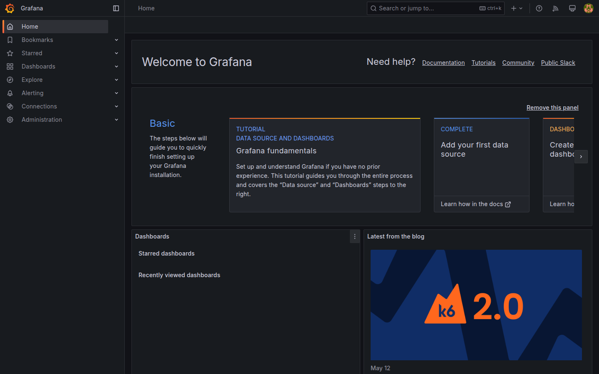
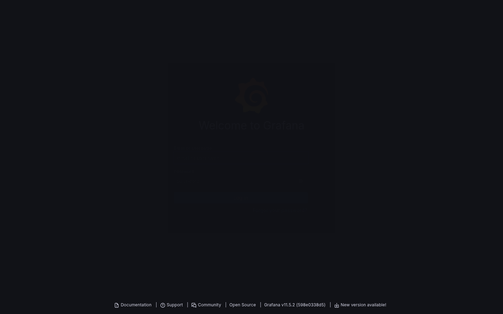
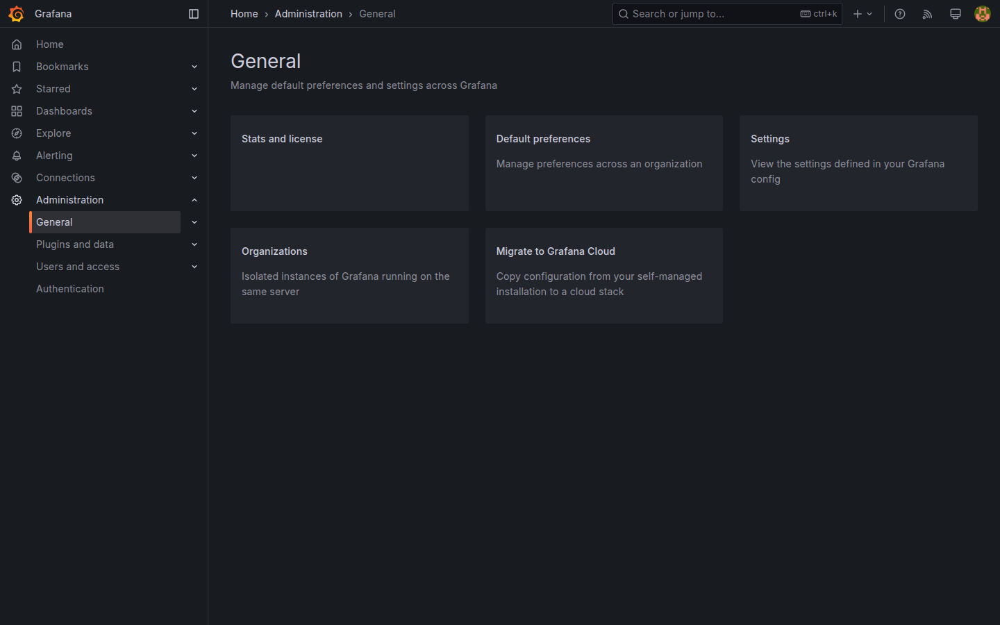
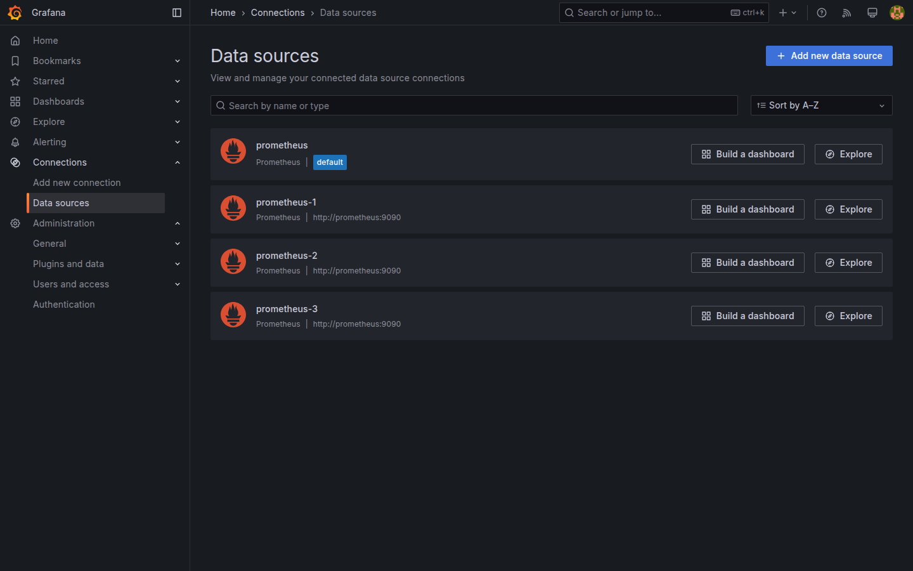
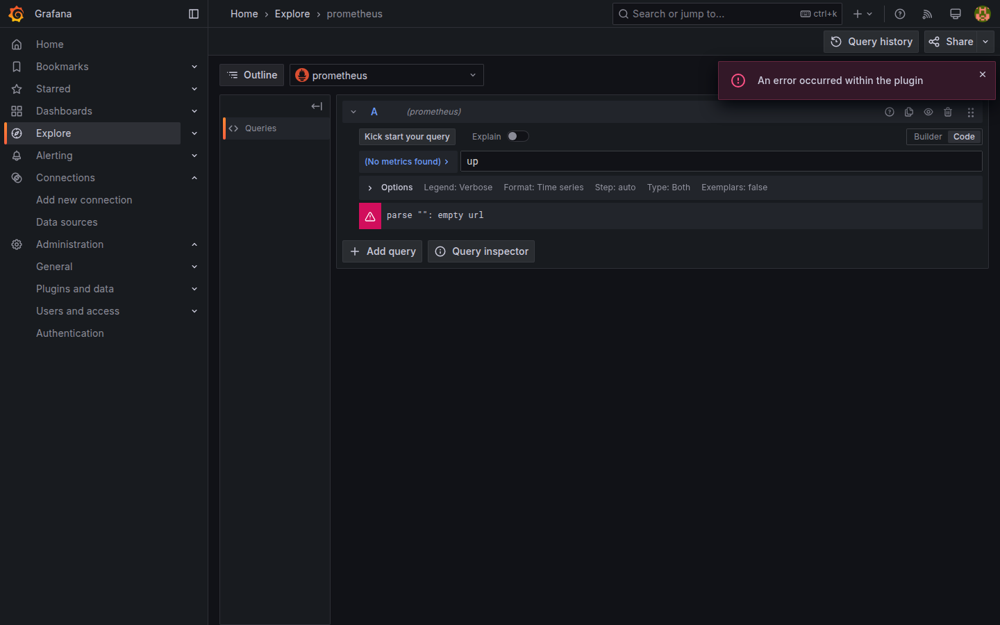

# M02-01 — Navegación y estructura de la interfaz

[← Página anterior](README.md) · [Siguiente página →](M02-02-paneles-graficos.md)

Grafana concentra en una sola interfaz tareas que en otros productos están repartidas entre consolas distintas: consultar métricas, revisar dashboards, registrar fuentes de datos o administrar usuarios. Antes de conectar Prometheus, Loki o PostgreSQL — o de diseñar el primer panel — conviene saber **dónde vive cada función** en Grafana 11 y cómo orientarte sin depender del menú en exceso.

En esta unidad trabajas sobre la instancia del lab (`http://localhost:3000`). El recorrido es solo de navegación: no crearás dashboards ni datasources todavía.

### Objetivos

Al cerrar la unidad deberías:

- Identificar barra superior, menú lateral, breadcrumbs y área central, y relacionarlos con consumo, conexión, alertas y administración.
- Llegar a **Explore**, **Data sources** y **Administration → General** por menú y por búsqueda global (`Ctrl+K` / `Cmd+K`).
- Ubicar perfil de usuario, organización activa y acceso a la ayuda integrada.

---

## Conceptos

Grafana organiza el trabajo en **cuatro ideas**:

1. **Consumir** — ver dashboards y explorar datos (*Home*, *Dashboards*, *Explore*).
2. **Conectar** — datasources y plugins (*Connections*).
3. **Alertar** — reglas y contact points (*Alerting*).
4. **Administrar** — usuarios, preferencias, plugins (*Administration*).

**Barra lateral (menú hamburguesa / dock):** acceso persistente a esas áreas. En pantallas estrechas puede colapsarse; el icono ☰ la expande.

**Barra superior:** breadcrumbs (ruta actual), **búsqueda global** (`Ctrl+K` / `Cmd+K`), accesos rápidos (+), ayuda y menú de usuario (perfil, tema, organización).

**Organización (*org*):** casi todo ocurre dentro de una organización. En el lab hay una sola (*Main Org*); en empresa puede haber varias con permisos distintos.

**Canvas central:** cambia según la sección — listados, editores de dashboard, formularios de datasource, etc.

En la vista **Home** se ven a la vez la barra superior, el menú lateral y el área central:



---

## En Grafana

La instancia del lab está en `http://localhost:3000` (puerto **3000** reenviado en Codespace). Lo siguiente describe la interfaz tal como aparece tras el primer acceso con **admin** / **admin**.

### Acceso e inicio de sesión

Al cargar la URL aparece el formulario de login. En el entorno del curso las credenciales son **admin** / **admin**; tras **Log in**, Grafana valida la sesión contra la base interna del contenedor.



En el **primer acceso** suele mostrarse la pantalla *Update your password*, con aviso de riesgo si se mantiene la contraseña por defecto. En formación se elige **Skip**: no afecta al resto del lab y evita bloquear el hilo de la unidad.

### Home y barra superior

Tras el login se llega a **Home**. En la franja superior, de izquierda a derecha, aparecen:

- el **logo** (vuelta al inicio);
- los **breadcrumbs**, que reflejan la ruta lógica (`Home`, o `Home > …` en otras secciones);
- la caja **Search or jump to…**, atajo de teclado `Ctrl+K` / `Cmd+K`;
- el icono **+**, para crear dashboards, alertas u otros recursos según permisos;
- **?**, ayuda contextual y enlace a documentación;
- el **avatar**, menú de perfil, tema, organización y cierre de sesión.

Los breadcrumbs son la referencia más fiable antes de guardar cambios: confirman que la acción afectará al contexto correcto.

### Menú lateral: las cuatro ideas en la UI

En el dock izquierdo cada entrada materializa una de las cuatro ideas de **Conceptos**. Al entrar en cada una **sin guardar cambios**, el canvas central y los breadcrumbs cambian, pero la barra superior mantiene la misma estructura.

| Entrada del menú | Qué muestra el canvas |
|------------------|------------------------|
| **Home** | Accesos recientes y punto de partida |
| **Dashboards** | Listado de tableros de la organización |
| **Explore** | Editor de consultas ad hoc sobre una fuente |
| **Connections → Data sources** | Fuentes registradas (vacío al inicio del curso) |
| **Alerting** | Reglas y contact points (a menudo sin configurar aún) |
| **Administration → General** | Tarjetas de ajustes de organización |

Al seleccionar **Administration → General**, el breadcrumb pasa a `Home > Administration > General` y el área central muestra tarjetas como *Default preferences*, *Organizations* o *Stats and license*:



*Connections* y *Administration* concentran tareas de integración y gobierno; en producción suelen restringirse por rol.

### Búsqueda global

Con `Ctrl+K` / `Cmd+K` se abre un buscador de páginas y acciones. Al teclear `data sources` y elegir el resultado homónimo, la aplicación navega a la misma pantalla que *Connections → Data sources*.



Aquí el breadcrumb es `Home > Connections > Data sources`. Compararlo con el de **Administration** ayuda a fijar la taxonomía de Grafana: *Connections* agrupa integraciones técnicas; *Administration*, gobierno de la plataforma.

### Perfil y zona horaria

Desde el **avatar** → **Profile** → **Preferences** se expone la **Timezone** del usuario. Grafana usa ese valor al renderizar ejes temporales en dashboards y Explore; en equipos mixtos suele acordarse UTC o la zona del servicio monitorizado, no la del portátil de cada persona.

---

## Laboratorio

### Objetivo

Confirmar en tu instancia del lab que dominas el acceso a Grafana, el recorrido por las secciones principales del menú, la búsqueda global, los breadcrumbs y los ajustes básicos de usuario y organización — sin crear aún dashboards ni datasources.

### En qué consiste

Practicarás **siete secuencias** encadenadas sobre la misma sesión:

1. Entrar en Grafana y validar **Home** tras el login.  
2. Visitar las entradas clave del **menú lateral** (Dashboards, Explore, Connections, Alerting, Administration).  
3. Llegar a **Data sources** con `Ctrl+K` / `Cmd+K`.  
4. Volver a **Home** usando **breadcrumbs**.  
5. Ir a **Explore** y regresar al inicio solo con el buscador.  
6. Revisar **organización** y preferencias por defecto.  
7. Abrir la **ayuda** integrada de Grafana.

Cada paso sigue **Acción → Por qué → Resultado esperado**. Al terminar deberías moverte por la UI sin perderte entre consumo de datos, conexiones y administración.

Punto de partida habitual tras el login:


### 1 — Acceso y comprobación de sesión

**Acción:** entra en Grafana con `admin` / `admin`. Si aparece *Update your password*, elige **Skip**.

**Por qué:** confirma que el stack del repo responde y que tienes rol de administrador en la org por defecto, necesario para las unidades siguientes.

**Resultado esperado:** pantalla **Home** con menú lateral completo y breadcrumb `Home`.


### 2 — Recorrido por el menú lateral

**Acción:** visita, en este orden, **Dashboards**, **Explore**, **Connections → Data sources**, **Alerting** y **Administration → General**. En cada parada observa título de página y breadcrumbs; no guardes formularios.

**Por qué:** asocia cada entrada del menú con un tipo de trabajo (consumir, conectar, alertar, administrar).

**Resultado esperado:** en **Data sources** aparece el estado sin fuentes o con las que hayas creado antes; en **Administration → General**, las tarjetas de ajustes como en la captura siguiente.


### 3 — Búsqueda global hasta Data sources

**Acción:** desde **Home**, pulsa `Ctrl+K` / `Cmd+K`, escribe `data sources` y entra en el resultado.

**Por qué:** demuestra que la búsqueda global es equivalente al menú para rutas frecuentes.

**Resultado esperado:** misma pantalla que en el paso 2, breadcrumb `Home > Connections > Data sources` (como en la captura).


### 4 — Breadcrumbs de vuelta a Home

**Acción:** en **Data sources**, haz clic en **Home** dentro de los breadcrumbs.

**Por qué:** los breadcrumbs no solo informan: permiten saltar niveles sin usar el menú lateral.

**Resultado esperado:** regreso a **Home** sin recargar la sesión.

### 5 — Explore desde el buscador

**Acción:** con `Ctrl+K` / `Cmd+K`, escribe `Explore` y entra. Luego repite el atajo, escribe `Home` y vuelve al inicio.

**Por qué:** refuerza navegación por teclado entre secciones de consumo de datos.

**Resultado esperado:** en **Explore** el breadcrumb incluye la sección Explore y, si hay fuentes configuradas, el selector de datasource; la captura muestra el editor de consultas vacío o con fuente por defecto:



### 6 — Organización y preferencias por defecto

**Acción:** abre el menú del **avatar** y comprueba el nombre de la **Organization** activa. Entra en **Administration → General** y abre la tarjeta **Default preferences** (solo lectura).

**Por qué:** la org delimita el ámbito de dashboards y datasources; las preferencias por defecto afectan a usuarios nuevos de esa org.

**Resultado esperado:** organización tipo *Main Org*; en *Default preferences*, opciones como home dashboard o timezone por defecto a nivel org.

### 7 — Ayuda integrada

**Acción:** pulsa **?** en la barra superior y localiza el enlace a documentación oficial. Cierra el panel de ayuda.

**Por qué:** Grafana expone la documentación de la versión instalada desde la propia UI.

**Resultado esperado:** panel de ayuda con enlace a **Documentation**; al cerrarlo, la vista permanece en la última sección visitada.

---

## Conclusiones

- La UI separa **ver datos**, **conectar fuentes**, **alertar** y **administrar**; los permisos por rol determinan qué entradas del menú ve cada perfil.
- **Explore** responde a consultas puntuales; **Dashboards**, a vistas compartidas y estables en el tiempo.
- **Ctrl+K / Cmd+K** y los **breadcrumbs** reducen dependencia del menú lateral en entornos con muchas secciones.
- Tras login inicial, **Skip** en cambio de contraseña es aceptable en lab; en producción se exige política de contraseñas distinta.

---

## Comprueba tu entendimiento

Ejecuta estas comprobaciones en tu entorno. Si el resultado no coincide, revisa el paso del laboratorio indicado.

**Navegación lateral — Explore y Data sources**  
Accede a **Explore** y a **Connections → Data sources** usando el menú lateral.  
→ Debes ver el editor de Explore y el listado de fuentes sin error de permisos (pasos 2 y 5).

**Navegación por teclado — Data sources**  
Desde **Home**, usa solo `Ctrl+K` / `Cmd+K` y la tecla **Enter** para abrir **Data sources**.  
→ Breadcrumb `Home > Connections > Data sources` (paso 3).

**Timezone de usuario**  
Localiza en **Profile → Preferences** dónde se define la **Timezone**.  
→ Campo editable de zona horaria del usuario actual (apartado **Perfil y zona horaria**).

**API de organización**

```bash
curl -s -u admin:admin http://localhost:3000/api/org | head -c 120
```

→ JSON con `"name":"Main Org."` (o el nombre de la org activa en tu sesión).

---

## Reto

### 1 — Administration → General solo con búsqueda global

Partiendo de **Home**, llega a **Administration → General** usando únicamente `Ctrl+K` / `Cmd+K`. Cuenta pulsaciones y clics y compáralo con el recorrido por menú lateral.

<details>
<summary>Ver solución</summary>

1. `Ctrl+K` / `Cmd+K` — abre la búsqueda global.  
2. Escribe `general` o `administration general`.  
3. Elige **General** bajo *Administration* (o el resultado que muestre la ruta completa).  

Suele bastar **una pulsación del atajo + texto + Enter** (3–5 pulsaciones en total). Por menú lateral: abrir *Administration*, clic en *General* — al menos **dos clics** más el desplazamiento visual. En la mayoría de instalaciones la búsqueda global es más rápida para rutas que recuerdas por nombre.

</details>

### 2 — Qué vería un rol Viewer

Sin cambiar permisos en M08, razona qué entradas de *Connections* o *Administration* dejarían de estar disponibles para un usuario que **solo puede ver** dashboards.

<details>
<summary>Ver solución</summary>

Un **Viewer** mantiene acceso a **Home**, **Dashboards** (lectura) y **Explore** limitado según configuración, pero **no** debería:

- Añadir ni editar **datasources** (*Connections*).  
- Gestionar **usuarios, roles, organizaciones** ni *Default preferences* de org (*Administration*).  
- Crear reglas en **Alerting** (solo ver alertas existentes si la política lo permite).  

En la práctica desaparecen o quedan deshabilitadas las acciones de escritura y gran parte del menú *Administration*; el detalle fino se configura en M08.

</details>

### 3 — Alerting sin reglas configuradas

Entra en **Alerting** y describe qué muestra la UI cuando aún no hay alertas configuradas.

<details>
<summary>Ver solución</summary>

En Grafana 11, con el lab recién levantado, **Alerting** suele mostrar un **estado vacío**: mensaje del tipo *You haven't created any alert rules yet* (o equivalente), botón **New alert rule** / **Create alert rule**, y submenús (*Alert rules*, *Contact points*, *Notification policies*) accesibles pero sin entradas listadas.  

No es un error: indica que la ruta de alertas está operativa y a la espera de configuración (unidad posterior o M05/M08 según el curso).

</details>

