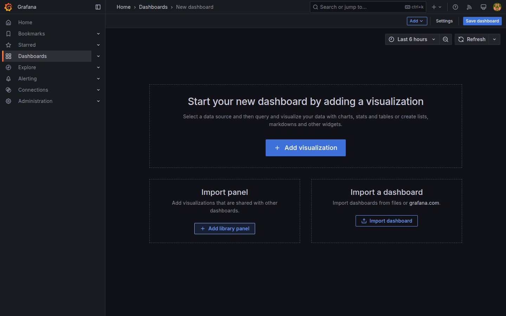
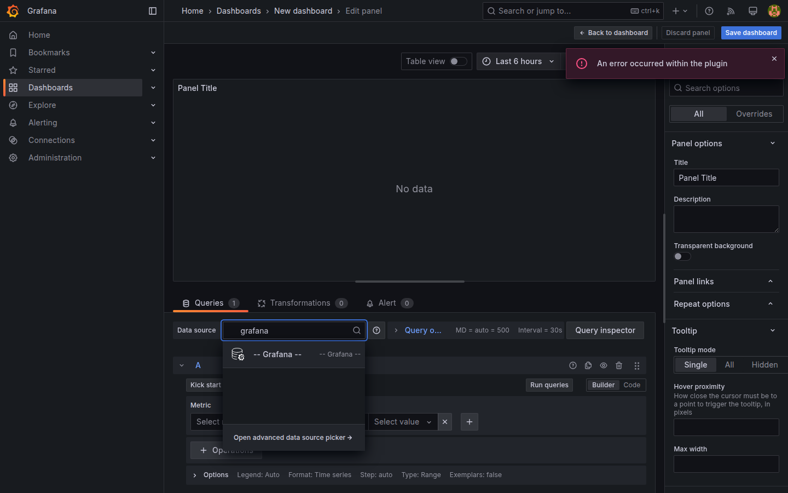
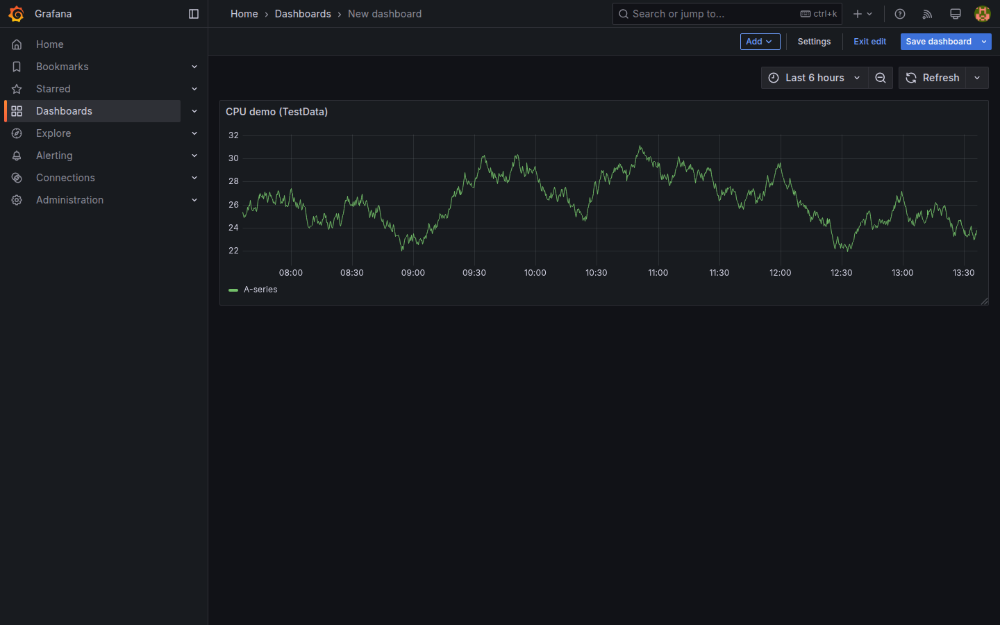
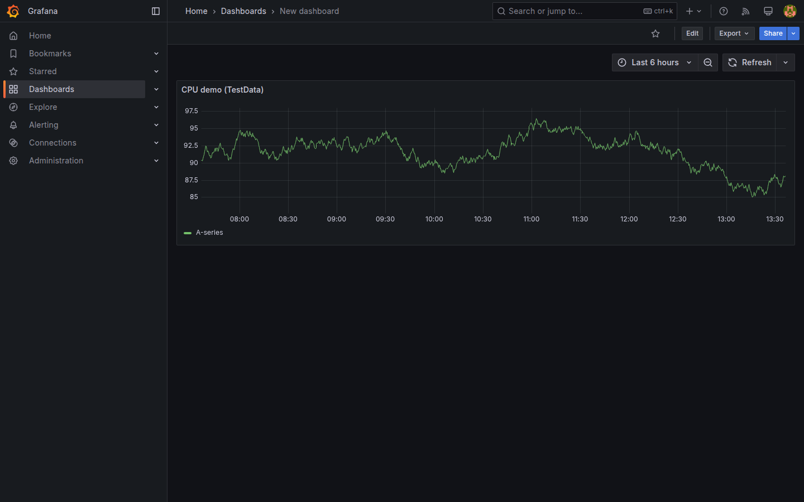
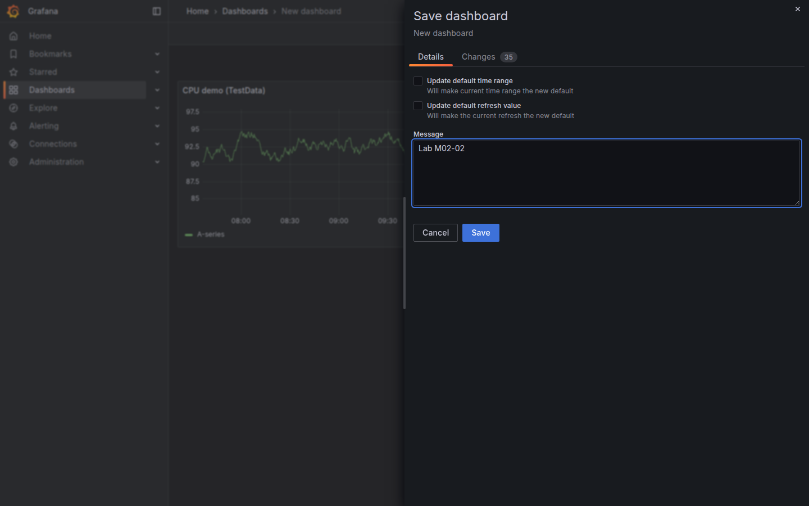
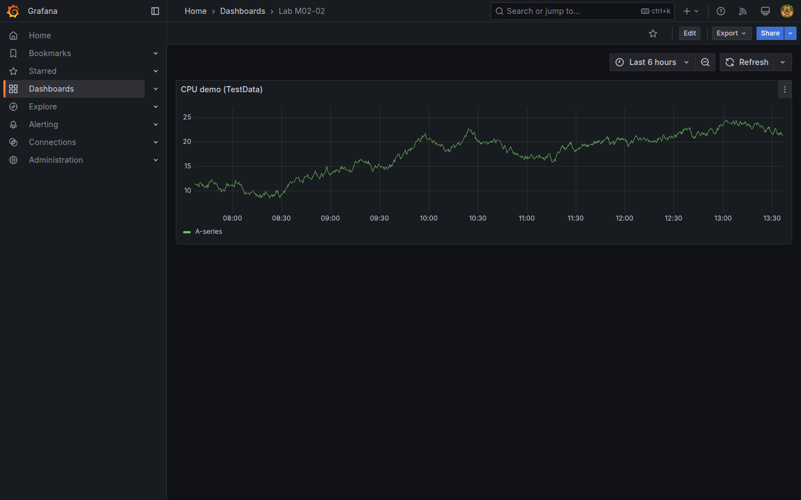

# M02-02 — Paneles y gráficos

[← Página anterior](M02-01-navegacion-estructura.md) · [Siguiente página →](M02-03-configuracion-paneles.md)

Tras orientarte en la interfaz (M02-01), el siguiente paso natural es **materializar datos en un panel**: elegir fuente, tipo de consulta y visualización, y guardar el resultado en un dashboard reutilizable. En Grafana un panel no es un gráfico suelto en disco — es una consulta + visualización embebida en un tablero que puedes compartir, versionar y alertar más adelante.

En esta unidad usarás la fuente integrada **TestData** (escenarios sintéticos incluidos en Grafana). No hace falta conectar Prometheus ni PostgreSQL todavía; el foco está en el flujo **dashboard → panel → time series → guardado**.

### Objetivos

Al cerrar la unidad deberías:

- Crear un dashboard nuevo y añadir un panel desde la UI.
- Seleccionar **TestData**, generar una serie temporal de ejemplo y visualizarla como **Time series**.
- Aplicar un título al panel, guardar el dashboard con nombre reconocible y volver a abrirlo desde **Dashboards**.

---

## Conceptos

Un **dashboard** agrupa uno o más **paneles**. Cada panel tiene tres capas:

1. **Datasource** — de dónde salen los datos (métricas, SQL, logs, sintéticos…).
2. **Consulta** — qué pides a esa fuente (PromQL, SQL, escenario TestData…).
3. **Visualización** — cómo se dibuja el resultado (time series, tabla, gauge, etc.).

**TestData** es un datasource **built-in** de Grafana: genera series aleatorias o CSV de demo sin backend externo. Sirve para practicar diseño de paneles cuando aún no hay métricas reales conectadas.

El escenario **Random walk** produce una serie numérica que **da pasos aleatorios** en cada punto temporal: no representa CPU ni ventas reales, solo una curva continua para probar ejes, leyenda y refresco. En M02-03 y M02-04 seguirás con TestData; desde M03 las fuentes serán Prometheus, PostgreSQL y Loki.

**Time series** es la visualización por defecto para métricas con eje temporal: una o más líneas (o áreas) en función del tiempo. Es el tipo más usado en observabilidad de infraestructura.

El **editor de panel** divide la pantalla: consulta abajo (o a un lado), previsualización arriba, y opciones de panel/visualización a la derecha. **Apply** confirma cambios en el dashboard; **Save dashboard** persiste el tablero en la base de Grafana del lab.

---

## En Grafana

Con sesión iniciada en el lab, el flujo habitual para un primer panel empieza en **Dashboards**.

### Crear un dashboard vacío

Desde **Dashboards → New → Dashboard** (o el botón **+** → *Dashboard*), Grafana abre un canvas sin paneles. El breadcrumb incluye *Dashboards* y el nombre provisional del tablero; la acción **Add** (o *Add visualization*) inicia el asistente de panel.



### Elegir datasource y consulta TestData

Al pulsar **Add → Visualization**, Grafana muestra el selector de **datasource** antes de abrir el editor completo. **-- Grafana --** (TestData) aparece en la lista sin configuración previa.



En la pestaña de consulta, el escenario **Random walk** produce una serie continua pseudoaleatoria — suficiente para ver ejes, leyenda y refresco temporal. En el editor, la previsualización se actualiza al cambiar escenario o alias de serie; a la derecha, **Panel options** expone el título visible y opciones de la visualización activa.



### Time series en el dashboard

Tras **Apply**, el panel queda incrustado en el grid del dashboard. El selector de intervalo temporal (esquina superior derecha) controla la ventana *from–to*; **Refresh** vuelve a ejecutar la consulta. Con TestData la curva cambia ligeramente en cada refresco — comportamiento esperado de datos sintéticos.



### Guardar el tablero

**Save dashboard** (icono de disco o menú del dashboard) abre un cuadro de diálogo con **nombre** y, opcionalmente, carpeta. Un nombre como `Lab M02-02` permite recuperarlo después en el listado de **Dashboards**. Tras confirmar **Save**, la URL incluye un identificador único (`/d/…`) compartible dentro de la organización.



Tras guardar, el tablero queda en modo vista con el panel ya incrustado:



---

## Laboratorio

### Objetivo

Construir un dashboard mínimo con un panel **Time series** alimentado por **TestData**, titularlo, guardarlo y comprobar que persiste al recargar la página.

### En qué consiste

Cuatro bloques encadenados en la misma sesión:

1. Crear dashboard vacío y abrir el editor de panel.  
2. Configurar **TestData** con escenario **Random walk**.  
3. Aplicar la visualización **Time series** y fijar un título al panel.  
4. Guardar el dashboard con nombre `Lab M02-02` y verificar que aparece en **Dashboards**.

Referencia del punto de partida:


### 1 — Dashboard nuevo

**Acción:** ve a **Dashboards → New → Dashboard** (o `+` → *Dashboard*). Pulsa **Add visualization** (o equivalente *Add* → *Visualization*).

**Por qué:** aísla la creación del contenedor (dashboard) antes de definir consultas concretas.

**Resultado esperado:** canvas vacío con invitación a añadir el primer panel.

### 2 — Consulta TestData

**Acción:** pulsa **Add → Visualization**. En el selector de **datasource**, busca `grafana` y elige **-- Grafana --**. En la consulta, selecciona escenario **Random walk** (o *Random Walk*). Comprueba que la previsualización muestra una línea en el rango temporal seleccionado.

**Por qué:** valida el circuito datasource → consulta → dibujo sin depender del stack Prometheus/Loki del repo.

**Resultado esperado:** selector de datasource visible al abrir la visualización; después, editor con curva en la zona de preview.


### 3 — Título y Apply

**Acción:** en **Panel options** (panel derecho), establece el título `CPU demo (TestData)` o similar. Confirma con **Apply**.

**Por qué:** el título identifica el panel en dashboards densos; **Apply** confirma cambios sin salir del tablero.

**Resultado esperado:** panel incrustado en el grid con leyenda y título visibles.


### 4 — Guardar y verificar

**Acción:** pulsa **Save dashboard**, asigna nombre `Lab M02-02` y confirma **Save**. Recarga el navegador (`F5`) o vuelve a **Dashboards** y abre de nuevo el tablero.

**Por qué:** confirma persistencia en la base de Grafana del contenedor (volumen `grafana-data` del lab).

**Resultado esperado:** mismo panel tras recargar; entrada `Lab M02-02` en el listado de dashboards.


---

## Conclusiones

- Dashboard y panel son niveles distintos: el tablero es el contenedor compartible; el panel encapsula consulta + visualización.
- **TestData** permite practicar sin datasource externo; en M03 sustituirás TestData por Prometheus, PostgreSQL o Loki.
- **Time series** es el punto de partida habitual para métricas; otros tipos (gauge, stat, table) reutilizan el mismo flujo de editor.
- **Apply** vs **Save dashboard**: el primero confirma el panel en memoria del tablero abierto; el segundo persiste en la base de datos de Grafana.

---

## Comprueba tu entendimiento

**Panel visible tras recarga**  
Abre `Lab M02-02` desde **Dashboards** tras recargar el navegador.  
→ Un panel **Time series** con título definido y serie activa (paso 4).

**Datasource del panel**  
En el editor del panel, revisa qué datasource figura en el selector de consulta.  
→ **-- Grafana --** / **TestData** (no Prometheus ni PostgreSQL).

**API del dashboard**

```bash
curl -s -u admin:admin "http://localhost:3000/api/search?query=Lab%20M02-02" | head -c 200
```

→ JSON con al menos un elemento `"title":"Lab M02-02"` (o el nombre que hayas usado).

---

## Reto

### 1 — Segundo panel en el mismo dashboard

Añade un **segundo panel** en `Lab M02-02` con TestData y escenario **CSV Metric** (o *CSV Metric Values*). Usa visualización **Stat** en lugar de time series.

<details>
<summary>Ver solución</summary>

1. Abre `Lab M02-02` → **Add** → **Visualization**.  
2. Datasource **-- Grafana --**; escenario **CSV Metric** / **CSV Metric Values**.  
3. En el selector de visualización (parte superior del preview o panel derecho), elige **Stat**.  
4. Título sugerido: `Stat demo (TestData)` → **Apply** → **Save dashboard**.  

Deberías ver dos paneles en el mismo grid: el time series original y un stat con valor numérico agregado.

</details>

### 2 — Cambiar rango temporal

En el dashboard guardado, cambia el intervalo superior de *Last 5 minutes* a *Last 6 hours* y observa el eje X del panel time series.

<details>
<summary>Ver solución</summary>

Usa el selector de tiempo (esquina superior derecha del dashboard). Al ampliar a **Last 6 hours**, Grafana re-ejecuta la consulta TestData en la ventana más ancha: más puntos visibles en el eje X y posible cambio de densidad de la curva. No requiere guardar de nuevo salvo que cambies título o consulta.

</details>

### 3 — Duplicar panel

Duplica el panel time series existente desde el menú del panel (*More…* → *Duplicate*) y renombra la copia.

<details>
<summary>Ver solución</summary>

En el panel, abre el menú **⋮** → **More…** → **Duplicate**. Grafana crea una copia en el grid. Entra en edición de la copia, cambia el título a `CPU demo (copia)` y **Apply**. **Save dashboard** para persistir. Útil en plantillas donde varias series comparten configuración base.

</details>
