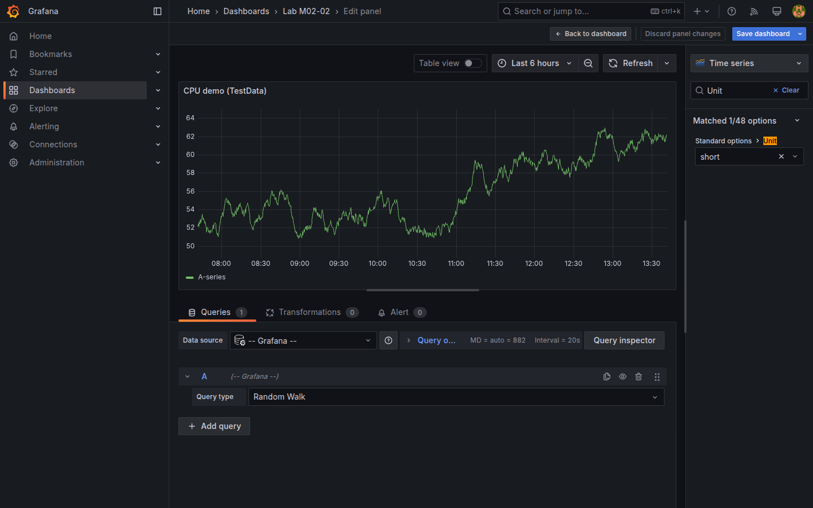
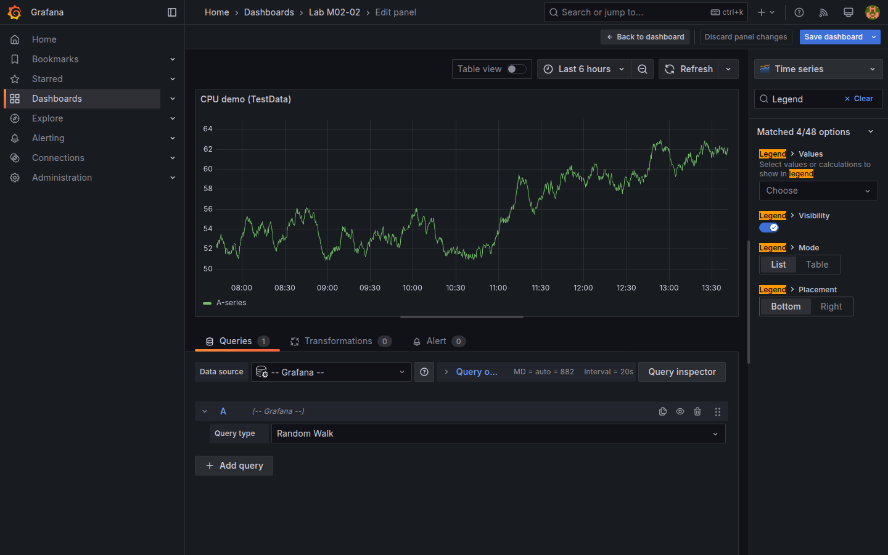
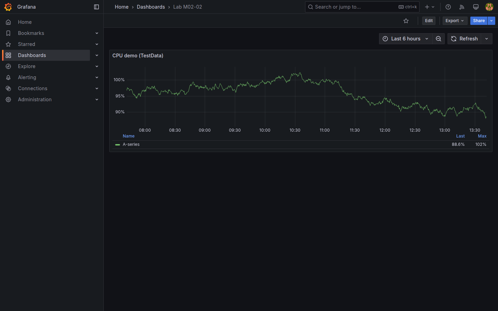
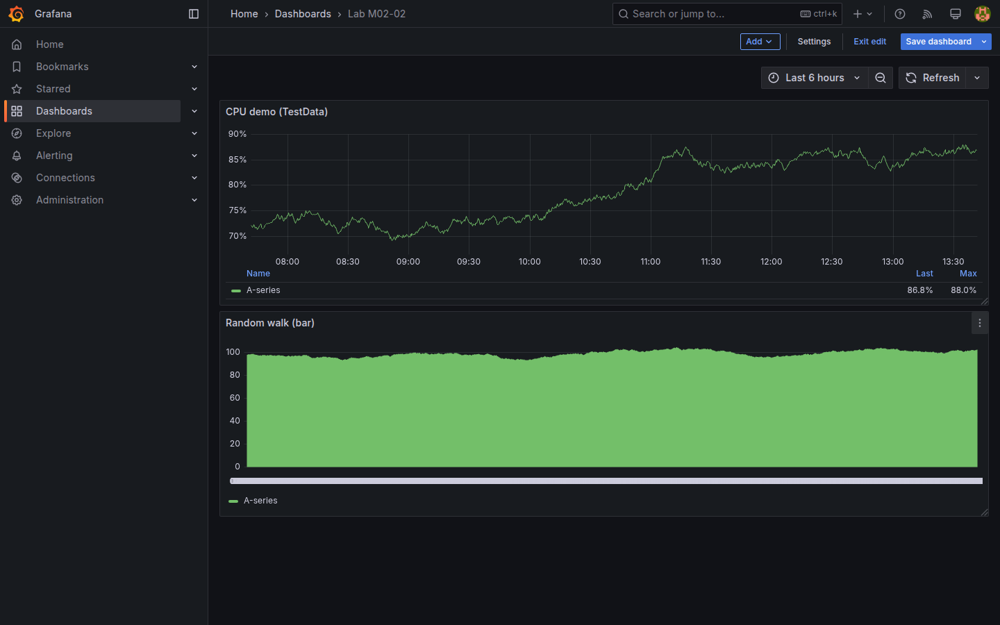
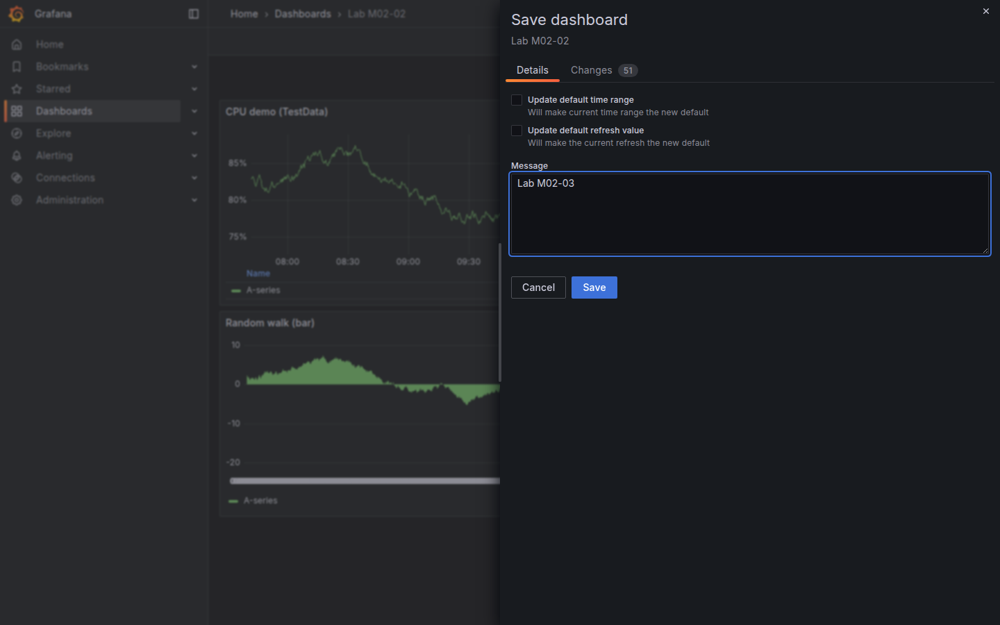
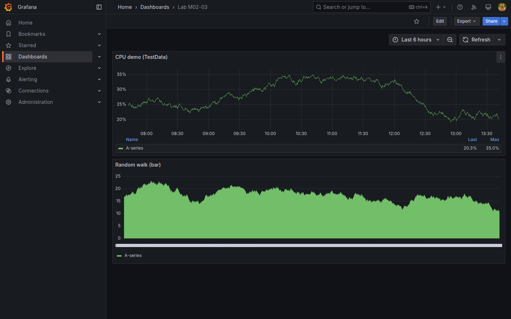

# M02-03 — Configuración básica de paneles

[← Página anterior](M02-02-paneles-graficos.md) · [Siguiente página →](M02-04-variables-dashboard.md)

Un panel funcional no basta en entorno real: operaciones y negocio esperan **unidades legibles**, **leyendas claras** y, a veces, **otro tipo de gráfico** sin reescribir la consulta. Grafana separa *qué datos pides* (consulta) de *cómo los presentas* (opciones de panel, campo y visualización).

En esta unidad partes del dashboard `Lab M02-02` (M02-02): mismo datasource **TestData**, mismo escenario **Random walk**. El trabajo está en el panel derecho del editor y en el selector de visualización. No conectarás fuentes nuevas ni usarás variables de dashboard (eso llega en M02-04).

### Objetivos

Al cerrar la unidad deberías:

- Ajustar **unidad de medida** y **leyenda** de un panel time series existente.
- Cambiar el **tipo de visualización** manteniendo la consulta TestData.
- Guardar los cambios en un dashboard reconocible (`Lab M02-03`) y verificar persistencia.

---

## Conceptos

Las opciones de un panel se agrupan en tres zonas habituales del editor:

1. **Panel options** — metadatos del panel: título, descripción, enlaces, transparencia. Afectan al contenedor, no a cada serie.
2. **Standard options** — comportamiento común a muchas visualizaciones: **unit** (%, bytes, segundos…), **min/max** del eje, **decimals**. Grafana formatea números según la unidad elegida.
3. **Opciones específicas de la visualización** — p. ej. *Legend*, *Graph styles*, *Bar chart* → orientación, apilado, etc.

La **leyenda** identifica series cuando hay más de una (o cuando el alias de consulta no es obvio). Puede mostrarse abajo, a la derecha o oculta; admite valores agregados (**Last**, **Min**, **Max**, **Mean**) junto al nombre de la serie.

El **selector de visualización** (parte superior del preview) permite cambiar de **Time series** a **Bar chart**, **Gauge**, **Stat**, etc. La consulta suele mantenerse; cambia el mapeo visual de los mismos puntos.

**Bar chart** representa cada intervalo temporal como **barra** en lugar de línea — enfatiza comparación por bucket frente a continuidad. En el laboratorio añadirás un segundo panel con el mismo escenario TestData en bar chart.

**Field overrides** (anidados bajo *Overrides* en el editor) permiten reglas por serie o por tipo de campo; en esta unidad basta con opciones estándar globales del panel.

---

## En Grafana

Con el dashboard `Lab M02-02` abierto en el lab, la edición de un panel recupera el layout del editor visto en M02-02: preview central, consulta abajo, opciones a la derecha.

### Panel options y Standard options

Al pulsar el título del panel → **Edit** (o **⋮** → **Edit**), el sidebar derecho muestra **Panel options** arriba. Más abajo, **Standard options** incluye el campo **Unit**: un buscador con categorías (*Misc*, *Data*, *Time*, *Percent*, …). Al abrirlo y buscar *percent*, aparecen opciones como **Percent (0-100)**; al elegir una, la escala del eje Y y las etiquetas de tooltip cambian sin tocar TestData.



### Leyenda en Time series

En visualización **Time series**, la sección **Legend** controla visibilidad, **Placement** (*Bottom*, *Right*, *Hidden*) y qué **Values** aparecen junto a cada entrada. Con una sola serie de Random walk, activar **Last** y **Max** ayuda a leer el valor actual y el pico en la ventana temporal.



### Panel refinado en modo vista

Tras **Apply**, el panel vuelve al grid del dashboard: el eje Y muestra el formato elegido y la leyenda inferior incluye las columnas configuradas.



### Cambiar visualización

El desplegable de tipo (icono junto al título del preview, p. ej. *Time series*) lista visualizaciones compatibles. **Bar chart** representa los mismos puntos como barras temporales; **Gauge** muestra un valor agregado (útil cuando el rango es acotado). Tras cambiar tipo, conviene revisar de nuevo **Standard options** porque algunas unidades se interpretan distinto según la visualización.



### Guardar como nuevo tablero

**Save dashboard** permite renombrar el tablero o guardarlo como copia. Un nombre `Lab M02-03` deja intacto `Lab M02-02` y concentra en un solo dashboard las variantes de configuración practicadas en esta unidad.



Vista final con los dos paneles en el grid:



---

## Laboratorio

### Objetivo

Refinar un panel TestData con unidad y leyenda, duplicar el flujo con visualización **Bar chart**, y persistir el resultado en `Lab M02-03`.

### En qué consiste

Cinco bloques sobre el dashboard de M02-02:

1. Abrir `Lab M02-02` y entrar en edición del panel time series.  
2. Configurar **Unit** y **Legend**.  
3. **Apply** y comprobar el panel en modo vista.  
4. Añadir un segundo panel con la misma consulta pero **Bar chart**.  
5. Guardar como `Lab M02-03` y verificar en **Dashboards**.

Referencia del punto de partida (selector de unidad abierto):


### 1 — Abrir el dashboard de M02-02

**Acción:** en **Dashboards**, abre `Lab M02-02`. Si no existe, créalo siguiendo [M02-02](M02-02-paneles-graficos.md) antes de continuar. En el panel *CPU demo (TestData)* (o equivalente), abre **Edit**.

**Por qué:** esta unidad asume un panel ya operativo; evita repetir creación de dashboard y consulta.

**Resultado esperado:** editor con TestData **Random walk** y visualización **Time series**.

### 2 — Unidad y leyenda

**Acción:** en **Standard options**, establece **Unit** → **Misc → Percent (0-100)** (o *Percent* equivalente). En **Legend**, activa visibilidad, **Placement** *Bottom*, y marca **Last** y **Max** en values.

**Por qué:** en producción, `%` y valores en leyenda reducen ambigüedad cuando el nombre de métrica es genérico (`value`, `random walk`).

**Resultado esperado:** eje Y y tooltips con formato porcentual; leyenda inferior con nombre de serie y columnas Last/Max.


### 3 — Apply y revisar

**Acción:** pulsa **Apply**. Sal del editor (flecha atrás o **Back to dashboard**). Observa el panel en modo vista con el rango temporal *Last 1 hour* (o el que tengas activo).

**Por qué:** **Apply** confirma opciones de presentación sin guardar aún el tablero en disco; permite comparar antes/después.

**Resultado esperado:** panel time series con unidad % y leyenda visible en la parte inferior del panel.


### 4 — Segundo panel Bar chart

**Acción:** **Add** → **Visualization**. Datasource **-- Grafana --** / **TestData**, escenario **Random walk**. Cambia visualización a **Bar chart**. Título sugerido: `Random walk (bar)`. **Apply**.

**Por qué:** demuestra que la misma consulta admite presentaciones distintas; bar chart enfatiza comparación por intervalo frente a continuidad de línea.

**Resultado esperado:** editor con barras visibles antes de volver al grid; tras **Apply**, dos paneles en el dashboard.


### 5 — Guardar Lab M02-03

**Acción:** **Save dashboard** → asigna nombre `Lab M02-03` (usa **Save as copy** si quieres conservar `Lab M02-02` intacto). Confirma **Save**. Recarga la página y localiza el tablero en **Dashboards**.

**Por qué:** separa el artefacto de M02-02 del de configuración avanzada; facilita comparar progreso entre unidades.

**Resultado esperado:** dashboard `Lab M02-03` con dos paneles; persistencia tras `F5`.


---

## Conclusiones

- **Consulta** y **presentación** son capas independientes: TestData no cambia al ajustar unidad o leyenda.
- **Standard options** centraliza formato numérico; conviene elegir unidad antes de comparar paneles entre equipos.
- La **leyenda** aporta contexto cuando hay varias series o alias poco descriptivos; *Last* y *Max* son lecturas frecuentes en ops.
- Cambiar a **Bar chart** (u otro tipo) no invalida el trabajo previo en time series — cada panel guarda su propia visualización.
- **Save as copy** permite experimentar sin sobrescribir tableros de unidades anteriores.

---

## Comprueba tu entendimiento

**Unidad en el panel time series**  
Abre `Lab M02-03`, edita el panel time series y revisa **Standard options → Unit**.  
→ **Percent (0-100)** o categoría *Percent* equivalente (paso 2).

**Dos visualizaciones distintas**  
En modo vista del dashboard, cuenta paneles y tipos.  
→ Al menos uno **Time series** y uno **Bar chart** (paso 4).

**Leyenda con valores**  
Con el panel time series en vista, localiza la leyenda inferior.  
→ Muestra nombre de serie y columnas **Last** y **Max** (paso 2).

**API del dashboard**

```bash
curl -s -u admin:admin "http://localhost:3000/api/search?query=Lab%20M02-03" | head -c 200
```

→ JSON con al menos un elemento cuyo `"title"` sea `Lab M02-03`.

---

## Reto

### 1 — Gauge con umbrales

**Gauge** muestra **un valor agregado** (último, media…) en un arco o medidor, útil cuando solo importa el estado actual (ocupación %, SLA).

Añade un tercer panel TestData (**Random walk**) con visualización **Gauge**. En **Standard options**, fija **Min** `0` y **Max** `100`. En opciones de **Gauge**, define umbrales de color (verde &lt; 70, amarillo 70–90, rojo &gt; 90).

<details>
<summary>Ver solución</summary>

1. **Add** → **Visualization** → TestData **Random walk** → tipo **Gauge**.  
2. **Standard options:** Unit **Percent (0-100)**, Min **0**, Max **100**.  
3. En **Gauge** → **Thresholds** (o *Standard options* → *Thresholds* según versión UI): modo *Absolute*, steps en 70 (yellow) y 90 (red), base green.  
4. Título `Random walk (gauge)` → **Apply** → **Save dashboard**.  

El arco refleja el último valor agregado de la serie dentro del rango 0–100 con color según umbral.

</details>

### 2 — Ocultar leyenda en Bar chart

En el panel bar chart, desactiva la leyenda por completo y comprueba que el gráfico sigue siendo legible con una sola serie.

<details>
<summary>Ver solución</summary>

Edita el panel bar chart → **Legend** → **Visibility** *Hidden* (o desmarca *Show legend*). **Apply**. Con una única serie, el eje y el título bastan; en dashboards con muchos paneles pequeños ocultar leyendas redundantes gana espacio.

</details>

### 3 — Decimals y prefijo

En el panel time series, en **Standard options**, establece **Decimals** `1` y **Unit** → **Data → bytes(SI)**. Observa cómo cambian tooltip y eje (TestData seguirá siendo sintético; el formato es lo que importa).

<details>
<summary>Ver solución</summary>

**Standard options → Decimals:** `1`. **Unit:** *Data* → *bytes(SI)*. **Apply**. Los valores numéricos de Random walk se renderizan como KiB/MiB aproximados con un decimal. En métricas reales (disco, red) esta combinación evita tablas de cifras crudas.

</details>
