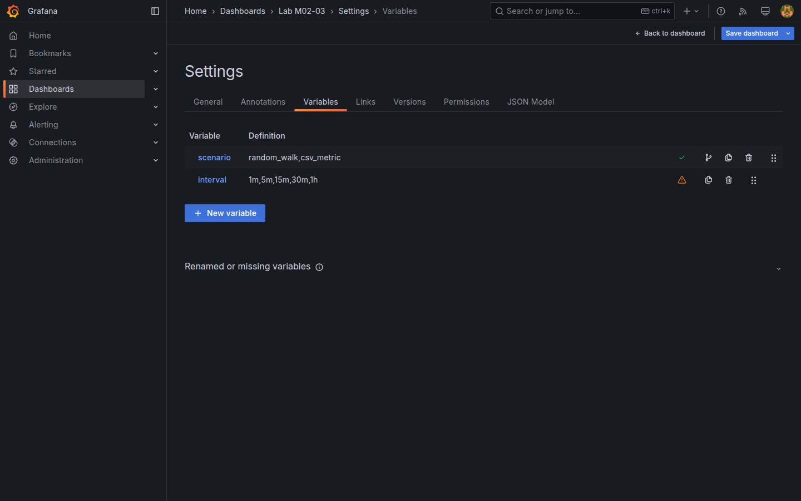
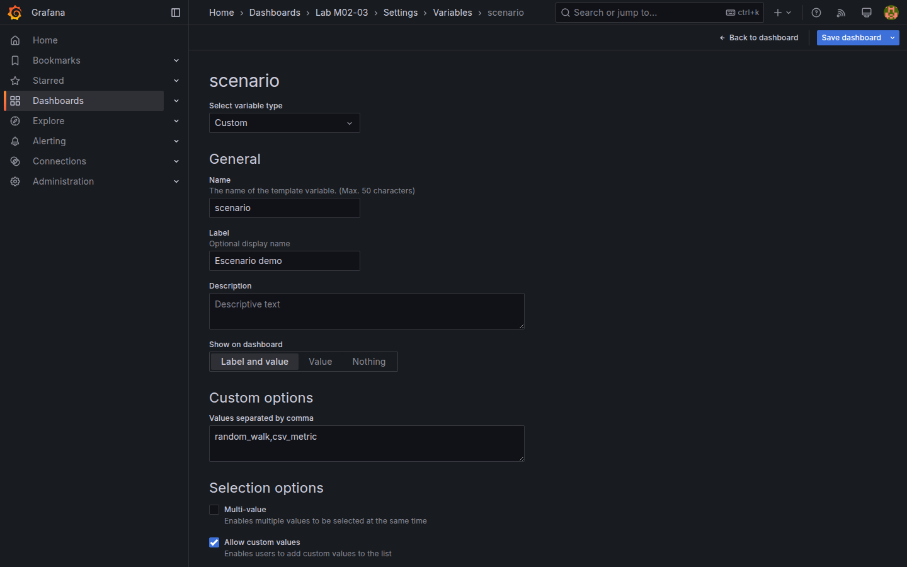
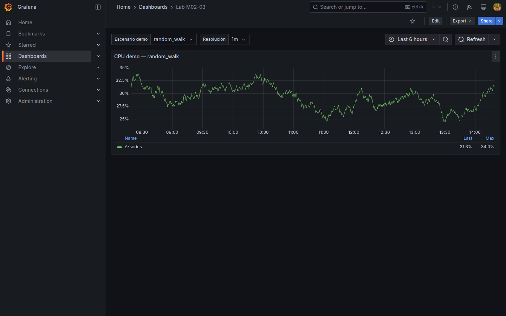
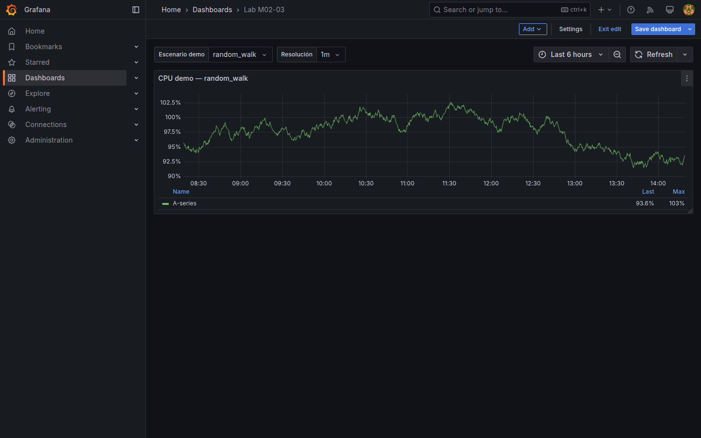
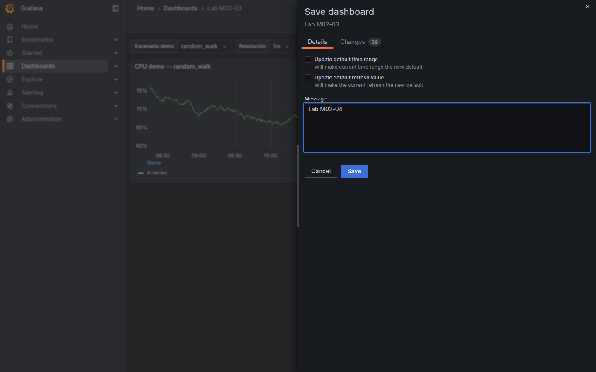
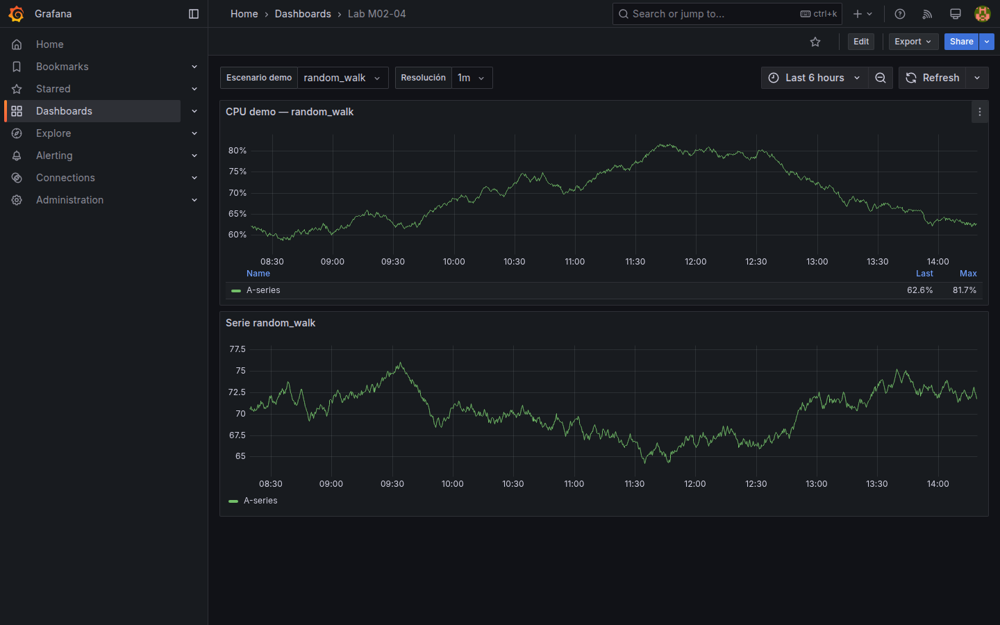

# M02-04 — Variables de dashboard

[← Página anterior](M02-03-configuracion-paneles.md) · [Siguiente página →](../m03-fuentes-datos/README.md)

Un dashboard estático obliga a duplicar tableros por entorno, intervalo o escenario. Las **variables de dashboard** parametrizan títulos, repeticiones de filas y — cuando la fuente lo permite — consultas, de modo que un solo tablero sirva a varios contextos.

En esta unidad trabajas sobre `Lab M02-03` con **TestData**. Crearás variables **custom** e **interval** y usarás **Repeat** en una fila. No registrarás Prometheus ni PostgreSQL (M03).

### Objetivos

Al cerrar la unidad deberías:

- Crear variables **Custom** e **Interval** desde **Dashboard settings → Variables**.
- Referenciar `$variable` en títulos de panel y comprobar el cambio al seleccionar otro valor.
- Repetir una fila por los valores de una variable (**Repeat for**).
- Guardar el resultado en `Lab M02-04` y verificar persistencia.

---

## Conceptos

Una **variable de dashboard** es un control en la barra superior del tablero (junto al selector temporal). Al cambiar su valor, Grafana recalcula paneles que dependen de ella.

Tipos habituales en Grafana 11:

| Tipo | Uso típico | Ejemplo en el lab |
|------|------------|-------------------|
| **Custom** | Lista fija definida por el autor | Escenarios TestData: `random_walk`, `csv` |
| **Interval** | Resolución mínima del eje temporal | `1m`, `5m`, `15m` |
| **Constant** | Valor oculto, útil en plantillas | `Main Org` |
| **Query** | Valores desde una consulta a datasource | En [M04-04](../../m04-paneles-personalizacion/M04-04-filtros-agrupamientos.md) con Prometheus/PostgreSQL |

La sintaxis **`$nombre`** (o `${nombre}`) inserta el valor actual en títulos, descripciones y — en módulos posteriores — en consultas PromQL o SQL.

**Repeat options** (en fila o panel): duplica el contenedor por cada valor seleccionado de una variable. Cada copia recibe el valor concreto en `$variable`, ideal para comparar escenarios TestData sin clonar paneles a mano.

**Multi-value** y **Include All** amplían el selector; en esta unidad basta con selección simple.

---

## En Grafana

Con `Lab M02-03` abierto, el menú del dashboard (**⚙** o **Dashboard settings**) incluye la sección **Variables**. El botón **Add variable** abre un formulario con **Name**, **Type** y opciones según el tipo.

Para una variable **Custom** llamada `scenario`, el campo **Custom options** acepta valores separados por coma (`random_walk, csv_metric`). **Label** puede ser `Escenario demo` para la UI.

Una variable **Interval** llamada `interval` suele definirse con **Auto option** activada y valores como `1m,5m,15m,30m,1h`. Grafana la usa como **Min interval** en paneles time series cuando el panel referencia `$interval`.

En **Panel options → Title**, la cadena `Demo: $scenario` se sustituye al cambiar el selector superior. Tras **Apply**, el título refleja el valor activo.









En una **Row**, **Repeat options → Repeat by variable** con `scenario` genera una fila por valor (`random_walk`, `csv_metric`). Los paneles hijos pueden incluir `$scenario` en el título para distinguir copias.

---

## Laboratorio

### Objetivo

Parametrizar un dashboard TestData con variables custom e interval, repetir una fila por escenario y persistir el tablero como `Lab M02-04`.

### En qué consiste

1. Abrir `Lab M02-03` y crear variables `scenario` (Custom) e `interval` (Interval).  
2. Ajustar el título de un panel existente con `$scenario`.  
3. Añadir una fila con **Repeat for** `scenario` y un panel TestData por copia.  
4. Guardar como `Lab M02-04` y validar el selector en modo vista.

Referencia del listado de variables (paso 1):


### 1 — Variables del dashboard

**Acción:** abre `Lab M02-03` → **Dashboard settings** → **Variables** → **Add variable**.

- **scenario:** Type **Custom**, Label `Escenario demo`, Values `random_walk, csv_metric` (o `csv` según lista TestData de tu versión). **Apply** en el formulario de variable.  
- **interval:** Type **Interval**, Label `Resolución`, Values `1m,5m,15m,30m,1h`, **Auto option** activada. **Apply**.

Vuelve al dashboard (**← Back to dashboard**). Comprueba que aparecen dos selectores en la barra superior.

**Por qué:** separa «qué escenario mostrar» de «con qué granularidad temporal» antes de conectar fuentes reales en M03.

**Resultado esperado:** selectores `Escenario demo` e `Resolución` visibles; valores conmutables sin error.


### 2 — Título parametrizado

**Acción:** edita el panel time series existente. En **Panel options → Title**, escribe `CPU demo — $scenario`. **Apply**.

**Por qué:** demuestra interpolación de variables sin tocar la consulta TestData.

**Resultado esperado:** el título incluye el valor actual de `scenario` (p. ej. `CPU demo — random_walk`).


### 3 — Fila repetida por escenario

**Acción:** **Add** → **Row**. Título de fila: `Escenario: $scenario`. En opciones de la fila, **Repeat by variable** → `scenario`. Dentro de la fila, **Add** → **Visualization** → TestData:

- Para la copia `random_walk`: escenario **Random walk**, título `Serie $scenario`, visualización **Time series**.  
- Grafana creará una segunda copia al repetir; en la copia `csv_metric`, elige escenario **CSV Metric** (o equivalente) y mantén el título con `$scenario`.

**Apply** en cada panel y vuelve al dashboard.

**Por qué:** **Repeat** evita duplicar manualmente paneles idénticos con distinto escenario TestData.

**Resultado esperado:** dos sub-filas o paneles repetidos, uno por valor de `scenario`, con títulos distintos.

### 4 — Guardar Lab M02-04

**Acción:** **Save dashboard** → nombre `Lab M02-04` (**Save as copy** recomendado). Recarga la página. Cambia `Escenario demo` y observa títulos y filas visibles.

**Por qué:** fija el artefacto del módulo M02 antes de pasar a datasources en M03.

**Resultado esperado:** dashboard `Lab M02-04` persistente; al cambiar `scenario`, los títulos con `$scenario` se actualizan.





---

## Qué sigue — cierre de M02 y entrada a M03

Hasta aquí todos los paneles usaron **TestData**: datos sintéticos integrados en Grafana, sin contenedor extra. Eso es deliberado — M02 enseña **interfaz**, paneles, variables y presentación antes de conectar backends reales.

En **M03** registrarás las fuentes del repo (**Prometheus**, **PostgreSQL**, **Loki**) y dejarás TestData como herramienta auxiliar. El flujo recomendado:

1. [M03-01](../m03-fuentes-datos/M03-01-tipos-fuentes-datos.md) — qué tipo de fuente responde a cada pregunta (métricas, logs, SQL).  
2. [M03-02](../m03-fuentes-datos/M03-02-configuracion-fuentes.md) — taller: alta de **Prometheus-Lab** y consulta PromQL con la métrica **`up`** (disponibilidad del target).  
3. [M03-03](../m03-fuentes-datos/M03-03-conexion-externa.md) — PostgreSQL y Loki.

Si aún no tienes `Lab M02-04` guardado, complétalo antes de M03-02; el resto de M03-01 puedes leerlo sin entorno adicional.

---

## Conclusiones

- Las variables viven a nivel **dashboard**, no panel; se gestionan en **Dashboard settings → Variables**.
- **Custom** e **Interval** no requieren datasource externa — útiles con TestData en M02.
- **`$nombre`** en títulos y **Repeat for** preparan tableros reutilizables antes de PromQL/SQL parametrizado (M04).
- **Query variables** (desde Prometheus o PostgreSQL) se practican al tener fuentes registradas (M03–M04).
- Un solo dashboard parametrizado reduce copias divergentes entre entornos.

---

## Comprueba tu entendimiento

**Variables creadas**  
Abre `Lab M02-04` → **Dashboard settings → Variables**.  
→ Existen `scenario` (Custom) e `interval` (Interval).

**Interpolación en título**  
Con `scenario = csv_metric`, localiza el panel cuyo título incluye `$scenario`.  
→ El título muestra `csv_metric` (o el valor equivalente elegido).

**Repeat**  
Cuenta paneles o filas generadas por la variable `scenario`.  
→ Al menos dos instancias (una por valor de la lista custom).

**API**

```bash
curl -s -u admin:admin "http://localhost:3000/api/search?query=Lab%20M02-04" | head -c 200
```

→ JSON con `"title":"Lab M02-04"`.

---

## Reto

### 1 — Variable constante

Añade una variable **Constant** `org_label` con valor `Main Org` y úsala en la descripción del dashboard (**Settings → General → Description**: `Organización: $org_label`).

<details>
<summary>Ver solución</summary>

**Dashboard settings → Variables → Add variable:** Type **Constant**, Name `org_label`, Value `Main Org`. En **General → Description**, escribe `Organización: $org_label`. Guarda. La constante no aparece como selector; la descripción muestra el valor fijo.

</details>

### 2 — Multi-value en scenario

Activa **Multi-value** y **Include All** en `scenario`. Observa cómo **Repeat** y los títulos reaccionan al seleccionar varios valores.

<details>
<summary>Ver solución</summary>

Edita `scenario` → **Multi-value** ON, **Include All** ON. En vista dashboard, selecciona dos escenarios: las filas repetidas muestran solo los seleccionados; **All** expande a todos los valores de la lista. En producción conviene limitar **All** en tableros pesados.

</details>

### 3 — Interval en panel time series

En un panel time series, **Query options → Min interval** → `$interval`. Cambia la variable **Resolución** y observa la densidad de puntos.

<details>
<summary>Ver solución</summary>

Edita panel → pestaña de consulta → **Query options** → **Min interval** `$interval`. **Apply**. Al pasar de `1m` a `15m`, la agregación temporal cambia (menos puntos en ventanas largas). Con TestData el efecto es pedagógico; con Prometheus es crítico para rendimiento.

</details>
