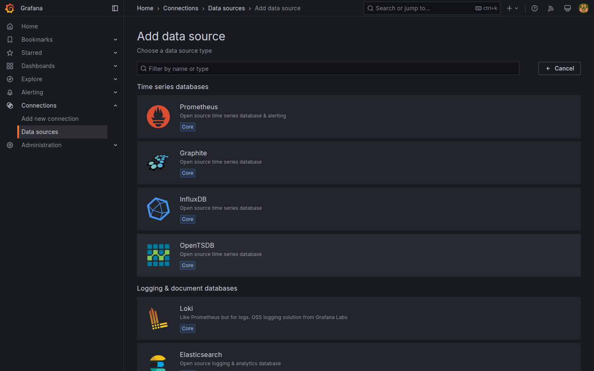

# M03-01 — Tipos de fuentes de datos compatibles

[← Página anterior](README.md) · [Siguiente página →](M03-02-configuracion-fuentes.md)

Hasta M02 trabajaste con **TestData** integrado. En operaciones reales Grafana actúa como **capa de visualización** sobre fuentes heterogéneas: métricas, logs, SQL y sintéticos. Antes de registrar conexiones conviene clasificar qué tipo de pregunta responde cada una en el lab.

En esta unidad no darás de alta datasources en la UI. Tras **Conceptos** y **En Grafana**, valida con **Comprueba tu entendimiento**; el taller de registro empieza en [M03-02](M03-02-configuracion-fuentes.md).

### Objetivos

Al cerrar la unidad deberías:

- Diferenciar **métricas**, **logs** y **SQL** en el contexto del stack del curso.
- Relacionar Prometheus, Loki, PostgreSQL y TestData con casos de uso de M01.
- Describir qué ocurre en **Connections → Data sources** antes y después del registro.
- Identificar el parámetro de conexión clave de cada fuente del lab (URL, host, BD).

---

## Conceptos

Grafana no almacena series de producción por defecto: **consulta en vivo** (o cachea resultados) contra backends registrados como **datasources**.

Clasificación alineada con el **lab**:

| Tipo lógico | Pregunta | Datasource del curso | Protocolo / lenguaje |
|-------------|----------|----------------------|----------------------|
| **Métricas** | ¿Cuánto / cuán rápido / tendencia? | **Prometheus** | PromQL, series temporales |
| **Logs** | ¿Qué ocurrió / qué texto? | **Loki** | LogQL, streams con labels |
| **Relacional / SQL** | ¿Agregados de negocio, sensores, eventos? | **PostgreSQL** | SQL sobre tablas demo |
| **Sintético** | ¿Practicar UI sin backend? | **TestData** (built-in) | Escenarios Random walk, CSV… |

**Prometheus** en el lab **scrapea** (interroga periódicamente) dos **targets**: el propio servicio Prometheus y **node-exporter** (métricas del host — ver `infra/prometheus/prometheus.yml`). Cada consulta devuelve **series temporales**: un **nombre de métrica**, **labels** (pares clave=valor que identifican origen) y puntos `(tiempo, valor)`.

En [M03-02](M03-02-configuracion-fuentes.md) registrarás Prometheus en Grafana y ejecutarás una consulta PromQL sobre **`up`**. Métricas de carga (`node_cpu_*`, red, disco) aparecen en [M04-01](../../m04-paneles-personalizacion/M04-01-configuracion-avanzada-paneles.md).

**Loki** recibe logs de **loggen-lab** vía **promtail-lab**. Consultas filtran por labels (`job`, `service`, etc.).

**PostgreSQL** (`lab` / usuario `grafana`) expone tablas `daily_sales`, `regions`, `sensor_readings`, `http_events` — escenarios negocio, IoT e IT del curso.

**TestData** no requiere contenedor; ideal en M02, sustituible progresivamente desde M03.

Cada datasource tiene **tipo** (plugin), **nombre** visible en paneles y **configuración de acceso** (URL desde Grafana: nombres de servicio Docker `prometheus`, `postgres`, `loki`).

**Default datasource:** la primera fuente marcada como predeterminada acelera altas de paneles; en el lab puedes dejar Prometheus tras M03-02.

---

## En Grafana

En **Connections → Data sources**, antes de M03-02 la lista puede estar vacía o mostrar solo entradas previas de prácticas. El botón **Add new data source** abre un catálogo: **Prometheus**, **Loki**, **PostgreSQL**, **TestData** (como `-- Grafana --`) aparecen entre los tipos habituales.

Al elegir un tipo sin guardar, el formulario muestra campos distintos:

- **Prometheus / Loki:** campo **URL** (`http://prometheus:9090`, `http://loki:3100` desde el contenedor Grafana).  
- **PostgreSQL:** **Host**, **Database**, **User**, **Password**, **TLS/SSL** desactivado en lab.  
- **TestData:** no requiere URL de red; se selecciona al crear paneles.

El botón **Save & test** (tras configurar) valida conectividad desde Grafana, no desde el navegador del alumno. Un fallo habitual es usar `localhost` en lugar del **nombre de servicio** Docker cuando Grafana corre en contenedor.

Documentación de referencia del repo: [infra/README.md](../../infra/README.md) — tabla de parámetros por fuente.

---

## Conclusiones

- Una datasource = tipo + credenciales + endpoint; Grafana unifica visualización, no sustituye el almacén.
- **Prometheus** (métricas), **Loki** (logs) y **PostgreSQL** (SQL) cubren los escenarios enterprise del curso; **TestData** cierra la brecha pedagógica de M02.
- Desde el contenedor Grafana las URLs usan **hostnames de servicio**, no `localhost` del portátil.
- **Save & test** confirma reachability antes de diseñar paneles costosos.
- El catálogo de tipos es extensible (plugins); el lab se centra en los cuatro anteriores.

---

## Comprueba tu entendimiento

**Fuente por dato**  
¿Qué datasource consultarías para CPU del host vs logs de loggen-lab vs ventas SQL?  
→ **Prometheus**, **Loki**, **PostgreSQL** respectivamente.

**URL Prometheus**  
Según `infra/README.md`, ¿qué URL debe usar Grafana en Docker?  
→ `http://prometheus:9090`.

**TestData vs Prometheus**  
¿Cuál requiere contenedor en `docker-compose.yml`?  
→ **Prometheus** (TestData es integrado).

**Lista vacía**  
Tras login limpio, ¿qué muestra **Connections → Data sources**?  
→ Listado vacío o sin fuentes del curso hasta M03-02.

---

## Reto

### 1 — Explorar catálogo sin guardar

Abre **Add new data source** y localiza **Prometheus**, **Loki** y **PostgreSQL**. Anota un campo obligatorio distinto en cada formulario.

Ver solución

**Prometheus:** URL del servidor. **Loki:** URL (`http://loki:3100`). **PostgreSQL:** host/puerto, database, user, password, SSL mode. No pulses **Save** si solo exploras — evitas entradas duplicadas sin nombre claro.

### 2 — ¿Grafana almacena métricas?

Ver solución

Grafana **cachea** resultados de consulta y metadatos de dashboards; las series vivas permanecen en **Prometheus**, logs en **Loki**, filas en **PostgreSQL**. Grafana consulta al renderizar paneles o Explore.

### 3 — Default datasource

Ver solución

Tras registrar Prometheus en M03-02, en la ficha del datasource activa **Set as default**. Los nuevos paneles propondrán esa fuente primero. Solo una default por organización.

