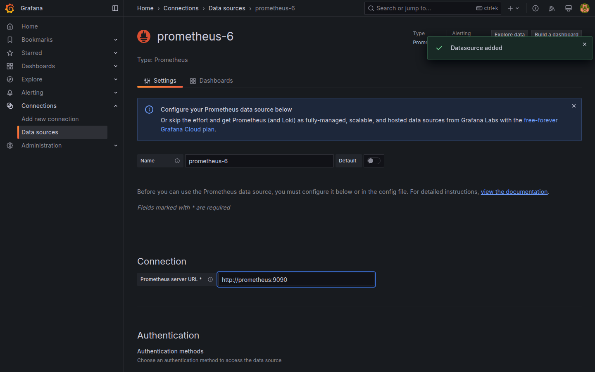
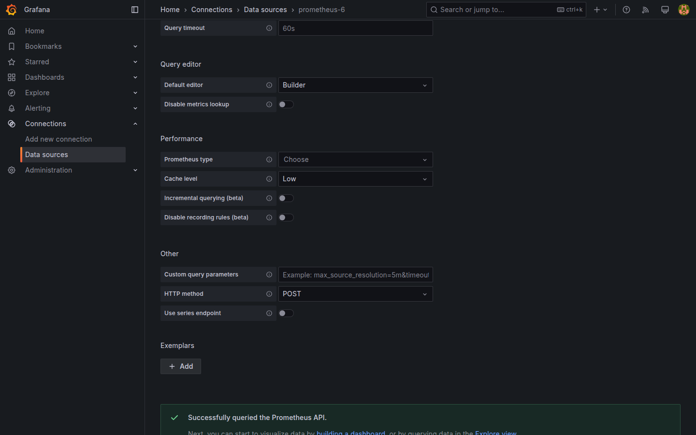
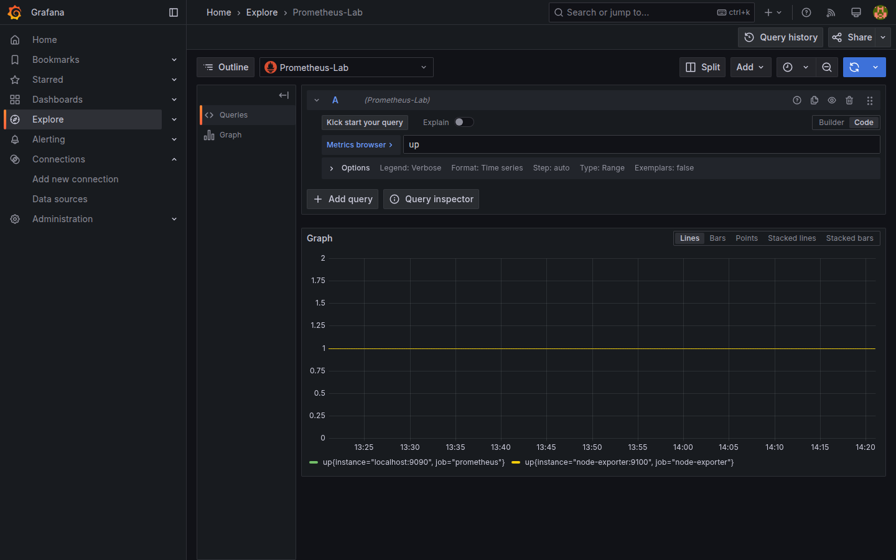

# M03-02 — Configuración de fuentes de datos

[← Página anterior](M03-01-tipos-fuentes-datos.md) · [Siguiente página →](M03-03-conexion-externa.md)

Conocer los tipos (M03-01) no basta: hay que **registrar** la fuente, validar conectividad desde Grafana y comprobar que las consultas devuelven series. En empresa un datasource mal configurado bloquea decenas de dashboards.

En esta unidad das de alta **Prometheus** en el lab, ejecutas **Save & test** y verificas métricas en **Explore**. PostgreSQL y Loki llegan en M03-03.

### Objetivos

Al cerrar la unidad deberías:

- Crear un datasource **Prometheus** con URL `http://prometheus:9090` y nombre reconocible.
- Ejecutar **Save & test** con mensaje de éxito.
- Consultar la métrica `up` en **Explore** y leer labels (`job`, `instance`).
- Opcionalmente marcar Prometheus como **default** datasource.

---

## Conceptos

**Alta de datasource:** tipo → nombre → parámetros → **Save & test**. El nombre (`Prometheus-Lab`) es lo que verás en selectores de panel; la URL es el endpoint HTTP que Grafana contacta **desde su contenedor**.

### Vocabulario Prometheus

Prometheus almacena **series temporales**. Cada serie tiene:

| Elemento | Qué es | Ejemplo en el lab |
|----------|--------|-------------------|
| **Nombre de métrica** | Identificador de lo medido | `up`, `node_cpu_seconds_total` |
| **Labels** | Pares `clave="valor"` que distinguen origen | `job="node-exporter"`, `instance="node-exporter:9100"` |
| **Punto** | Par `(marca temporal, valor numérico)` | `(14:05, 1)` |

**Target y scrape:** en `infra/prometheus/prometheus.yml` Prometheus lista **targets** (URLs a interrogar cada ~15 s). Ese proceso se llama **scrape**. Si el target responde, Prometheus guarda sus métricas; si no, registra el fallo.

**PromQL** es el lenguaje de consulta: escribes una expresión (p. ej. un nombre de métrica) y Prometheus devuelve las series que coinciden en el intervalo temporal elegido.

### La métrica `up`

**`up`** no la publica tu aplicación: la **genera Prometheus** para cada target configurado. Responde a la pregunta: *¿respondió este target al último scrape?*

| Valor | Significado |
|-------|-------------|
| **1** | El target respondió correctamente en el último scrape |
| **0** | El target no respondió o falló |

Es una métrica de tipo **gauge** (valor instantáneo 0 o 1, no un contador acumulativo). En Explore verás **una serie por target**, diferenciada por labels como `job` (grupo lógico del scrape) e `instance` (dirección concreta).

En el lab, tras conectar `Prometheus-Lab`, la consulta PromQL `up` suele devolver al menos dos series: `job="prometheus"` (auto-monitoreo) y `job="node-exporter"` (métricas del host). Es la **sonda mínima** antes de consultas de CPU, red o disco (M04).

**Save & test** al guardar el datasource puede ejecutar internamente una consulta de prueba (a menudo equivalente a comprobar que Prometheus responde y devuelve series). Errores frecuentes:

| Síntoma | Causa habitual |
|---------|----------------|
| Connection refused | URL incorrecta o servicio caído (`docker compose ps`) |
| Timeout | Red Docker rota; reiniciar stack |
| 401/403 | Autenticación activada (no aplica en lab) |

**Explore** es el entorno ad hoc para probar PromQL sin crear dashboard. Tras elegir `Prometheus-Lab`, el campo de consulta acepta expresiones; empieza por `up` en el laboratorio de esta unidad.

**Default datasource:** acelera altas posteriores; conviene asignarla a la fuente principal de métricas del equipo.

---

## En Grafana

En **Connections → Data sources → Add new data source**, la tarjeta **Prometheus** abre un formulario con **Name**, **URL**, **Access** (Server — Grafana proxy al backend) y opciones avanzadas (Scrape interval, HTTP method).

Con **URL** `http://prometheus:9090` y **Access** *Server*, Grafana resuelve el hostname dentro de la red `docker compose`. Tras **Save & test**, un banner verde confirma que la fuente responde.





En **Explore**, al seleccionar `Prometheus-Lab`, la barra de consulta muestra **Metrics browser** y el campo PromQL. Escribe `up` y pulsa **Run query**: verás una línea por target (valor 0 o 1) y, en la vista **Table**, los labels `job` e `instance` de cada serie.



El selector temporal superior (`Last 1 hour`) aplica igual que en dashboards.

---

## Laboratorio

### Objetivo

Registrar **Prometheus-Lab**, validar con **Save & test** y confirmar métricas `up` en **Explore**.

### En qué consiste

1. Comprobar que el stack está en marcha.  
2. Alta de datasource Prometheus.  
3. **Save & test** exitoso.  
4. Consulta `up` en Explore.  
5. (Opcional) Default datasource y comprobación por API.

### 1 — Stack operativo

**Acción:**

```bash
bash infra/up.sh
curl -s -u admin:admin http://localhost:3000/api/health
curl -s http://localhost:9090/-/ready
```

**Por qué:** Grafana y Prometheus deben responder antes de probar la conexión.

**Resultado esperado:** JSON `{"database":"ok"…}` en health; Prometheus `ready`.

### 2 — Alta Prometheus-Lab

**Acción:** **Connections → Data sources → Add new data source → Prometheus**.

- **Name:** `Prometheus-Lab`  
- **URL:** `http://prometheus:9090`  
- **Access:** Server (default)

**Por qué:** el nombre establece convención para el resto del curso; la URL usa el servicio Docker documentado en [infra/README.md](../../infra/README.md).

**Resultado esperado:** formulario completo sin errores de validación en cliente.


### 3 — Save & test

**Acción:** pulsa **Save & test**. Espera mensaje de datasource working / successfully connected.

**Por qué:** confirma reachability desde Grafana, no solo que Prometheus responda en el host.

**Resultado esperado:** indicador verde; la entrada aparece en el listado de datasources.


### 4 — Explore con `up`

**Acción:** **Explore** → datasource `Prometheus-Lab` → consulta `up` → **Run query**. Revisa el gráfico (0/1) y la tabla de labels.

**Por qué:** aplica la definición de **Conceptos** — confirmar que los targets del lab responden antes de consultas más complejas en M04 (`node_*`, `rate()`, etc.).

**Resultado esperado:** al menos dos series (`job="prometheus"`, `job="node-exporter"` o equivalente); valores 0 o 1 en la ventana temporal.


### 5 — Default (opcional) y API

**Acción:** en la ficha del datasource, **Set as default** si está disponible. Comprueba listado:

```bash
curl -s -u admin:admin http://localhost:3000/api/datasources | python3 -m json.tool | head -40
```

**Por qué:** la API replica lo que verás al automatizar provisioning (M09).

**Resultado esperado:** JSON con entrada `"name":"Prometheus-Lab"`, `"type":"prometheus"`, `"url":"http://prometheus:9090"`.

---

## Conclusiones

- El datasource Prometheus se define con **nombre + URL + access Server** en el lab Docker.
- **Save & test** es el gate antes de paneles y alertas.
- **`up`** (0/1 por target) valida que el scrape funciona; los labels `job` / `instance` preparan filtros de M04.
- **Explore** acelera iteración PromQL sin ensuciar dashboards.
- PostgreSQL y Loki siguen el mismo patrón de alta con otros campos (M03-03).

---

## Comprueba tu entendimiento

**Datasource registrado**  
**Connections → Data sources**  
→ Aparece `Prometheus-Lab` tipo Prometheus.

**Consulta Explore**  
Con `Prometheus-Lab`, ejecuta `up`.  
→ Gráfico o tabla con series y labels `job`.

**Qué mide `up`**  
Con valor **1** en una serie `job="node-exporter"`, ¿qué significa?  
→ Ese target respondió al último scrape de Prometheus (está **UP**). **0** = no respondió.

**URL correcta**  
Abre la ficha del datasource.  
→ URL `http://prometheus:9090` (no `localhost:9090` desde contenedor Grafana).

**API**

```bash
curl -s -u admin:admin "http://localhost:3000/api/datasources/name/Prometheus-Lab"
```

→ Objeto JSON con `"type":"prometheus"`.

---

## Reto

### 1 — Explorar `node_cpu_seconds_total`

En Explore, consulta **`node_cpu_seconds_total`** con **Last 15 minutes**. Observa labels `cpu` y `mode`.

<details>
<summary>Ver solución</summary>

Explore → `node_cpu_seconds_total` → **Run query**. Muchas series (una por CPU/mode) son normales. Es un **contador** de segundos de CPU por modo; en [M04-01](../../m04-paneles-personalizacion/M04-01-configuracion-avanzada-paneles.md) la combinarás con **`rate()`**. Aquí basta con reconocer la cardinalidad de labels.

</details>

### 2 — Error deliberado

Duplica la entrada con URL `http://localhost:9090` (nombre `Prometheus-WRONG`) y ejecuta **Save & test**. Lee el mensaje de error.

<details>
<summary>Ver solución</summary>

Desde el contenedor Grafana, `localhost` apunta al propio Grafana, no al host. **Save & test** falla (connection refused). Corrige a `http://prometheus:9090` o borra la entrada errónea.

</details>

### 3 — Instant query

En Explore, cambia el tipo de consulta a **Instant** (si visible) con `up` y compara con **Range**.

<details>
<summary>Ver solución</summary>

**Range** devuelve puntos en el intervalo temporal; **Instant** un valor en un instante (`now`). Útil para stats y alertas puntuales.

</details>
