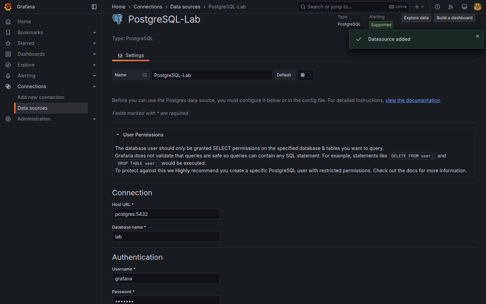
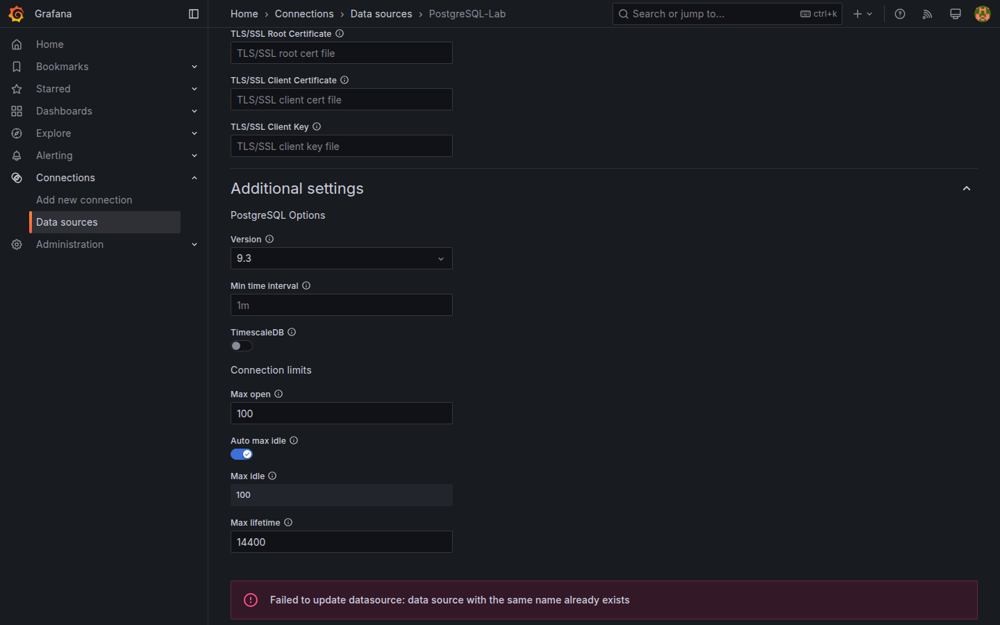
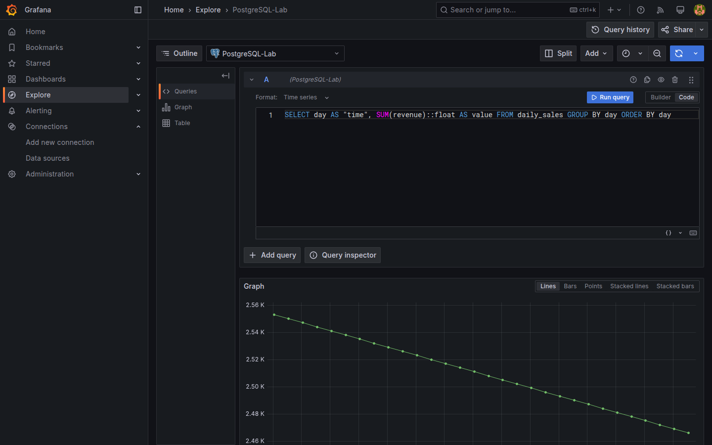
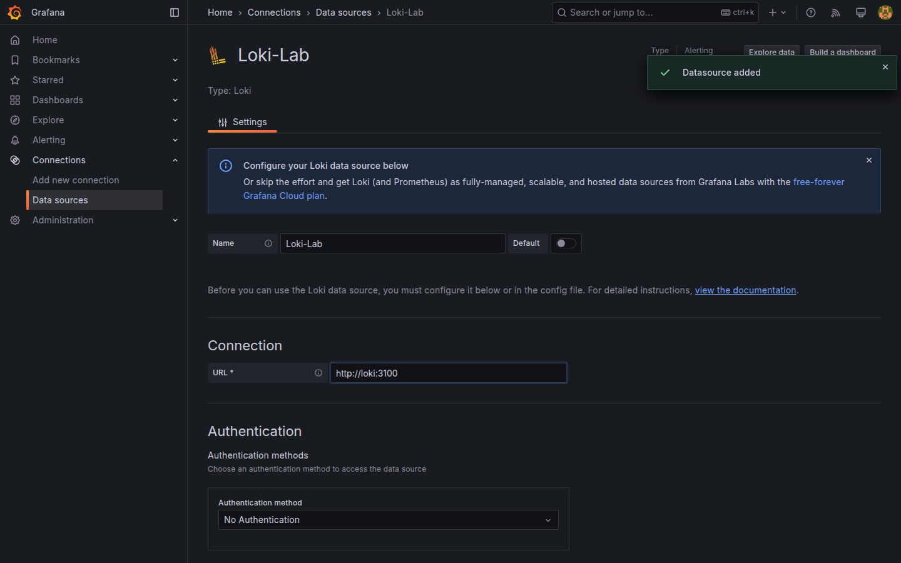
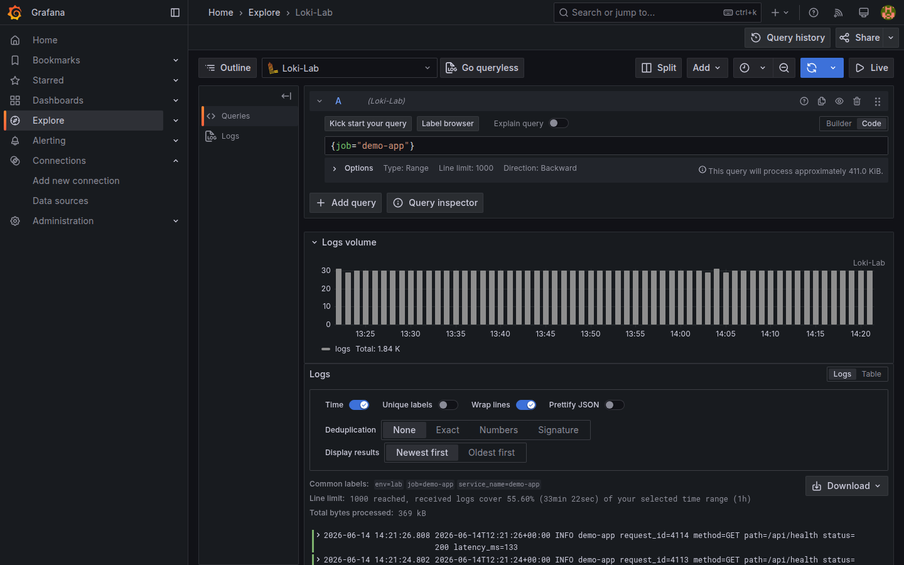
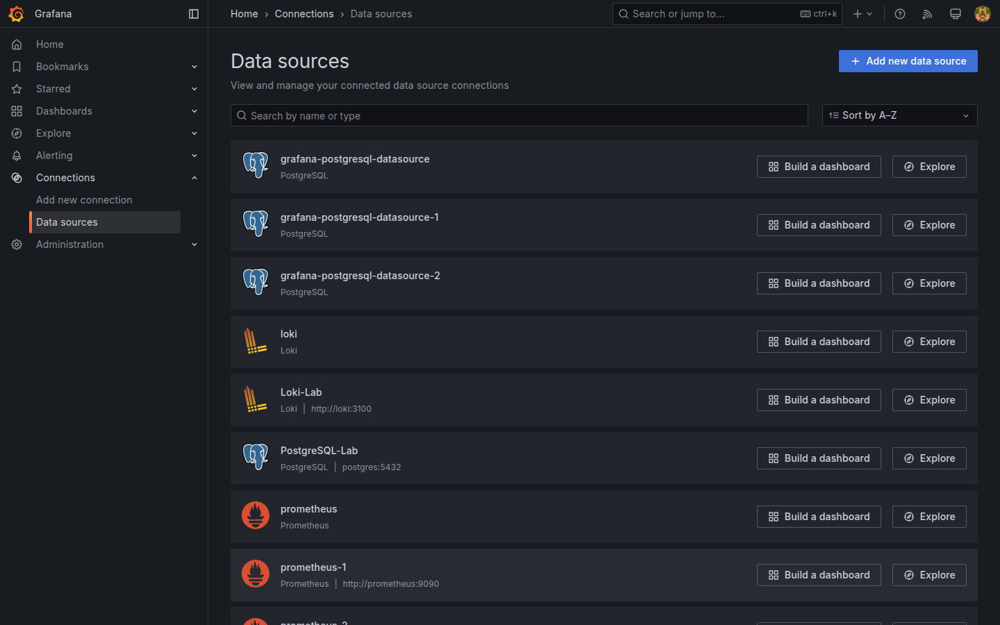

# M03-03 — Conexión a bases de datos y servicios externos

[← Página anterior](M03-02-configuracion-fuentes.md) · [Siguiente página →](../m04-paneles-personalizacion/README.md)

Prometheus cubre métricas; muchos equipos enterprise combinan **SQL de negocio**, **logs** y **métricas** en un mismo tablero. Completar el triángulo del lab implica registrar **PostgreSQL** y **Loki** y validar consultas representativas.

En esta unidad das de alta ambas fuentes, ejecutas **Save & test** y pruebas una consulta SQL y una LogQL en **Explore**. No crearás dashboards completos (M04–M05).

### Objetivos

Al cerrar la unidad deberías:

- Registrar **PostgreSQL-Lab** con host `postgres:5432`, BD `lab`, usuario `grafana`.
- Registrar **Loki-Lab** con URL `http://loki:3100`.
- Ejecutar consulta SQL sobre `daily_sales` y consulta LogQL sobre streams del lab.
- Verificar las tres fuentes principales (`Prometheus-Lab`, `PostgreSQL-Lab`, `Loki-Lab`) en el listado.

---

## Conceptos

**PostgreSQL como datasource:** Grafana envía SQL en modo **Time series** (columna temporal + valor numérico) o **Table**. Requiere:

| Campo | Valor lab |
|-------|-----------|
| Host | `postgres:5432` |
| Database | `lab` |
| User / Password | `grafana` / `grafana` |
| TLS/SSL | disable |
| Version | 16+ (según selector) |

Tablas demo: `daily_sales` (ventas por día y región), `sensor_readings` (IoT), `http_events` (IT), `regions` (dimensiones).

### Consulta SQL en Explore

Grafana envía tu **SQL** al PostgreSQL del lab y espera columnas con nombres concretos según el **formato** elegido:

| Formato | Columnas esperadas | Uso |
|---------|-------------------|-----|
| **Time series** | `time` (timestamp) + `value` (numérico) | Gráfico de línea en Explore |
| **Table** | Una o más columnas arbitrarias | Filas de resultado |

En esta unidad usarás **time series** sobre `daily_sales`: agregas `revenue` por `day` y alias `day AS "time"`.

### LogQL

**LogQL** consulta **logs** en Loki (no métricas). Toda expresión empieza por un **selector de labels** entre llaves, p. ej. `{job="demo-app"}`, que define **qué streams** entran en la búsqueda. **Promtail** etiqueta cada línea ingerida desde **loggen-lab** con `job="demo-app"` y `env="lab"` (ver `infra/promtail/promtail-config.yaml`).

Tras el selector puedes filtrar texto (`|= "error"`), pero el primer paso es siempre elegir labels correctos en el **Label browser** de Explore.

**Servicios externos** en sentido curso = backends fuera del proceso Grafana pero dentro del stack Docker (no SaaS del cliente). El patrón es idéntico para endpoints fuera del compose en producción (host + credenciales + TLS).

**Explore multi-datasource:** el selector superior cambia entre editores PromQL / SQL / LogQL sin salir de Explore (PromQL en [M03-02](M03-02-configuracion-fuentes.md)).

---

## En Grafana

El formulario **PostgreSQL** muestra host, base, credenciales y **Connection limits**. Tras **Save & test**, Grafana puede listar tablas en el editor de consultas SQL.

Una consulta de prueba sobre ventas:

```sql
SELECT day AS "time", SUM(revenue) AS value
FROM daily_sales
GROUP BY day
ORDER BY day
```

Formato **Time series** espera columna temporal (`time`) y valor numérico.





En **Loki**, **Save & test** valida `/ready`. En Explore, `{job="demo-app"}` muestra líneas de **loggen-lab** ingeridas por promtail (labels `job`, `env`).







Listado final con las tres fuentes del curso:



---

## Laboratorio

### Objetivo

Completar el registro de **PostgreSQL-Lab** y **Loki-Lab**, validar con **Save & test** y ejecutar consultas de smoke test en **Explore**.

### En qué consiste

1. Alta PostgreSQL-Lab.  
2. Consulta SQL de ventas en Explore.  
3. Alta Loki-Lab.  
4. Consulta LogQL en Explore.  
5. Revisión del listado de datasources.

### 1 — PostgreSQL-Lab

**Acción:** **Add new data source → PostgreSQL**.

- **Name:** `PostgreSQL-Lab`  
- **Host:** `postgres:5432`  
- **Database:** `lab`  
- **User / Password:** `grafana` / `grafana`  
- **TLS/SSL:** disable  

**Save & test** → success.

**Por qué:** SQL alimenta paneles de negocio e IoT del curso sin duplicar datos en Prometheus.

**Resultado esperado:** datasource operativo; mensaje verde en test.

### 2 — Explore SQL

**Acción:** **Explore** → `PostgreSQL-Lab` → modo **Code** → pega:

```sql
SELECT day AS "time", SUM(revenue) AS value
FROM daily_sales
GROUP BY day
ORDER BY day
```

Formato **Time series** → **Run query**.

**Por qué:** confirma esquema `daily_sales` y convención columna `time`.

**Resultado esperado:** serie temporal de ingresos agregados (~30 días demo).

### 3 — Loki-Lab

**Acción:** **Add new data source → Loki**.

- **Name:** `Loki-Lab`  
- **URL:** `http://loki:3100`  

**Save & test** → success.

**Por qué:** cierra el triángulo métricas / logs / SQL del stack.

**Resultado esperado:** datasource Loki operativo.

### 4 — Explore LogQL

**Acción:** **Explore** → `Loki-Lab`. Abre **Label browser** y elige el label `job` con valor `demo-app` (configurado en promtail del lab). Consulta:

```logql
{job="demo-app"}
```

Si no ves líneas, prueba `{env="lab"}`. **Run query**.

**Por qué:** LogQL siempre filtra por labels antes de buscar texto; el browser evita adivinar nombres.

**Resultado esperado:** líneas de log en ventana temporal (loggen continuo).

### 5 — Inventario de fuentes

**Acción:** **Connections → Data sources**. Confirma:

- `Prometheus-Lab` (M03-02)  
- `PostgreSQL-Lab`  
- `Loki-Lab`  

```bash
curl -s -u admin:admin http://localhost:3000/api/datasources | python3 -c "import sys,json; d=json.load(sys.stdin); print([x['name'] for x in d])"
```

**Por qué:** inventario claro antes de M04 (paneles multi-fuente).

**Resultado esperado:** listado con al menos tres nombres anteriores.

---

## Conclusiones

- **PostgreSQL** y **Loki** completan fuentes del lab junto a **Prometheus** registrado en M03-02.
- Hostnames **postgres** y **loki** son válidos solo desde red Docker; mismo patrón que `prometheus`.
- SQL de agregación requiere columna temporal alias `time` para time series.
- LogQL parte de **selectores de labels**; Explore Label browser reduce prueba-error.
- TestData sigue disponible pero el curso bascula a fuentes reales desde M04.

---

## Comprueba tu entendimiento

**Tres fuentes**  
Listado **Data sources**  
→ `Prometheus-Lab`, `PostgreSQL-Lab`, `Loki-Lab`.

**SQL ventas**  
Repite consulta agregada sobre `daily_sales`.  
→ Serie con puntos diarios de `value` (revenue).

**Loki responde**  
**Save & test** en Loki-Lab  
→ Mensaje de conexión correcta.

**Tabla IT**  
¿Qué tabla usarías para latencias HTTP demo?  
→ `http_events` (consulta en M04/M05).

---

## Reto

### 1 — SQL tabla

En Explore PostgreSQL, consulta:

```sql
SELECT ts AS "time", temperature_c AS value, site
FROM sensor_readings
WHERE site = 'plant-a'
ORDER BY ts
```

Formato **Time series** o **Table** según prefieras explorar labels.

<details>
<summary>Ver solución</summary>

**Time series** con columna extra `site` puede requerir formato **Table** o transformaciones (M04). Con una sola site, time series muestra temperatura en el tiempo.

</details>

### 2 — LogQL filtro status

Si los logs incluyen campo parseado o label de status, filtra errores. Si no, usa `{service=~".+"} |= "500"` como búsqueda de texto.

<details>
<summary>Ver solución</summary>

LogQL combina selectores `{…}` con filtros de línea `|=`, `|~`. Ejemplo: `{job=~".+"} |= "error"`. Ajusta al label set real del lab.

</details>

### 3 — Health por terminal

```bash
docker compose -f infra/docker-compose.yml exec postgres psql -U grafana -d lab -c "SELECT COUNT(*) FROM daily_sales;"
curl -s http://localhost:3100/ready
```

<details>
<summary>Ver solución</summary>

COUNT ≈ 90 filas (30 días × 3 regiones). Loki `ready` confirma servicio; Grafana **Save & test** valida desde el contenedor Grafana.

</details>
