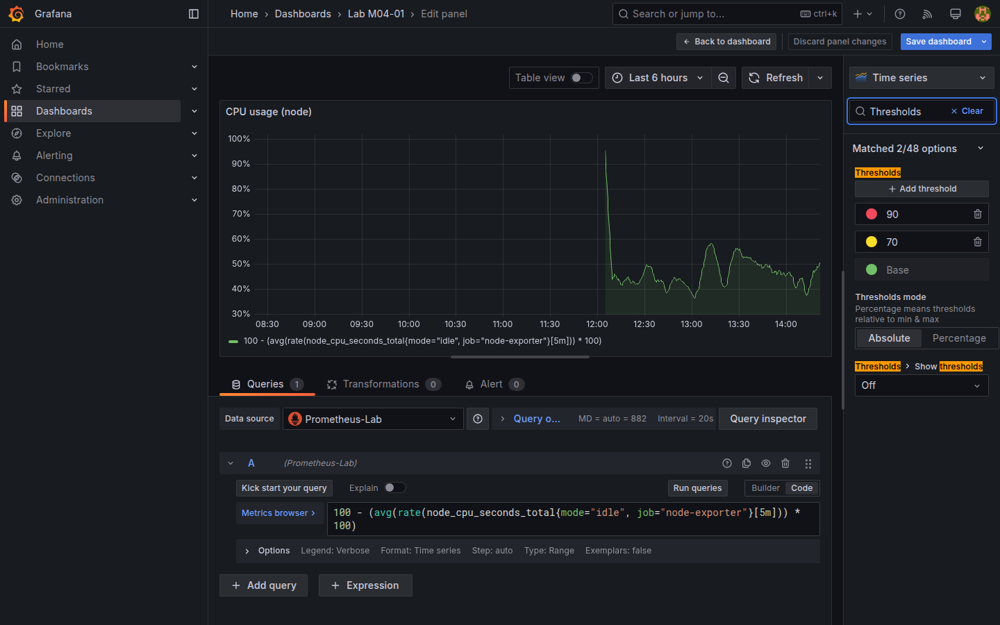
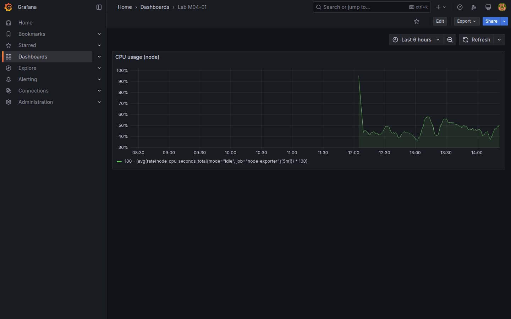

# M04-01 — Configuración avanzada de paneles

[← Página anterior](../m03-fuentes-datos/M03-03-conexion-externa.md) · [Siguiente página →](M04-02-metricas-consultas.md)

M02 cubrió unidad, leyenda y cambio de visualización básico. Con fuentes reales (M03) entran **field overrides**, **thresholds** por campo y **transformations** ligeras para alinear presentación con acuerdos de equipo (colores, unidades distintas por serie).

En esta unidad creas `Lab M04-01` con métricas **Prometheus** de node-exporter, aplicas overrides y umbrales, y guardas el dashboard.

### Objetivos

Al cerrar la unidad deberías:

- Crear un panel time series con `Prometheus-Lab` y métrica de CPU.
- Configurar **Standard options** y **Thresholds** globales del panel.
- Añadir **Field override** por regex o por nombre de campo (color, unit).
- Guardar dashboard `Lab M04-01`.

---

## Conceptos

**Field config** en Grafana 11 agrupa:

- **Defaults** — aplican a todos los campos del panel.  
- **Overrides** — reglas que coinciden por **field name**, **regex**, **labels** o tipo.

Un override típico: serie `user` en verde, `system` en amarillo; o forzar **Unit** `%` solo en campos que coincidan con `.*user.*`.

**Thresholds** definen steps de color (base + valores). Modos **Absolute** (valor fijo) o **Percentage** (del min/max). Afectan time series (línea/área), gauge y stat.

**Transformations** (pestaña **Transform data**) reorganizan resultados **después** de la consulta, sin modificar PromQL/SQL upstream: renombrar columnas, filtrar campos, unir tablas. En esta unidad usarás **Organize fields** para cambiar el nombre visible de una serie en leyenda y tooltip.

**Panel links** y **Description** documentan runbooks — práctica enterprise en paneles compartidos.

### Métrica de CPU y `rate()`

El contenedor **node-exporter** del lab publica métricas del host. **`node_cpu_seconds_total`** es un **contador**: segundos de CPU acumulados desde el arranque, con labels **`mode`** (`idle`, `user`, `system`, …) y **`cpu`**. Los contadores solo suben; no se grafican en bruto.

**`rate(metric[5m])`** es una función PromQL que calcula la **tasa por segundo** en los últimos cinco minutos a partir de la pendiente del contador. Es la forma habitual de convertir `_total` en algo interpretable.

En esta unidad aplicas la fórmula de **CPU ocupada %** aproximada: restar al 100 % el tiempo en **`mode="idle"`** (`100 - rate(idle) * 100`). La misma idea se reutiliza en M04–M05.

---

## En Grafana

Tras **Add visualization** con `Prometheus-Lab`, la consulta `100 - (avg by (mode) (rate(node_cpu_seconds_total{mode="idle", job="node-exporter"}[5m])) * 100)` aproxima **CPU usage %** (ajusta `job` si tu label difiere — comprueba en Explore con `node_cpu_seconds_total`).

En el sidebar, **Overrides → Add field override → Fields with name** (o regex) permite **Standard options → Color scheme** fixed color o **Unit** específica.

**Thresholds** en defaults: steps 70 (yellow), 90 (red) sobre base green — coherente con SLOs operativos.





---

## Laboratorio

### Objetivo

Dashboard `Lab M04-01` con panel CPU Prometheus, thresholds y al menos un field override visible.

### En qué consiste

1. Nuevo dashboard y panel CPU.  
2. Thresholds en defaults.  
3. Override de color o unidad en una serie/campo.  
4. Transform **Organize fields** (rename display name).  
5. Save `Lab M04-01`.

### 1 — Panel CPU Prometheus

**Acción:** **Dashboards → New → Add visualization** → `Prometheus-Lab`.

Consulta (ver **Conceptos**):

```promql
100 - (
  avg(rate(node_cpu_seconds_total{mode="idle", job="node-exporter"}[5m])) * 100
)
```

Visualización **Time series**. Título `CPU usage (node)`.

**Por qué:** métrica real del lab sustituye TestData; aquí combinas contador + `rate()`.

**Resultado esperado:** curva de CPU % en ventana temporal.

### 2 — Thresholds

**Acción:** en defaults del panel → **Thresholds** → mode **Absolute**, base **green**, step **70** yellow, **90** red.

**Por qué:** codifica semáforo acordado con negocio/ops.

**Resultado esperado:** tramos de color visibles en línea o área según valor.

### 3 — Field override

**Acción:** **Overrides → Add field override** → match por nombre del campo/refId → **Standard options → Color scheme** → fixed color (p. ej. blue) o **Unit** distinta.

**Por qué:** overrides resuelven excepciones sin duplicar paneles.

**Resultado esperado:** al menos un campo con estilo distinto al default.

### 4 — Organize fields

**Acción:** **Transform data → Organize fields** → renombra display name a `CPU % (5m avg)`.

**Por qué:** leyendas legibles en dashboards compartidos.

**Resultado esperado:** leyenda/tooltip muestran nombre amigable.

### 5 — Guardar

**Acción:** **Save dashboard** → `Lab M04-01`.

**Resultado esperado:** dashboard persistente con panel CPU configurado.

---

## Conclusiones

- **Overrides** refinan campos concretos; **defaults** establecen baseline del panel.
- **Thresholds** comunican estado (SLO) más rápido que leer ejes.
- **Transformations** post-procesan tablas/series sin reescribir PromQL/SQL.
- Métricas reales exigen validar **labels** (`job`, `instance`) en Explore antes del panel.
- Documentar panel (**Description**) reduce preguntas en war rooms.

---

## Comprueba tu entendimiento

**Datasource**  
Panel CPU usa  
→ `Prometheus-Lab`.

**Thresholds**  
Revisa steps configurados  
→ Base green, umbrales 70 y 90 (o equivalente documentado).

**Override activo**  
En editor, pestaña **Overrides**  
→ Al menos una regla listada.

**API**

```bash
curl -s -u admin:admin "http://localhost:3000/api/search?query=Lab%20M04-01"
```

→ Entrada con título `Lab M04-01`.

---

## Reto

### 1 — Override por regex

Crea override para campos que coincidan con regex `.*idle.*` (si existe serie idle en otra consulta) u oculta un campo con **Transform → Filter fields by name**.

<details>
<summary>Ver solución</summary>

**Add field override → Fields with regex** → patrón → **Hide in visualization** o color distinto. Útil cuando PromQL devuelve muchas series.

</details>

### 2 — Segundo panel memoria

Añade panel con `node_memory_MemAvailable_bytes` y unit **bytes(SI)** en defaults.

<details>
<summary>Ver solución</summary>

Consulta directa o ratio vs total. **Standard options → Unit → bytes(SI)**. Compara con CPU en mismo dashboard.

</details>

### 3 — Panel description

Añade **Description** con enlace a runbook interno (URL ficticia) y texto «Escalar si CPU &gt; 90% 15m».

<details>
<summary>Ver solución</summary>

**Panel options → Description** admite Markdown. Aparece tooltip/info en vista dashboard.

</details>
