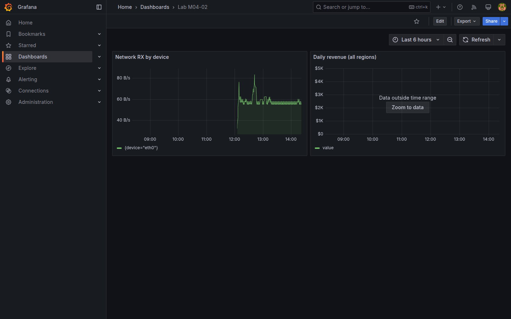

# M04-02 — Utilización de métricas y consultas

[← Página anterior](M04-01-configuracion-avanzada-paneles.md) · [Siguiente página →](M04-03-funciones-operaciones.md)

Un panel enterprise nace de una **consulta correcta**: labels, rangos temporales y convenciones PromQL/SQL. Mal formulada, distorsiona SLOs aunque el gráfico sea bonito.

En esta unidad amplías `Lab M04-01` (o creas `Lab M04-02`) con consultas **Prometheus** y **PostgreSQL**, interpretas labels y validas resultados en **Explore** antes de fijar paneles.

### Objetivos

Al cerrar la unidad deberías:

- Escribir consultas PromQL con **selectores de labels** y ventana `[5m]`.
- Crear panel SQL sobre `daily_sales` con formato time series.
- Comparar exploración en **Explore** vs panel embebido.
- Documentar en título qué pregunta responde cada panel.

---

## Conceptos

En M04-01 ya usaste **`rate()`** sobre contadores y la métrica **`node_cpu_seconds_total`**. Aquí amplías PromQL con otra métrica de **node-exporter** y llevas SQL de Explore (M03-03) a un **panel** de dashboard.

### Tráfico de red — `node_network_receive_bytes_total`

**`node_network_receive_bytes_total`** es otro **contador**: bytes recibidos por interfaz de red desde el arranque. Cada interfaz es una serie distinta; el label **`device`** identifica la tarjeta (`eth0`, `lo`, …). Aplicas de nuevo **`rate(...[5m])`**, que en este caso da **bytes por segundo** recibidos.

**`sum by (device) (...)`** agrega series con el mismo valor de label `device` y devuelve **una línea por interfaz**. Sin `by`, obtendrías demasiadas series superpuestas.

**Selector `{device!~"lo|veth.*"}`:** excluye interfaces de loopback y virtuales Docker para quedarte con tráfico representativo.

### SQL en panel time series

En [M03-03](../m03-fuentes-datos/M03-03-conexion-externa.md) ejecutaste SQL en **Explore**. En un **panel**, el patrón es el mismo: consulta sobre `daily_sales`, columna temporal alias **`time`**, valor numérico **`value`**, formato **Time series**. Grafana pinta la columna `time` en el eje X.

**Legend `{{device}}`:** plantilla que sustituye el nombre del label en la leyenda.

**RefId** identifica consultas A, B, C en un panel; permite combinar fuentes en modo **Mixed** (uso puntual, fuera de alcance aquí).

**Query inspector** (Inspect → Query) muestra request/response — primera parada ante paneles vacíos.

---

## En Grafana

En editor Prometheus, **Metrics browser** autocompleta `node_*`. **Explain** (si disponible) describe pasos de la consulta.

Editor PostgreSQL ofrece **Format: Time series / Table** y editor SQL con syntax highlight. Preview inferior muestra columnas detectadas.

**Query inspector** (Inspect → Query) muestra request/response — primera parada ante paneles vacíos.



---

## Laboratorio

### Objetivo

Dashboard `Lab M04-02` con un panel PromQL de red/disco o CPU y un panel SQL de revenue diario.

### En qué consiste

1. Validar labels en Explore.  
2. Panel PromQL con `rate()` y leyenda por label.  
3. Panel PostgreSQL revenue.  
4. Save `Lab M04-02`.

### 1 — Explore labels

**Acción:** **Explore** → `Prometheus-Lab` → `node_network_receive_bytes_total` → **Run**. Anota labels (`device`, `job`).

**Por qué:** evita paneles vacíos por selectores incorrectos.

**Resultado esperado:** series visibles con labels identificables.

### 2 — Panel PromQL

**Acción:** nuevo dashboard o duplica M04-01 → **Add visualization**:

```promql
sum by (device) (
  rate(node_network_receive_bytes_total{job="node-exporter", device!~"lo|veth.*"}[5m])
)
```

Unit **bytes/sec(SI)**. Leyenda `{{device}}`. Título `Network RX by device`.

**Por qué:** métrica de **red** del lab; `rate` + `sum by` sobre contador `_bytes_total` (véase **Conceptos**).

**Resultado esperado:** una serie por interfaz física relevante.

### 3 — Panel SQL revenue

**Acción:** **Add visualization** → `PostgreSQL-Lab`:

```sql
SELECT day AS "time", SUM(revenue)::float AS value
FROM daily_sales
GROUP BY day
ORDER BY 1
```

Format **Time series**. Título `Daily revenue (all regions)`.

**Por qué:** conecta métricas ops con dato negocio demo del lab.

**Resultado esperado:** curva de ingresos diarios.

### 4 — Guardar

**Acción:** **Save dashboard** → `Lab M04-02`.

**Resultado esperado:** dos paneles con datasources distintas en un tablero.

---

## Conclusiones

- **Explore** es el sandbox obligatorio antes de publicar consultas en dashboards compartidos.
- **rate + sum by** domina métricas de contador en ops; SQL agrega negocio por ventana temporal.
- Excluir interfaces (`device!~"lo|..."`) reduce ruido en gráficos de red.
- Título del panel debe formular la **pregunta de negocio/ops**, no el nombre crudo de la métrica.
- **Query inspector** acelera diagnóstico cuando el panel «no tiene datos».

---

## Comprueba tu entendimiento

**Panel red**  
¿Usa `rate()` sobre contador?  
→ Sí, `node_network_receive_bytes_total` con ventana `[5m]`.

**Panel SQL**  
¿Qué tabla agrega?  
→ `daily_sales`, columna `revenue`.

**Labels**  
En panel red, leyenda  
→ Incluye `device` vía `{{device}}`.

**Explore previo**  
¿Por qué se exploró antes?  
→ Confirmar labels `job` e interfaces presentes.

---

## Reto

### 1 — Panel `up`

Añade **Stat** con `sum(up{job="node-exporter"})` — cuenta targets UP del exporter (métrica introducida en [M03-02](../m03-fuentes-datos/M03-02-configuracion-fuentes.md)).

<details>
<summary>Ver solución</summary>

Visualización **Stat**, value **Last**. Muestra 1 si un target UP. Útil como tile de salud.

</details>

### 2 — SQL por región

Consulta revenue filtrado por región EMEA (`JOIN regions WHERE code='EMEA'`).

<details>
<summary>Ver solución</summary>

```sql
SELECT d.day AS "time", SUM(d.revenue)::float AS value
FROM daily_sales d
JOIN regions r ON d.region_id = r.id
WHERE r.code = 'EMEA'
GROUP BY d.day
ORDER BY 1
```

</details>

### 3 — Mixed datasource

Investiga panel con **Mixed** (Prometheus + PostgreSQL en consultas A/B) — solo lectura de documentación si no lo necesitas en lab.

<details>
<summary>Ver solución</summary>

**Mixed** permite refIds distintos por datasource en un panel; cada query elige su fuente. Útil para anotaciones cruzadas; muchos equipos prefieren paneles separados por claridad.

</details>
