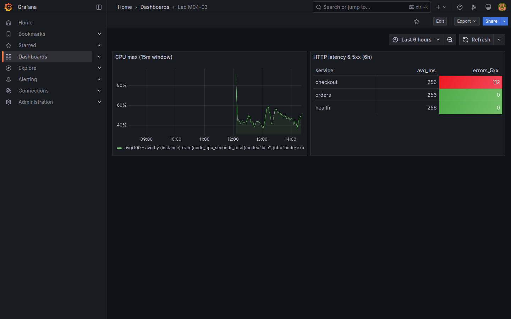

# M04-03 — Funciones y operaciones en consultas

[← Página anterior](M04-02-metricas-consultas.md) · [Siguiente página →](M04-04-filtros-agrupamientos.md)

Agregar y transformar datos es lo que separa un gráfico «crudo» de un indicador accionable: medias móviles, percentiles, tasas y sumas SQL condicionadas.

En esta unidad practicas funciones **PromQL** (`avg`, `max`, `histogram_quantile` si hay histogramas, `deriv`) y agregaciones **SQL** (`AVG`, `COUNT`, `DATE_TRUNC`) en `Lab M04-03`.

### Objetivos

Al cerrar la unidad deberías:

- Aplicar `avg_over_time`, `max_over_time` o `quantile` sobre métricas del lab.
- Usar funciones SQL de agregación y agrupación temporal.
- Comparar resultado de agregación global vs **by label** en PromQL.
- Guardar `Lab M04-03` con al menos dos paneles que usen funciones distintas.

---

## Conceptos

**`rate()`** y contadores ya se practicaron en [M04-01](M04-01-configuracion-avanzada-paneles.md) y [M04-02](M04-02-metricas-consultas.md). Aquí entran funciones que resumen **ventanas de tiempo** y agregados SQL más expresivos.

### Funciones de rango PromQL

Operan sobre puntos dentro de `[5m]`, `[15m]`, etc.:

| Función | Qué hace | Uso en esta unidad |
|---------|----------|-------------------|
| **`max_over_time(expr[15m:])`** | Valor **máximo** de la expresión en la ventana | Pico de CPU % agregada |
| **`avg(...)`** sin `by` | Media de todas las series devueltas | Una sola línea «global» |

*(Referencia: `rate()` convierte contadores en tasa — M04-01.)*

### Agregación SQL con `FILTER`

**`COUNT(*) FILTER (WHERE status >= 500)`** (PostgreSQL): cuenta filas que cumplen la condición **sin** subconsulta. En el lab, sobre **`http_events`**, responde: *¿cuántos eventos HTTP 5xx hubo por servicio en las últimas horas?*

**Visualización Table** en panel: filas = servicios, columnas = métricas calculadas — distinto de time series.

**Intervalo vs instant:** funciones de rango PromQL necesitan ventana ≥ **scrape_interval** del lab (15 s).

---

## En Grafana

En panel Prometheus, el autocompletado sugiere funciones al escribir. Errores «parse error» suelen indicar paréntesis o ventana mal cerrada `[5m]`.

PostgreSQL admite **Format table** para ver agregados múltiples columnas antes de convertir a time series.



---

## Laboratorio

### Objetivo

Crear `Lab M04-03` con panel PromQL agregado y panel SQL con `AVG`/`COUNT`.

### En qué consiste

1. Panel PromQL `avg_over_time` o CPU agregada.  
2. Panel SQL latencia HTTP.  
3. Save dashboard.

### 1 — PromQL agregado

**Acción:** **New dashboard → Add visualization** → `Prometheus-Lab`:

```promql
max_over_time(
  (100 - avg(rate(node_cpu_seconds_total{mode="idle", job="node-exporter"}[5m])) * 100)[15m:]
)
```

Título `CPU max (15m window)`. Unit `%`.

Alternativa si la sintaxis anidada falla en tu versión:

```promql
avg(
  100 - avg by (instance) (rate(node_cpu_seconds_total{mode="idle", job="node-exporter"}[5m])) * 100
)
```

**Por qué:** agregación resume host para ejecutivos; detalle por label queda en M04-04.

**Resultado esperado:** serie única o pocas series con valor agregado.

### 2 — SQL latencia HTTP

**Acción:** **Add visualization** → `PostgreSQL-Lab`, format **Table**:

```sql
SELECT
  service,
  AVG(latency_ms)::int AS avg_ms,
  COUNT(*) FILTER (WHERE status >= 500) AS errors_5xx
FROM http_events
WHERE ts > NOW() - INTERVAL '6 hours'
GROUP BY service
ORDER BY errors_5xx DESC
```

Título `HTTP latency & 5xx (6h)`.

**Por qué:** mezcla gauge agregado y conteo condicionado — patrón IT del lab.

**Resultado esperado:** tabla con filas `checkout`, `orders`, `health`.

### 3 — Guardar

**Acción:** **Save dashboard** → `Lab M04-03`.

**Resultado esperado:** dashboard con panel time series Prometheus y tabla SQL.

---

## Conclusiones

- Funciones de rango PromQL requieren ventana acorde al **scrape_interval** (15s lab).
- Agregadores `by (label)` vs sin `by` cambian cardinalidad y significado.
- SQL `FILTER (WHERE …)` expresa conteos condicionados sin subconsultas verbosas.
- Tabla SQL complementa time series cuando hay múltiples columnas métricas.
- Validar en Explore evita publicar agregaciones vacías por ventanas cortas.

---

## Comprueba tu entendimiento

**Función PromQL**  
El panel CPU usa  
→ `max_over_time`, `avg` o `rate` (según consulta aplicada).

**SQL agregado**  
Columnas de la tabla HTTP  
→ `avg_ms`, `errors_5xx` por `service`.

**Ventana temporal SQL**  
Filtro temporal  
→ Últimas 6 horas (`NOW() - INTERVAL '6 hours'`).

**Cardinalidad**  
¿Cuántas filas esperas en tabla HTTP?  
→ Tres servicios demo.

---

## Reto

### 1 — `quantile` CPU

Calcula percentil 0.95 de CPU con agregación `quantile(0.95, …)` sobre series instantáneas (simplificado) o documenta limitación si cardinalidad alta.

<details>
<summary>Ver solución</summary>

En entornos con pocas series: `quantile(0.95, 100 - avg by (instance) (rate(node_cpu_seconds_total{mode="idle"}[5m])) * 100)`. Con muchas series, usar recording rules (fuera de alcance 201).

</details>

### 2 — SQL sensores

`AVG(temperature_c)` por `site` en `sensor_readings` últimas 24h — formato Table.

<details>
<summary>Ver solución</summary>

```sql
SELECT site, ROUND(AVG(temperature_c)::numeric, 1) AS avg_temp
FROM sensor_readings
WHERE ts > NOW() - INTERVAL '24 hours'
GROUP BY site;
```

</details>

### 3 — Transformations

Convierte tabla SQL a bar gauge con **Transform → Rows to fields** (experimental según versión) o deja tabla y añade **Bar chart** en M05.

<details>
<summary>Ver solución</summary>

Si transform no aplica, mantén **Table** — M05-02 profundiza visualización tabular.

</details>
