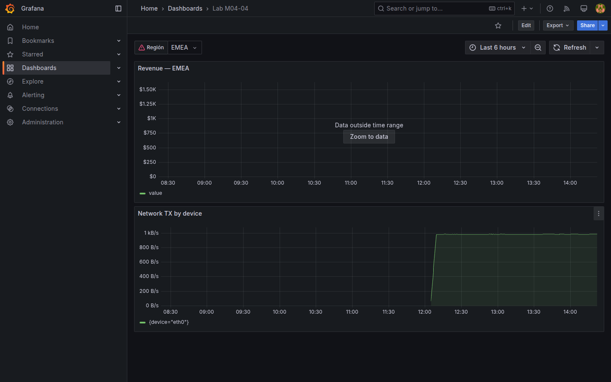
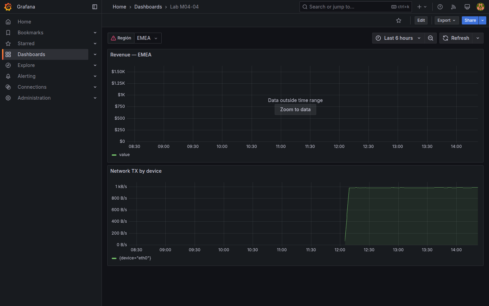

# M04-04 — Filtros y agrupamientos

[← Página anterior](M04-03-funciones-operaciones.md) · [Siguiente página →](../m05-visualizaciones-avanzadas/README.md)

Dashboards compartidos necesitan **filtrar** por entorno, región o servicio sin duplicar tableros. Variables de consulta (M02-04 introdujo custom/interval) se combinan aquí con **selectores PromQL**, cláusulas **SQL WHERE** y agrupamientos `GROUP BY`.

En esta unidad creas `Lab M04-04` con variable **query** desde PostgreSQL o custom alimentando títulos/filtros, y paneles Prometheus/SQL agrupados.

### Objetivos

Al cerrar la unidad deberías:

- Crear variable **Query** o **Custom** ligada a dimensiones del lab (`regions.code`, `service`).
- Filtrar consulta SQL con `$variable` o macro equivalente.
- Aplicar selectores `{label=~"$var"}` en PromQL cuando uses variable multi-value.
- Agrupar resultados con `sum by` / `GROUP BY` coherente con la variable.

---

## Conceptos

M02-04 introdujo variables **Custom** e **Interval** (lista fija, sin consulta). Aquí usas variables tipo **Query**: los valores del selector **salen de una consulta** a PostgreSQL o Prometheus.

### Variable Query desde PostgreSQL

**Tipo Query** + datasource `PostgreSQL-Lab`. La consulta devuelve dos columnas que Grafana mapea a selector:

- **`__text`** — lo que ve el usuario (p. ej. nombre región).  
- **`__value`** — lo que se sustituye en `$region` en SQL del panel.

Ejemplo sobre tabla **`regions`**: selector EMEA / APAC / AMER alimentado por datos reales, no por lista manual.

### `label_values()` en Prometheus

```promql
label_values(up, job)
```

Función PromQL auxiliar: devuelve los valores **distintos** del label `job` entre las series de **`up`** ([M03-02](../m03-fuentes-datos/M03-02-configuracion-fuentes.md)). Sirve para poblar un selector de jobs scrapeados sin escribirlos a mano.

**Interpolación en SQL:** `'$region'` o `${region}` sustituye el valor elegido en la consulta del panel.

**Interpolación en PromQL multi-value:** `{job=~"$job"}` cuando la variable admite varios valores (regex).

**`sum by` / `GROUP BY`:** en [M04-02](M04-02-metricas-consultas.md) y [M04-03](M04-03-funciones-operaciones.md); aquí deben alinearse con el filtro de la variable.

**Include All:** valor `$__all` exige sintaxis tolerante (`=~` o omitir `WHERE`).

---

## En Grafana

**Dashboard settings → Variables → Query** permite elegir datasource de la query. Preview muestra valores detectados.

En panel SQL, el botón **Format** y vista previa validan que `$region` sustituye correctamente al cambiar selector.

PromQL con `$job` falla si la variable está vacía — define **Default value** o **All**.





---

## Laboratorio

### Objetivo

Dashboard `Lab M04-04` con variable de región, panel SQL filtrado y panel Prometheus agrupado por label.

### En qué consiste

1. Variable `region` desde PostgreSQL.  
2. Panel revenue filtrado por región.  
3. Panel Prometheus con `sum by`.  
4. Save `Lab M04-04`.

### 1 — Variable region

**Acción:** **New dashboard** → **Settings → Variables → Add**:

- **Name:** `region`  
- **Type:** Query  
- **Data source:** `PostgreSQL-Lab`  
- **Query:**

```sql
SELECT code AS __text, code AS __value FROM regions ORDER BY 1
```

- **Refresh:** On dashboard load  

**Apply** variable. Comprueba selector EMEA/APAC/AMER en vista dashboard.

**Por qué:** variable alimentada por SQL refleja dimensiones de negocio reales.

**Resultado esperado:** dropdown con tres regiones.

### 2 — Panel SQL filtrado

**Acción:** **Add visualization** → `PostgreSQL-Lab`:

```sql
SELECT d.day AS "time", SUM(d.revenue)::float AS value
FROM daily_sales d
JOIN regions r ON d.region_id = r.id
WHERE r.code = '${region}'
GROUP BY d.day
ORDER BY 1
```

Format **Time series**. Título `Revenue — $region`.

**Por qué:** demuestra filtro dinámico sin tres dashboards clones.

**Resultado esperado:** curva cambia al seleccionar otra región.

### 3 — Panel Prometheus agrupado

**Acción:** **Add visualization** → `Prometheus-Lab`:

```promql
sum by (device) (
  rate(node_network_transmit_bytes_total{job="node-exporter", device!~"lo|veth.*"}[5m])
)
```

Título `Network TX by device`. Leyenda `{{device}}`.

**Por qué:** agrupamiento por label complementa filtro SQL — ops y negocio en un tablero.

**Resultado esperado:** múltiples series por interfaz.

### 4 — Guardar

**Acción:** **Save dashboard** → `Lab M04-04`.

**Resultado esperado:** selector `region` operativo y paneles persistentes.

---

## Conclusiones

- **Query variables** enlazan dimensiones del datastore con la UI del dashboard.
- Sintaxis `${var}` en SQL y `$var` en PromQL deben probarse al cambiar **Multi-value**.
- **sum by / GROUP BY** alinean agregación con la granularidad del filtro.
- **Include All** exige consultas tolerantes (`=~` o omitir WHERE).
- Tras M04 el alumno puede combinar filtros negocio (SQL) y ops (Prometheus) en un solo tablero.

---

## Comprueba tu entendimiento

**Variable region**  
Origen de valores  
→ Query PostgreSQL sobre tabla `regions`.

**Cambio de región**  
Al pasar EMEA → APAC, panel SQL  
→ Curva distinta (revenue regional).

**Agrupamiento PromQL**  
Cláusula usada  
→ `sum by (device)`.

**API variable**

```bash
curl -s -u admin:admin "http://localhost:3000/api/search?query=Lab%20M04-04"
```

→ Dashboard encontrado.

---

## Reto

### 1 — Variable job Prometheus

Añade variable `job` con `label_values(up, job)` y filtra panel red con `{job=~"$job"}`.

<details>
<summary>Ver solución</summary>

Variable Query Prometheus → en panel añade selector `{job=~"$job"}`. Default `node-exporter`.

</details>

### 2 — Multi-value region

Activa **Multi-value** en `region` y adapta SQL:

```sql
WHERE r.code IN (${region:singlequote})
```

(sintaxis puede variar; usar **Custom all value** o formato CSV según Grafana 11 docs).

<details>
<summary>Ver solución</summary>

Con multi-value, Grafana expande `${region:csv}` o `IN (${region:singlequote})`. Prueba en Query inspector hasta ver SQL expandido correcto.

</details>

### 3 — Repeat row

Repite fila por `$region` con panel SQL mini-stat de revenue total.

<details>
<summary>Ver solución</summary>

**Add row → Repeat by variable → region**. Panel **Stat** con SQL `SELECT SUM(revenue) FROM daily_sales d JOIN regions r … WHERE r.code = '$region'`. Título `$region total`.

</details>
