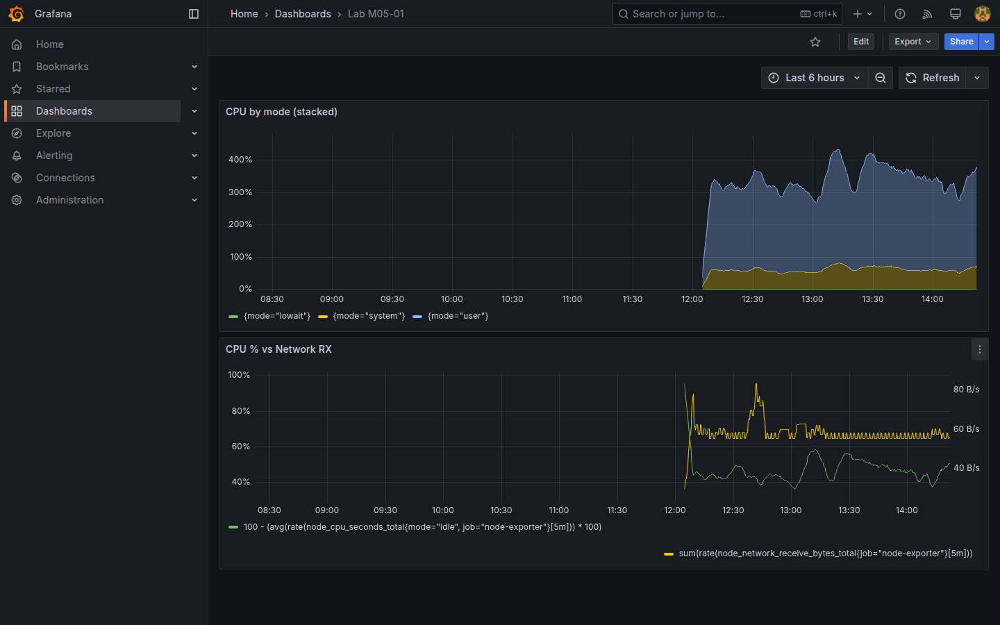

# M05-01 — Visualizaciones de series temporales

[← Página anterior](../m04-paneles-personalizacion/M04-04-filtros-agrupamientos.md) · [Siguiente página →](M05-02-tablas-listas.md)

El time series es la visualización por defecto de observabilidad: múltiples series, estilos de línea, apilado y eje secundario comunican tendencia y saturación. Ir más allá del line chart básico de M02–M04 mejora lectura en salas de crisis y informes ejecutivos.

En esta unidad creas `Lab M05-01` con paneles time series avanzados: **stacking**, **fill opacity**, **line style** y opcional **dual axis** con métricas Prometheus.

### Objetivos

Al cerrar la unidad deberías:

- Configurar **Graph styles** (line width, fill, point size) en time series.
- Apilar series (**Stack series**) cuando sumen una totalidad interpretable.
- Combinar dos consultas con unidades distintas y **Right Y** axis override.
- Guardar `Lab M05-01`.

---

## Conceptos

Has usado **time series** lineal desde M02. Aquí configuras opciones de **presentación avanzada** sobre consultas Prometheus ya conocidas (`rate()`, CPU, red).

### Stack series

**Stack series → Normal** dibuja las series **apiladas** en vertical: la altura total en un instante es la suma de los valores. Tiene sentido cuando las series son **partes de un total** (p. ej. CPU `user` + `system` + `iowait`, excluyendo `idle`). **Stack 100 %** normaliza a proporción; no lo uses aquí.

### Dual axis — dos escalas Y

Cuando dos consultas miden **unidades distintas** (CPU **%** vs red **bytes/s**), forzar un solo eje comprime una de las curvas. **Axis → Right** en la consulta B (vía **override** por refId, como en M04-01) asigna un **segundo eje Y**. Máximo dos escalas por panel por legibilidad.

**Graph styles** (line width, fill opacity, interpolation) y **null value** controlan trazo y huecos de scrape — refuerzo visual, no cambian la consulta.

**Time zone** del dashboard vs usuario ([M02-01](../m02-explorando-interfaz/M02-01-navegacion-estructura.md)): coherencia en incidentes multi-región.

---

## En Grafana

Panel con dos queries Prometheus (A y B) muestra dos bloques de consulta. **Override** por query refId B → **Axis placement** Right.

**Stack series: Normal** apila; **100%** normaliza a proporción. Usar solo cuando la suma tiene significado físico.




---

## Laboratorio

### Objetivo

Dashboard `Lab M05-01` con time series apilado de CPU por mode (subset) y dual axis red + CPU.

### En qué consiste

1. Panel stacked CPU modes.  
2. Panel dual axis red vs CPU.  
3. Ajustes graph styles.  
4. Save.

### 1 — CPU stacked

**Acción:** **New dashboard → Add visualization** → `Prometheus-Lab`:

```promql
sum by (mode) (
  rate(node_cpu_seconds_total{job="node-exporter", mode=~"user|system|iowait"}[5m])
) * 100
```

**Graph styles → Stack series:** Normal. **Fill opacity** ~30. Título `CPU by mode (stacked)`.

**Por qué:** apilado muestra composición del tiempo CPU (excluye idle).

**Resultado esperado:** áreas apiladas que suman fracción visible de uso.

### 2 — Dual axis

**Acción:** **Add visualization**. Query A — CPU % (consulta simplificada anterior sin stack). Query B:

```promql
sum(rate(node_network_receive_bytes_total{job="node-exporter"}[5m]))
```

Override query B → **Standard options → Axis → Right**, Unit **bytes/sec(SI)**. Query A Unit **Percent**. Título `CPU % vs Network RX`.

**Por qué:** correlacionar saturación CPU con tráfico entrante.

**Resultado esperado:** dos escalas Y visibles.

### 3 — Estilo

**Acción:** en panel stacked, **Line width** 1, **Show points** Never, **Line interpolation** smooth (opcional).

**Save dashboard** → `Lab M05-01`.

**Resultado esperado:** dashboard con dos paneles time series configurados.

---

## Conclusiones

- **Stack** solo cuando las series son componentes de un total coherente.
- **Dual axis** evita forzar unidades incompatibles en un eje; limita a 2 escalas por legibilidad.
- **Fill opacity** ayuda en pocos series; con muchas, preferir líneas finas.
- PromQL `rate * 100` en CPU modes expresa porcentaje de un core aproximado.
- Time series sigue siendo workhorse de ops; perfeccionar estilo reduce fatiga en NOC.

---

## Comprueba tu entendimiento

**Stacked panel**  
Modos incluidos  
→ `user`, `system`, `iowait` (regex `mode=~"user|system|iowait"`).

**Dual axis**  
Query en eje derecho  
→ Network RX bytes/s.

**Dashboard**  
Nombre guardado  
→ `Lab M05-01`.

**Null handling**  
¿Dónde se configura?  
→ Graph styles / Standard options → **Connect null values**.

---

## Reto

### 1 — Band mode

Activa **Show thresholds** as bands behind series en panel CPU.

<details>
<summary>Ver solución</summary>

**Thresholds** con display mode **Area** o **Line** según versión — bandas 70/90 visibles detrás de la serie.

</details>

### 2 — SQL time series

Añade panel PostgreSQL `sensor_readings` multi-site con una serie por site (wide format o múltiples queries).

<details>
<summary>Ver solución</summary>

Tres queries A/B/C con `WHERE site='plant-a'` etc., o transform **Partition by values**. Leyenda con nombre site.

</details>

### 3 — Span nulls

Simula gap bajando scrape — observa **Connect null values** vs **Null**.

<details>
<summary>Ver solución</summary>

En lab continuo difícil simular; conceptualmente **Null** deja huecos visibles (útil para detectar pérdida de scrape).

</details>
