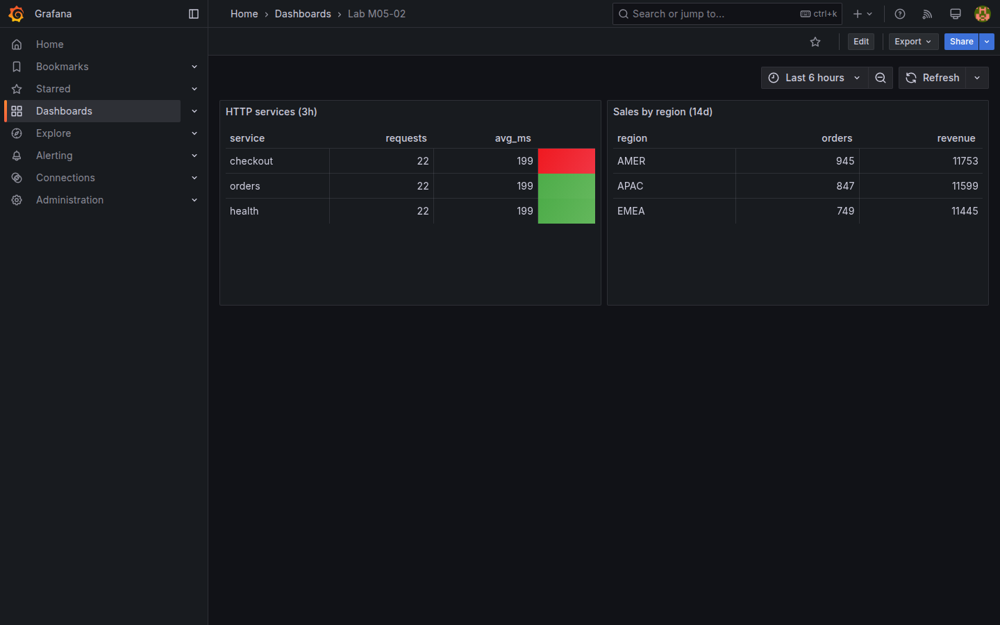

# M05-02 — Visualizaciones de tabla y listas

[← Página anterior](M05-01-series-temporales.md) · [Siguiente página →](M05-03-mapas-geolocalizacion.md)

No todo dato es serie temporal: rankings de error, inventario de sensores o top N de latencia se leen mejor en **tabla**. Grafana ofrece sorting, column width, cell display mode y enlaces por fila.

En esta unidad creas `Lab M05-02` con paneles **Table** alimentados por PostgreSQL (`http_events`, `daily_sales`) y opcional **Logs** de Loki en modo table.

### Objetivos

Al cerrar la unidad deberías:

- Crear panel **Table** con SQL multi-columna.
- Configurar **Column width**, **Align** y **Cell display** (color background por value).
- Ordenar por columna crítica (errores, latencia).
- Aplicar transform **Organize fields** para ocultar/reordenar columnas.

---

## Conceptos

M04-03 usó **Table** para agregados HTTP. Aquí el foco es **presentación tabular** para lectura ejecutiva: orden, alineación y semáforos en celda.

**Table visualization:** cada fila = un registro (servicio, región…); columnas = métricas calculadas. No exige columna `time` — ideal para *snapshots* agregados.

### Cell display mode

Por columna, **Cell display** define cómo se pinta el valor:

| Modo | Qué hace |
|------|----------|
| **Basic** | Texto plano |
| **Color background** | Fondo coloreado según **thresholds** de esa columna — semáforo **por celda** (distinto de thresholds de panel entero en M04-01) |
| **Gauge** | Barra horizontal mini dentro de la celda |
| **JSON** | Payload estructurado legible |

**Footer reducers** (sum, mean, count): totales bajo columna numérica — p. ej. suma de `revenue`.

**Logs panel (Loki):** lista timestamp + labels + línea; panel de **eventos** en dashboard ([LogQL](../../m03-fuentes-datos/M03-03-conexion-externa.md) en M03-03).

**Pagination:** en tablas grandes, filtra en SQL (`WHERE`, `LIMIT`) antes que en la UI.

---

## En Grafana

Editor SQL con **Format: Table** muestra preview tabular. **Column inspector** (click cabecera en preview) asigna display mode.

Transform **Sort by** ordena post-query; **Filter data by values** oculta filas.



---

## Laboratorio

### Objetivo

Dashboard `Lab M05-02` con tabla HTTP errors y tabla ventas por región.

### En qué consiste

1. Tabla latencia/errores HTTP.  
2. Tabla revenue por región (snapshot).  
3. Estilos de celda.  
4. Save.

### 1 — Tabla HTTP

**Acción:** **New dashboard → Add visualization** → `PostgreSQL-Lab`, **Table**:

```sql
SELECT
  service,
  COUNT(*) AS requests,
  AVG(latency_ms)::int AS avg_ms,
  MAX(latency_ms) AS max_ms,
  COUNT(*) FILTER (WHERE status >= 500) AS errors
FROM http_events
WHERE ts > NOW() - INTERVAL '3 hours'
GROUP BY service
ORDER BY errors DESC, avg_ms DESC
```

Título `HTTP services (3h)`.

**Por qué:** vista tipo «top offenders» para IT.

**Resultado esperado:** tres filas servicio con métricas numéricas.

### 2 — Estilos columna

**Acción:** columna `errors` → **Cell display → Color background**; thresholds 0 green, 1 yellow, 5 red. Columna `avg_ms` → **Align** right.

**Por qué:** errores destacan sin leer cada número.

**Resultado esperado:** celdas coloreadas en columna errors.

### 3 — Tabla ventas región

**Acción:** **Add visualization** → SQL:

```sql
SELECT
  r.code AS region,
  SUM(d.orders) AS orders,
  ROUND(SUM(d.revenue)::numeric, 2) AS revenue
FROM daily_sales d
JOIN regions r ON d.region_id = r.id
WHERE d.day > CURRENT_DATE - INTERVAL '14 days'
GROUP BY r.code
ORDER BY revenue DESC
```

**Table**. Footer **Sum** en `revenue`. Título `Sales by region (14d)`.

**Save dashboard** → `Lab M05-02`.

**Resultado esperado:** tabla negocio con totales footer.

---

## Conclusiones

- **Table** es la visualización correcta para rankings y inventarios agregados.
- Colorear celdas comunica prioridad más rápido que thresholds en time series.
- Agregar en SQL reduce filas antes de renderizar — mejor rendimiento.
- **Organize fields** limpia columnas técnicas (`region_id`).
- Logs Loki en formato lista complementan SQL para troubleshooting (M03-03).

---

## Comprueba tu entendimiento

**Panel HTTP**  
Orden por defecto  
→ `errors DESC`, luego `avg_ms`.

**Color background**  
¿Qué columna?  
→ `errors` (o la configurada).

**Ventas**  
Periodo filtrado  
→ Últimos 14 días.

**Footer**  
¿Qué columna suma?  
→ `revenue`.

---

## Reto

### 1 — Logs table

Añade panel **Logs** con `Loki-Lab`, query `{job="demo-app"}` limit 50 líneas.

<details>
<summary>Ver solución</summary>

Visualización **Logs** (Explore-like en dashboard). Ajusta label selector a streams activos del lab.

</details>

### 2 — Enlace drill-down

Columna `service` → **Data links** → URL dashboard Explore filtrado (URL con parámetros orgId y datasource).

<details>
<summary>Ver solución</summary>

**Field overrides → service → Data links → Add link** con URL `${__url.path}/explore?...` o enlace genérico a documentación del servicio.

</details>

### 3 — Transform hide

Oculta columna `max_ms` con **Organize fields** si no aporta en vista ejecutiva.

<details>
<summary>Ver solución</summary>

**Transform → Organize fields** → eye icon off en `max_ms`.

</details>
