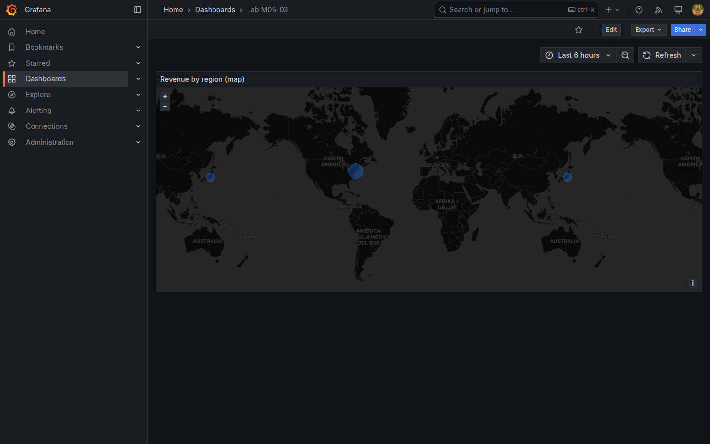

# M05-03 — Visualizaciones de mapas y geolocalización

[← Página anterior](M05-02-tablas-listas.md) · [Siguiente página →](M05-04-alertas-umbrales.md)

Métricas y tablas no capturan dimensión geográfica: ventas por región global, sensores por planta o CDN por PoP se benefician de **Geomap**. Grafana 11 incluye capas de marcadores, heatmap y rutas sobre mapas base.

En esta unidad creas `Lab M05-03` con panel **Geomap** usando coordenadas derivadas de `regions` en PostgreSQL (mapeo didáctico código → lat/lon).

### Objetivos

Al cerrar la unidad deberías:

- Preparar consulta SQL con columnas **latitude**, **longitude** y campo de valor.
- Configurar visualización **Geomap** con capa **Markers**.
- Ajustar tamaño/color de marcador según métrica (revenue).
- Guardar `Lab M05-03`.

---

## Conceptos

**Geomap** muestra datos con **coordenadas geográficas** sobre un mapa base. Requiere columnas **`latitude`** y **`longitude`** (WGS84) en el resultado SQL; opcionalmente un campo **`value`** para tamaño o color del marcador.

| Campo | Rol |
|-------|-----|
| **latitude** / **longitude** | Posición WGS84 |
| **value** (opcional) | Tamaño o color del marcador |
| **name** / **label** | Tooltip |

En producción lat/lon vienen de BD GIS o geocoding; en el lab se asignan coordenadas representativas por `regions.code`.

**Map layers:** Markers, Heatmap, Route. **Base layer** — OpenStreetMap, CARTO (según config Grafana).

**Location mode:** coords explícitas vs **Lookup** (geohash — fuera de alcance lab).

**Unit** del valor afecta escala de **Marker size** ( revenue → size scale).

---

## En Grafana

Tras SQL con columnas nombradas `latitude`, `longitude`, Grafana suele detectar campos geo. Si no, **Field overrides → latitude/longitude → Type → Coordinates**.

En **Geomap → Map view**, zoom inicial **Fit to data** centra marcadores.



---

## Laboratorio

### Objetivo

Dashboard `Lab M05-03` con Geomap de revenue agregado por región demo.

### En qué consiste

1. Consulta SQL con coords.  
2. Panel Geomap markers.  
3. Estilo tamaño por revenue.  
4. Save.

### 1 — SQL geo

**Acción:** **New dashboard → Add visualization** → `PostgreSQL-Lab`, **Table** (Geomap acepta table result):

```sql
SELECT
  r.code AS name,
  CASE r.code
    WHEN 'EMEA' THEN 50.1109
    WHEN 'APAC' THEN 35.6762
    WHEN 'AMER' THEN 40.7128
  END AS latitude,
  CASE r.code
    WHEN 'EMEA' THEN 8.6821
    WHEN 'APAC' THEN 139.6503
    WHEN 'AMER' THEN -74.0060
  END AS longitude,
  SUM(d.revenue)::float AS value
FROM daily_sales d
JOIN regions r ON d.region_id = r.id
WHERE d.day > CURRENT_DATE - INTERVAL '30 days'
GROUP BY r.code
```

Título `Revenue by region (map)`.

**Por qué:** coordenadas simbólicas (Frankfurt, Tokyo, NYC) anclan concepto geo sin GIS real.

**Resultado esperado:** tres filas con lat/lon/value.

### 2 — Geomap

**Acción:** cambia visualización a **Geomap**. **Map layers → Markers**:

- **Latitude field** → `latitude`  
- **Longitude field** → `longitude`  
- **Label** → `name`  
- **Size** → field `value` (scale linear)

**Map view → Fit to data**.

**Por qué:** tamaño proporcional revenue destaca región dominante.

**Resultado esperado:** tres marcadores en continentes aproximados.

### 3 — Color (opcional)

**Acción:** **Markers → Color** → field `value`, scheme **Blues** o thresholds.

**Save dashboard** → `Lab M05-03`.

**Resultado esperado:** mapa interactivo persistente (zoom/pan).

---

## Conclusiones

- **Geomap** necesita lat/lon explícitos o lookup; SQL del lab simula geocoding por región.
- **Marker size** por `value` comunica magnitud; **color** añade segunda dimensión con moderación.
- Datos geo incorrectos inducen decisiones erróneas — validar coords en tabla antes del mapa.
- No confundir mapa con **Table** geográfica: el mapa es para pattern spatial.
- En enterprise, coords suelen venir de pipeline ETL, no de CASE manual.

---

## Comprueba tu entendimiento

**Regiones en mapa**  
¿Cuántos marcadores?  
→ Tres (EMEA, APAC, AMER).

**Campo tamaño**  
¿Qué métrica escala marcador?  
→ `value` (revenue agregado).

**Coordenadas**  
¿De dónde salen?  
→ CASE SQL sobre `regions.code` (mapeo didáctico).

**Visualización**  
Tipo panel  
→ **Geomap**.

---

## Reto

### 1 — Heatmap layer

Duplica panel y prueba capa **Heatmap** (si datos densos; con 3 puntos el efecto es limitado).

<details>
<summary>Ver solución</summary>

**Heatmap** brilla con muchos puntos; con tres regiones, **Markers** es más claro. Documenta la limitación.

</details>

### 2 — Tooltip custom

Añade **Description** en panel con leyenda de ciudades representativas.

<details>
<summary>Ver solución</summary>

**Panel options → Description:** EMEA ≈ Frankfurt, APAC ≈ Tokyo, AMER ≈ NYC — coords ilustrativas.

</details>

### 3 — Sensores por site

Segundo Geomap con `sensor_readings`: lat/lon fijos por `site` (plant-a, plant-b, warehouse-1) y value = avg temperature.

<details>
<summary>Ver solución</summary>

SQL similar con CASE por `site` y coords de planta ficticia. **Markers** colored by temperature thresholds.

</details>
