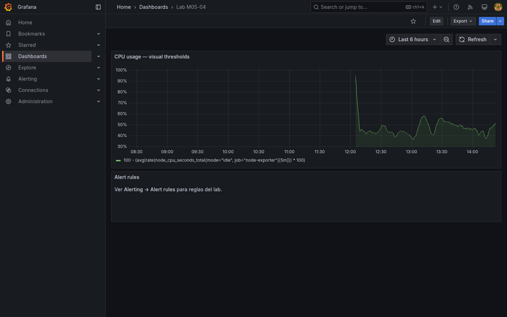
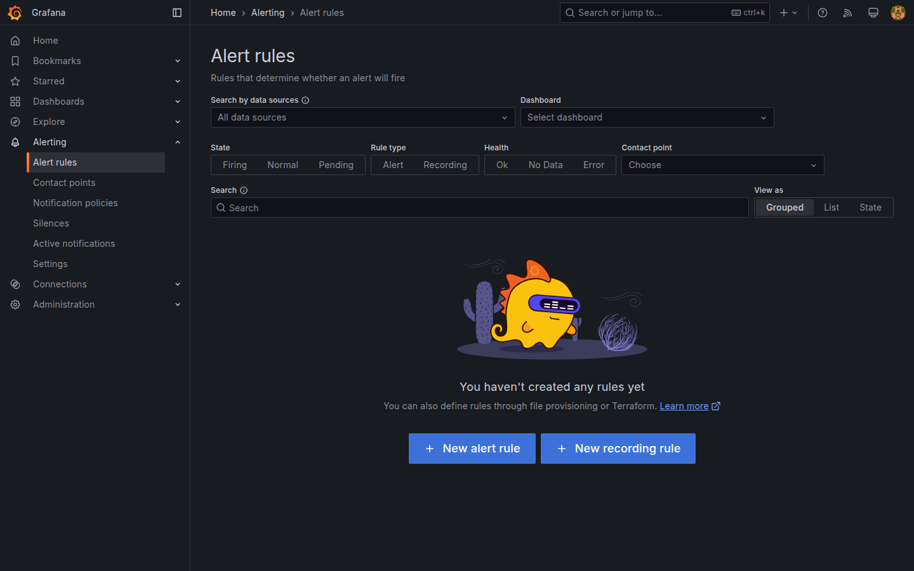
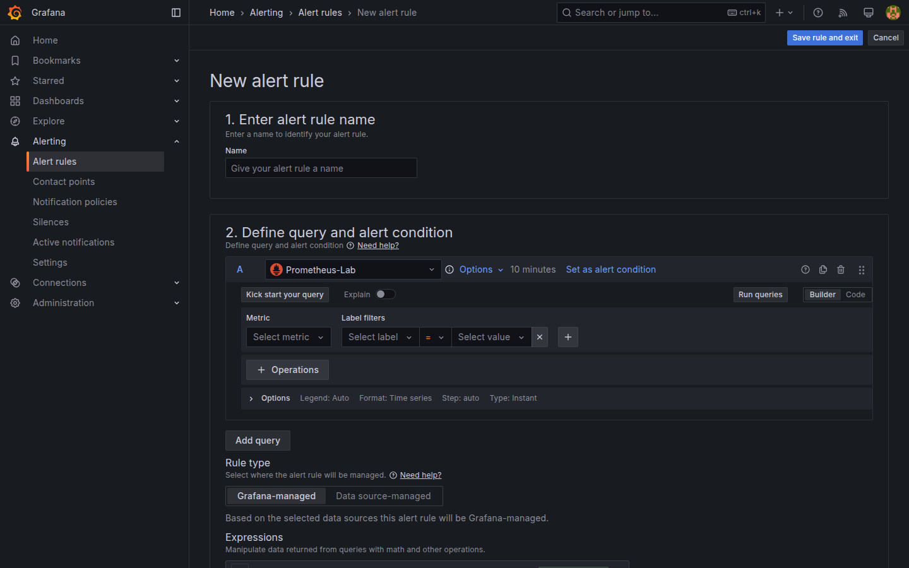

# M05-04 — Alertas y umbrales

[← Página anterior](M05-03-mapas-geolocalizacion.md) · [Siguiente página →](../m06-paneles-fuentes-personalizados/README.md)

Un dashboard solo informa si alguien lo mira; **alertas** notifican cuando una métrica viola umbral. Grafana 11 unifica **Alerting** con reglas evaluadas periódicamente y **thresholds** visuales en paneles (M02-03, M04-01).

En esta unidad configuras umbrales en panel, creas **alert rule** sobre métrica Prometheus del lab y revisas estado en **Alerting → Alert rules**.

### Objetivos

Al cerrar la unidad deberías:

- Diferenciar **threshold visual** de panel vs **alert rule** evaluada.
- Crear regla **Grafana managed** con condición sobre **`up`** (disponibilidad — M03-02) o CPU.
- Asignar **labels** y **annotations** mínimas a la regla.
- Simular estado **Pending/Firing** (o explicar evaluación) y guardar dashboard `Lab M05-04`.

---

## Conceptos

**Thresholds (panel)** colorean la visualización según umbrales ([M04-01](../../m04-paneles-personalizacion/M04-01-configuracion-avanzada-paneles.md), retos en M02-03): ayudan al ojo humano en el dashboard, **pero no envían notificaciones** por sí solos.

### Alert rule — Unified Alerting

Una **alert rule** es una **evaluación periódica** independiente del panel: Grafana ejecuta una consulta (PromQL, SQL, LogQL), aplica una **condición** y, si se cumple durante un tiempo **For**, pasa a estado **Firing** y puede notificar vía **contact point** (email, Slack, webhook — en el lab la notificación real suele omitirse; importa el **estado** en la UI).

| Pieza | Qué hace |
|-------|----------|
| **Query** | Misma idea que un panel: p. ej. `up{job="node-exporter"}` o CPU % |
| **Expression / Reduce** | Reduce series a un número (p. ej. **Last**) |
| **Condition** | `IS BELOW 1`, `IS ABOVE 90`, etc. |
| **For** | Cuánto debe cumplirse antes de alertar (anti-ruido) |
| **Evaluation group** | Cada cuánto se reevalúa (1m, 5m) |

**Estados:** Normal → Pending (cumplida pero aún no **For**) → Firing; también No Data y Error.

**Regla sobre `up`:** `up{job="node-exporter"} < 1` detecta target caído (métrica definida en [M03-02](../../m03-fuentes-datos/M03-02-configuracion-fuentes.md)).

**Regla sobre CPU:** consulta de M04-01 + condición **> 90** durante **5m**.

**Annotations** (`summary`, `description`): texto humano en la alerta.

**Pause evaluation** — silenciar en mantenimiento (M08 profundiza contact points).

---

## En Grafana

**Alerting → Alert rules → New alert rule** abre asistente: seleccionar datasource `Prometheus-Lab`, query, expresión reduce **last**, umbral, carpeta de reglas, evaluation group.

Desde panel: **Alert → Create alert rule from this panel** (si visible) pre-rellena consulta.

**Alerting → Contact points** lista destinos; **default-email** puede no enviar sin SMTP — basta estado Firing en UI del lab.







---

## Laboratorio

### Objetivo

Dashboard `Lab M05-04` con panel CPU con thresholds visuales y al menos una **alert rule** activa sobre métrica del lab.

### En qué consiste

1. Panel CPU con thresholds (refuerzo M04).  
2. Alert rule `up` o CPU.  
3. Revisión en Alert rules list.  
4. Save dashboard.

### 1 — Panel con thresholds

**Acción:** **New dashboard → Add visualization** → `Prometheus-Lab`:

```promql
100 - (
  avg(rate(node_cpu_seconds_total{mode="idle", job="node-exporter"}[5m])) * 100
)
```

**Thresholds:** 70 yellow, 90 red. Título `CPU usage — visual thresholds`.

**Por qué:** diferencia umbral visual (panel) de regla evaluada (paso 2).

**Resultado esperado:** panel con bandas o colores de umbral.

### 2 — Alert rule target down

**Acción:** **Alerting → Alert rules → + New alert rule**.

- **Name:** `Lab node-exporter down`  
- **Query A:** `up{job="node-exporter"}`  
- **Expression B:** Reduce **Last** of A  
- **Condition:** IS BELOW 1  
- **For:** 1m  
- **Folder:** `Lab Alerts` (carpeta de reglas; crear si falta)  
- **Evaluation group:** `lab-evaluation` interval 1m  

**Save rule**.

**Por qué:** regla simple verificable — si paras `node-exporter` en compose, pasa a Firing.

**Resultado esperado:** regla listed as Normal (con stack sano).

### 3 — Segunda regla CPU (opcional)

**Acción:** regla `Lab CPU high` — query CPU % anterior, condition **IS ABOVE 90**, **For 5m**.

**Annotations:** Summary `CPU high on node-exporter lab`.

**Por qué:** patrón SLO ops realista.

**Resultado esperado:** segunda regla en carpeta `Lab Alerts`.

### 4 — Dashboard y verificación

**Acción:** añade **Text panel** con texto «Alert rules: ver Alerting → Alert rules». **Save dashboard** → `Lab M05-04`.

Comprueba **Alerting → Alert rules** — estado Normal/Pending.

**Resultado esperado:** dashboard + reglas visibles en UI.

---

## Conclusiones

- **Thresholds** de panel ≠ notificación; hacen falta **alert rules** + **contact points**.
- Reglas evalúan en intervalo del **evaluation group**; **For** reduce falsos positivos.
- `up` (M03-02) y CPU son plantillas reutilizables en cualquier scrape Prometheus.
- Annotations traducen métrica a mensaje humano en on-call.
- M08 cubre RBAC, silencing y contact points enterprise; aquí el foco es ciclo básico create → evaluate → state.

---

## Comprueba tu entendimiento

**Regla up**  
Condición  
→ Último valor de `up{job="node-exporter"}` **below** 1.

**Estado sano**  
Con stack up  
→ **Normal** (no Firing).

**Panel vs alert**  
¿Panel CPU notifica solo?  
→ No, salvo regla vinculada; thresholds son visuales.

**Lista reglas**  
**Alerting → Alert rules**  
→ Aparece `Lab node-exporter down`.

---

## Reto

### 1 — Simular Firing

```bash
cd infra && docker compose stop node-exporter
# Espera 1–2 evaluaciones
# Restaura: docker compose start node-exporter
```

<details>
<summary>Ver solución</summary>

Tras parar exporter, la serie `up` pasa a **0** → Pending → Firing tras **For 1m**. Al restaurar, vuelve Normal. No dejes el servicio parado en lab compartido.

</details>

### 2 — Contact point webhook

Crea contact point tipo **Webhook** con URL ficticia `https://example.com/hook` y asígnalo a la regla (sin expectativa de entrega real).

<details>
<summary>Ver solución</summary>

**Alerting → Contact points → New** → Webhook. En regla, **Notifications** → seleccionar contact point. En lab sin URL real, estado Firing basta.

</details>

### 3 — Alert from panel

Usa **Create alert rule from this panel** en panel CPU y compara consulta pre-rellenada.

<details>
<summary>Ver solución</summary>

El asistente hereda PromQL del panel; ajusta **For** y nombre. Evita duplicar reglas idénticas.

</details>
