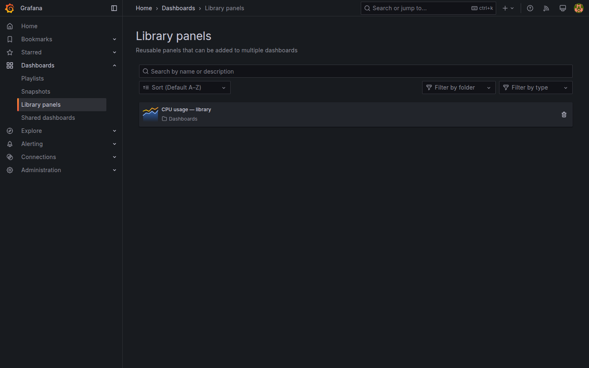
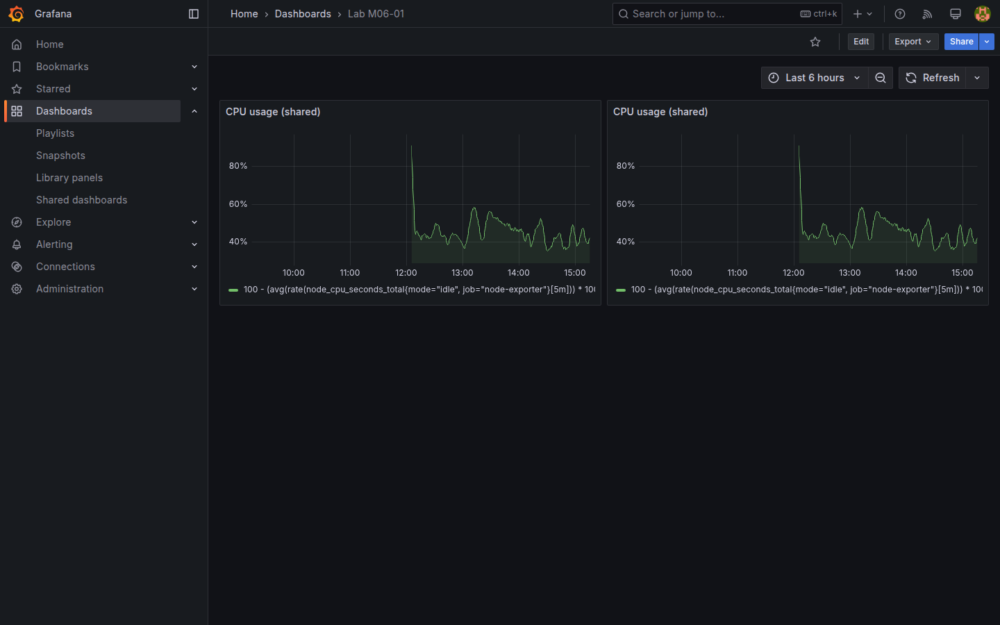

# M06-01 — Paneles de biblioteca

[← Página anterior](../m05-visualizaciones-avanzadas/M05-04-alertas-umbrales.md) · [Siguiente página →](M06-02-fuentes-mixtas-transformaciones.md)

En equipos enterprise un mismo panel (CPU, revenue, tabla HTTP) se repite en varios dashboards. Duplicar paneles manualmente provoca **drift**: cambias uno y olvidas el resto. Grafana resuelve esto con **Library panels**: artefactos reutilizables que se **vinculan** a los dashboards consumidores.

En esta unidad publicarás un panel del lab en la biblioteca, lo insertarás en un dashboard nuevo y comprobarás la actualización centralizada.

### Objetivos

Al cerrar la unidad deberías:

- Guardar un panel existente como **Library panel** con nombre y carpeta de biblioteca.
- Insertar un panel de biblioteca en un dashboard (`Lab M06-01`).
- Editar el panel de biblioteca y ver el cambio reflejado en todos los dashboards vinculados.
- Diferenciar panel **desvinculado** (copia local) de panel **vinculado** a biblioteca.

---

## Conceptos

Un **Library panel** es un panel maestro almacenado fuera de un dashboard concreto. Los dashboards no copian la definición completa: mantienen una **referencia** (`libraryPanel` en el JSON exportado).

| Acción | Efecto |
|--------|--------|
| **Save to library** | Crea o actualiza el maestro |
| **Add → Add panel from panel library** | Inserta referencia en el dashboard |
| **Edit library panel** | Propaga cambios a consumidores vinculados |
| **Unlink** | Convierte la referencia en panel local editable sin afectar la biblioteca |

**Library panel folder** organiza paneles reutilizables; en el lab usa `Lab panels`. Es una jerarquía **independiente** de los **dashboard folders** (`Lab Ops` / `Lab Business`, M07-03/M08).

**Cuándo usar biblioteca:** KPIs corporativos, paneles auditados por SRE, bloques estándar de runbook. **Cuándo no:** experimentos rápidos o paneles con variables muy específicas de un solo tablero.

Paneles basados en consultas de [M04](../m04-paneles-personalizacion/README.md) (Prometheus, PostgreSQL) son candidatos ideales: misma query, mismos thresholds, distinto layout de dashboard.

---

## En Grafana

**Dashboards → Panel library** (o desde un panel en edición: menú **⋮ → Create library panel**) abre el flujo de publicación. Indica **Name** (`CPU usage — library`) y **Folder** de biblioteca.

En un dashboard vacío: **Add → Add panel from panel library** → elige el panel publicado. Grafana crea un panel vinculado; el icono de biblioteca indica que no es una copia suelta.

Al editar un panel vinculado, Grafana pregunta si editas **la biblioteca** (propaga) o solo la instancia local. En formación elige **Edit library panel** para ver la propagación.

**Browse → Panel library** lista paneles publicados con metadatos y dashboards que los consumen (vista de gobierno ligera).





---

## Laboratorio

### Objetivo

Publicar un panel CPU o revenue en la biblioteca, montar dashboard `Lab M06-01` con dos referencias al mismo library panel (o uno library + uno local clonado) y validar propagación de cambios.

### En qué consiste

1. Elegir panel fuente desde un dashboard M04/M05.  
2. **Save to library**.  
3. Crear `Lab M06-01` con panel desde biblioteca.  
4. Editar biblioteca y comprobar cambio.  
5. Save dashboard.

### 1 — Panel fuente

**Acción:** abre `Lab M04-01` o `Lab M05-04` → edita el panel CPU (Prometheus) → menú del panel **⋮ → Create library panel** (o equivalente **Save to library**).

- **Name:** `CPU usage — library`  
- **Folder:** crea `Lab panels` si no existe  

**Por qué:** partir de consulta ya validada evita errores PromQL al practicar biblioteca.

**Resultado esperado:** mensaje de panel guardado en biblioteca; entrada visible en **Panel library**.

### 2 — Dashboard consumidor

**Acción:** **Dashboards → New → Add → Add panel from panel library** → selecciona `CPU usage — library`. Repite **Add panel from panel library** una segunda vez (mismo panel) o añade un panel distinto (p. ej. revenue SQL de M04-02) para comparar layout.

Título del dashboard: `Lab M06-01`. Organiza dos paneles en fila.

**Por qué:** dos referencias demuestran propagación simultánea.

**Resultado esperado:** dos paneles vinculados con icono de biblioteca; datos visibles.

### 3 — Propagación

**Acción:** edita uno de los paneles vinculados → **Edit library panel** → cambia **Title** a `CPU usage (shared)` o añade un **Description** con enlace runbook → **Save library panel**.

**Por qué:** la biblioteca es fuente única de verdad para equipos grandes.

**Resultado esperado:** ambos paneles del dashboard muestran el nuevo título sin editarlos uno a uno.

### 4 — Desvincular (opcional)

**Acción:** en el segundo panel → **Unlink library panel** → cambia solo su título local → **Apply**.

**Por qué:** a veces un dashboard necesita variante local sin romper el estándar corporativo.

**Resultado esperado:** primer panel sigue sincronizado con biblioteca; el desvinculado conserva título local.

### 5 — Save y API

**Acción:** **Save dashboard** como `Lab M06-01`. Exporta JSON (**Share → Export → Save to file**) y busca `"libraryPanel"` en el archivo.

```bash
curl -s -u admin:admin "http://localhost:3000/api/search?query=Lab%20M06-01" | python3 -m json.tool
```

**Por qué:** el JSON confirma referencias; la API prepara [M09](../m09-integraciones/README.md).

**Resultado esperado:** export con uid de biblioteca; API devuelve dashboard `Lab M06-01`.

---

## Conclusiones

- **Library panels** evitan duplicar definiciones de panel entre dashboards.
- Editar la **biblioteca** propaga cambios a paneles vinculados; **Unlink** crea copia local.
- Combinan bien con consultas estandarizadas de M04–M05.
- La carpeta de biblioteca ayuda a gobernar paneles compartidos por equipo.

---

## Comprueba tu entendimiento

**Listado biblioteca**  
**Dashboards → Panel library**  
→ Aparece `CPU usage — library`.

**Propagación**  
Tras editar biblioteca, abre `Lab M06-01`.  
→ Paneles vinculados muestran el cambio.

**JSON exportado**  
Busca `"libraryPanel"` en el export.  
→ Objeto con `uid` del panel de biblioteca.

**Unlink**  
Tras desvincular un panel, edita biblioteca otra vez.  
→ Panel desvinculado no cambia; vinculado sí.

---

## Reto

### 1 — Biblioteca SQL

Publica en biblioteca el panel **revenue** de `Lab M04-02` e insértalo en `Lab M06-01`.

<details>
<summary>Ver solución</summary>

Edita panel SQL → **Save to library** (`Revenue daily — library`). **Add panel from panel library** en M06-01. Verifica que `$__timeFilter` o rango temporal sigue funcionando.

</details>

### 2 — Permisos Viewer

Razona qué ocurre si un usuario **Viewer** intenta **Edit library panel** (roles en [M08](../m08-administracion/M08-01-usuarios-roles.md)).

<details>
<summary>Ver solución</summary>

**Viewer** no puede editar paneles ni biblioteca; solo consume dashboards. Los editores y admins mantienen biblioteca (M08).

</details>

### 3 — Duplicado con nombre distinto

Crea segunda entrada de biblioteca clonando consulta con otro nombre (`CPU usage — staging`) y úsala solo en dashboard de prueba.

<details>
<summary>Ver solución</summary>

**Save to library** desde panel clonado con consulta idéntica pero título distinto. Dos uids de biblioteca independientes; cambios no se cruzan.

</details>
