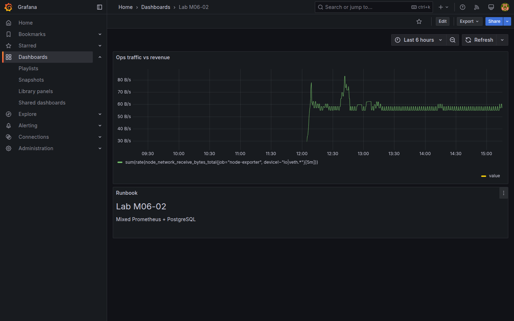
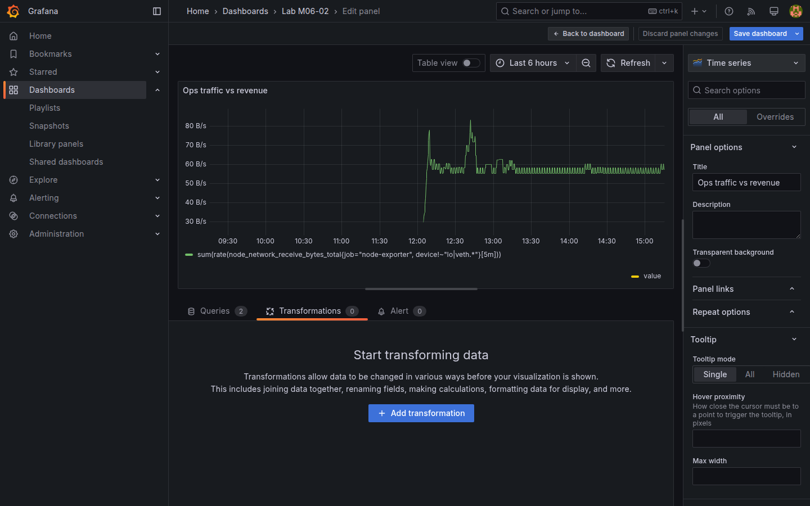

# M06-02 — Fuentes mixtas y transformaciones

[← Página anterior](M06-01-paneles-biblioteca.md) · [Siguiente página →](../m07-tableros-organizacion/README.md)

Un panel no está limitado a **una** fuente de datos. Grafana permite consultas **A, B, C…** con datasources distintos en el mismo panel y combinar resultados con **transformaciones**. Es el patrón habitual cuando correlacionas **métricas ops** (Prometheus) con **KPIs de negocio** (PostgreSQL) o enriqueces series con cálculos post-query.

En esta unidad montarás `Lab M06-02` con datasource **`-- Mixed --`**, consultas Prometheus + SQL y transformaciones **Merge** / **Add field from calculation**.

### Objetivos

Al cerrar la unidad deberías:

- Crear un panel con datasource **`-- Mixed --`** y al menos dos consultas (Prometheus + PostgreSQL).
- Aplicar transformación **Merge** o **Join by field** cuando el resultado lo requiera.
- Añadir campo calculado (**Add field from calculation**) sobre columnas numéricas.
- Guardar dashboard `Lab M06-02` con panel híbrido funcional.

---

## Conceptos

**Mixed datasource** indica al panel que cada consulta elige su propio datasource en el selector de query (A → Prometheus-Lab, B → PostgreSQL-Lab). Grafana ejecuta consultas en paralelo y entrega tablas/series al pipeline de transformaciones.

| RefId | Datasource | Ejemplo lab |
|-------|------------|-------------|
| **A** | Prometheus-Lab | `sum(rate(node_network_receive_bytes_total[5m]))` |
| **B** | PostgreSQL-Lab | Revenue agregado del día (`daily_sales`) |

**Transformations** (pestaña **Transform data**) operan **después** de las consultas ([M04-01](../m04-paneles-personalizacion/M04-01-configuracion-avanzada-paneles.md) usó **Organize fields**). Aquí destacan:

| Transformación | Uso |
|----------------|-----|
| **Merge** | Apila tablas/series de consultas distintas en un flujo común |
| **Join by field** | Une filas por columna clave (`time`, `region`) |
| **Add field from calculation** | Nueva columna = expresión sobre existentes (ratio, margen) |
| **Filter by value** | Descarta filas fuera de umbral antes de pintar |

**Limitaciones:** Prometheus devuelve series temporales; SQL en formato **Time series** alinea por columna `time`. Unir métricas con granularidades distintas puede requerir **agrupar SQL** al bucket temporal o mostrar **Table** en lugar de time series dual.

**Panel Text / Markdown:** paneles sin query útiles para runbooks junto a gráficos híbridos — contenido estático personalizado por dashboard.

---

## En Grafana

En **Add visualization**, elige datasource **`-- Mixed --`**. En query **A**, selecciona `Prometheus-Lab`; en **+ Query** **B**, `PostgreSQL-Lab`. Cada bloque conserva editor PromQL o SQL independiente.

Tras **Run queries**, abre **Transform data** → **Add transformation**. El orden importa: p. ej. **Merge** antes de **Organize fields**.

Para SQL time series sobre revenue:

```sql
SELECT
  day AS time,
  SUM(revenue) AS value
FROM daily_sales
WHERE $__timeFilter(day)
GROUP BY day
ORDER BY day
```

Format **Time series**. Prometheus en **A** puede ser tráfico RX agregado de M04-02.

Visualización **Time series** con dos unidades distintas puede requerir **dual axis** ([M05-01](../m05-visualizaciones-avanzadas/M05-01-series-temporales.md)) o **Table** si la correlación es tabular.





---

## Laboratorio

### Objetivo

Dashboard `Lab M06-02` con panel Mixed (Prometheus + PostgreSQL), al menos una transformación de cálculo o merge, y panel **Text** con runbook breve.

### En qué consiste

1. Panel Mixed con consultas A y B.  
2. Transformación post-query.  
3. Panel Text con enlaces.  
4. Save `Lab M06-02`.

### 1 — Panel Mixed

**Acción:** **New dashboard → Add visualization** → datasource **`-- Mixed --`**.

**Query A — Prometheus-Lab:**

```promql
sum(rate(node_network_receive_bytes_total{job="node-exporter", device!~"lo|veth.*"}[5m]))
```

Unit **bytes/sec (SI)** (`Bps`). RefId **A**.

**Query B — PostgreSQL-Lab:**

```sql
SELECT day AS time, SUM(revenue)::float AS value
FROM daily_sales
WHERE $__timeFilter(day)
GROUP BY day
ORDER BY day
```

Format **Time series**. RefId **B**.

Visualización **Time series**. Título `Ops traffic vs revenue`. Aplica **Right Y** a query B vía override si las escalas difieren.

**Por qué:** correlaciona señal infra con KPI negocio en un solo panel.

**Resultado esperado:** dos series visibles; puede requerir dual axis.

### 2 — Transformación

**Acción:** **Transform data → Add field from calculation** (modo **Reduce row** o **Binary operation** según UI) o **Merge** si prefieres tabla unificada.

Ejemplo tabular alternativo: cambia visualización a **Table**, consulta B:

```sql
SELECT r.code AS region, SUM(d.revenue) AS revenue, SUM(d.orders) AS orders
FROM daily_sales d
JOIN regions r ON r.id = d.region_id
WHERE $__timeFilter(d.day)
GROUP BY r.code
```

**Add field from calculation:** `revenue` / `orders` como **ticket medio** (€/pedido) por región.

**Por qué:** transformaciones evitan duplicar lógica en SQL y PromQL cuando el cálculo es presentacional.

**Resultado esperado:** columna calculada visible en tabla o series mergeadas.

### 3 — Panel Text runbook

**Acción:** **Add → Visualization → Text** → modo **Markdown**:

```markdown
## Lab M06-02
- **Traffic:** node-exporter RX (Prometheus)
- **Revenue:** `daily_sales` (PostgreSQL)
- Runbook: si revenue cae y tráfico sube, revisar checkout (`http_events` M04-03)
```

**Por qué:** paneles híbridos suelen documentarse inline para operadores.

**Resultado esperado:** bloque markdown legible encima o al lado de gráficos.

### 4 — Save

**Acción:** **Save dashboard** `Lab M06-02`. **Inspect → Query** en panel Mixed y verifica dos requests distintos.

**Resultado esperado:** dashboard persistido; inspector muestra A Prometheus y B PostgreSQL.

---

## Conclusiones

- **`-- Mixed --`** permite combinar fuentes en un panel sin duplicar dashboards.
- Las **transformaciones** enriquecen o unen resultados tras la consulta.
- Elegir **time series** vs **table** depende de si necesitas alinear temporalmente o comparar dimensiones.
- Panel **Text** complementa paneles de datos con contexto operativo.

---

## Comprueba tu entendimiento

**Mixed datasource**  
Abre panel del lab → selector datasource del panel.  
→ `-- Mixed --`; A y B con fuentes distintas.

**Inspector**  
**Inspect → Query** en panel híbrido.  
→ Dos peticiones (Prometheus + PostgreSQL).

**Transformación**  
Lista transformaciones aplicadas.  
→ Al menos Merge, Join o Add field from calculation.

**Dual axis**  
Si revenue aplasta tráfico, ¿qué ajuste usaste?  
→ Override **Axis → Right** en consulta B ([M05-01](../m05-visualizaciones-avanzadas/M05-01-series-temporales.md)).

---

## Reto

### 1 — Tercera consulta Loki

Añade **Query C** con `Loki-Lab` y selector `{job="demo-app"}` (labels del lab en [M03-03](../m03-fuentes-datos/M03-03-conexion-externa.md)). Muestra conteo de líneas ERROR en **Stat** aparte.

<details>
<summary>Ver solución</summary>

```logql
sum(count_over_time({job="demo-app"} |= "ERROR" [5m]))
```

Panel **Stat** separado o tercera query si el editor lo permite. LogQL definido en [M03-03](../m03-fuentes-datos/M03-03-conexion-externa.md).

</details>

### 2 — Join by field

En variante **Table**, une Prometheus `up` instant y SQL revenue por día usando **Join by field** sobre columna `time` (requiere alinear buckets — simplifica SQL a un solo día).

<details>
<summary>Ver solución</summary>

Reduce ventana temporal a **Last 24 hours**; SQL filtra un día; Join puede ser parcial — documenta limitación en descripción del panel.

</details>

### 3 — Library panel Mixed

Publica el panel Mixed en biblioteca ([M06-01](M06-01-paneles-biblioteca.md)) e insértalo en otro dashboard.

<details>
<summary>Ver solución</summary>

**Save to library** → `Hybrid ops-business`. Referencia desde dashboard nuevo; edición centralizada mantiene consultas A/B.

</details>
