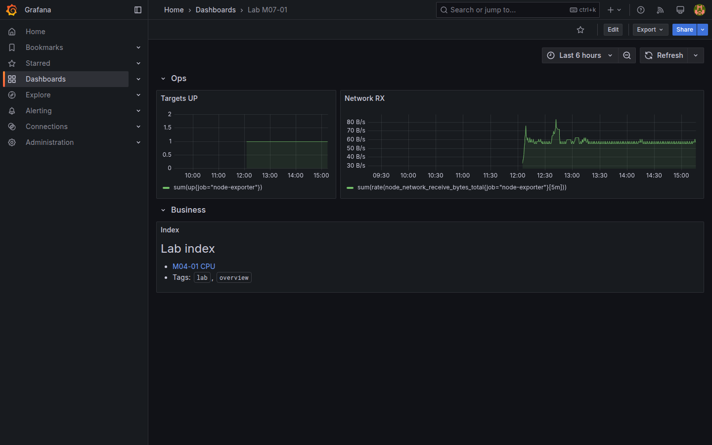
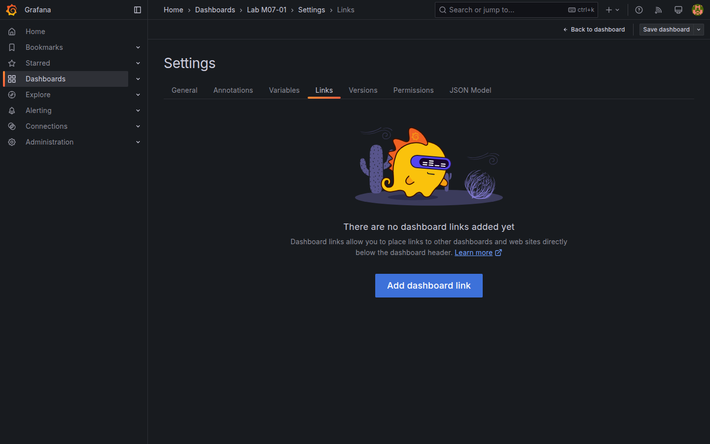

# M07-01 — Diseño y enlaces entre dashboards

[← Página anterior](../m06-paneles-fuentes-personalizados/M06-02-fuentes-mixtas-transformaciones.md) · [Siguiente página →](M07-02-anotaciones-eventos.md)

Un dashboard útil no es solo una cuadrícula de paneles: necesita **jerarquía visual**, **navegación** hacia detalle y **metadatos** para encontrarlo. Grafana organiza paneles en **filas (rows)**, permite **links** entre dashboards con variables en la URL y etiqueta tableros con **tags** y **folders**.

En esta unidad diseñarás `Lab M07-01` como dashboard índice con filas colapsables, enlaces drill-down y tags de búsqueda.

### Objetivos

Al cerrar la unidad deberías:

- Estructurar paneles en **filas** con títulos y colapso.
- Configurar **Dashboard links** y **Panel links** hacia otro dashboard del lab con parámetros.
- Asignar **tags** y guardar en carpeta **Lab**.
- Aplicar **Panel repeater** o enlaces desde stat/KPI hacia detalle.

---

## Conceptos

**Row (fila):** contenedor horizontal que agrupa paneles. Puede **colapsarse** para ocultar secciones (Ops, Business, Logs). Título de fila visible en modo presentación.

**Dashboard links** (Settings → Links): botones en barra superior que abren otro dashboard, URL externa o exploración. Soportan variables: `.../d/uid/lab-m04-04?var-region=EMEA`.

**Panel links** (Panel → Links): clic en panel o en valor concreto navega a otro tablero — patrón **overview → detail**.

**Tags:** etiquetas libres (`lab`, `ops`, `m07`) indexadas por **Dashboards → Browse** y búsqueda global.

**Folders:** agrupan dashboards por equipo o entorno ([M08](M08-02-permisos-carpetas.md) aplica permisos). En el lab usa carpeta `Lab`.

**Variables en URL:** `var-<nombre>=valor` sincroniza selectores al llegar desde enlace ([M02-04](../m02-explorando-interfaz/M02-04-variables-dashboard.md), [M04-04](../m04-paneles-personalizacion/M04-04-filtros-agrupamientos.md)).

**Time range en URL:** `from` / `to` propagan ventana temporal al destino.

---

## En Grafana

**Add → Row** crea fila vacía; arrastra paneles existentes dentro. **Row options → Collapse** controla estado inicial.

**Dashboard settings → Links → Add dashboard link**:
- **Type:** Dashboard  
- **Dashboard:** `Lab M04-04`  
- **Include current time range:** on  
- **Include variables:** on  

**Panel → Edit → Panel links → Add link** con **Open in new tab** opcional.

**Dashboard settings → General → Tags** añade `lab`, `overview`. **Folder** → `Lab`.

**Share → Link** copia URL con query string actual — útil para runbooks.





---

## Laboratorio

### Objetivo

Dashboard `Lab M07-01` índice con filas Ops/Business, links a `Lab M04-04` y `Lab M05-02`, tags y carpeta Lab.

### En qué consiste

1. Crear filas y mover paneles o enlaces.  
2. Dashboard link con variables.  
3. Panel link desde Stat.  
4. Tags, folder, save.

### 1 — Estructura por filas

**Acción:** **New dashboard** → **Add row** `Ops` → añade panel Stat o time series desde `Lab M04-01` (CPU) o enlace visual duplicando consulta `up`.

Segunda fila **Business** → panel revenue SQL resumido o enlace a panel de M04-02.

Tercera fila **Links** → panel **Text** listando dashboards del curso con markdown.

**Por qué:** filas escalan tableros sin scroll infinito en reuniones.

**Resultado esperado:** tres filas identificables; al menos dos paneles con datos.

### 2 — Dashboard link

**Acción:** **Settings → Links → Add dashboard link**:
- Title: `Detalle por región`  
- Dashboard: `Lab M04-04`  
- Tooltip: `Variables region`  
- Include time range + variables: **Yes**

En barra superior aparece enlace. Ábrelo y comprueba selector `region` si existe en destino.

**Por qué:** navegación sin buscar manualmente en Browse.

**Resultado esperado:** salto a M04-04 con contexto temporal preservado.

### 3 — Panel link

**Acción:** en panel Stat `sum(up{job="node-exporter"})` → **Panel links** → **Add link**:
- Title: `Ver alertas`  
- Dashboard: `Lab M05-04`  

**Por qué:** KPI clicables aceleran respuesta a incidentes.

**Resultado esperado:** clic abre dashboard de alertas.

### 4 — Metadatos y save

**Acción:** **Tags:** `lab`, `overview`, `m07`. **Folder:** Lab (crear si falta). **Save** `Lab M07-01`.

```bash
curl -s -u admin:admin "http://localhost:3000/api/search?tag=overview" | python3 -m json.tool
```

**Resultado esperado:** API lista `Lab M07-01`.

---

## Conclusiones

- **Filas** organizan dashboards grandes; el colapso ayuda en presentaciones.
- **Links** conectan overview y detalle propagando tiempo y variables.
- **Tags** y **folders** facilitan descubrimiento antes de permisos finos (M08).
- Un índice `Lab M07-01` puede servir de home operativo del entorno.

---

## Comprueba tu entendimiento

**Filas**  
Modo vista de `Lab M07-01`.  
→ Filas Ops / Business visibles o colapsables.

**Dashboard link**  
Clic en `Detalle por región`.  
→ Abre M04-04 con rango temporal coherente.

**Tags API**

```bash
curl -s -u admin:admin "http://localhost:3000/api/search?query=Lab%20M07-01"
```

→ Entrada con tags `overview` o equivalentes.

**URL variables**  
Enlace manual con `?var-region=APAC` hacia M04-04.  
→ Selector region en APAC al cargar.

---

## Reto

### 1 — Link externo

Añade dashboard link tipo **URL** a documentación oficial de Grafana con **Open in new tab**.

<details>
<summary>Ver solución</summary>

**Settings → Links → Type URL** → `https://grafana.com/docs/grafana/latest/dashboards/`. Aparece junto a enlaces internos.

</details>

### 2 — Home dashboard

En **Administration → General → Default preferences**, razona (sin aplicar en lab compartido) qué implica fijar `Lab M07-01` como home org.

<details>
<summary>Ver solución</summary>

Todos los usuarios aterrizarían en el índice al login; requiere permiso Admin y acuerdo de equipo.

</details>

### 3 — Starred

Marca dashboards clave como **Star** y accede desde **Dashboards → Starred**.

<details>
<summary>Ver solución</summary>

**Star** en barra superior de M04-04, M05-04, M07-01. Atajo personal de navegación.

</details>
