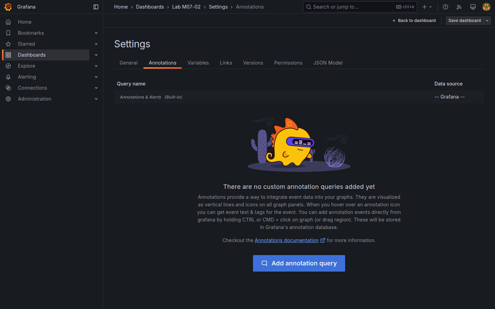
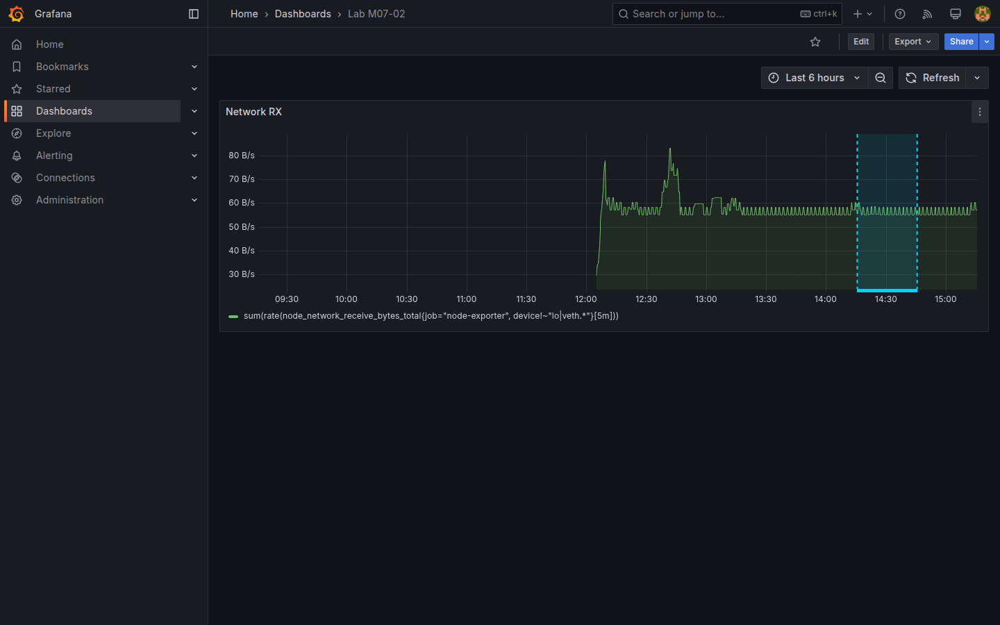

# M07-02 — Anotaciones y eventos

[← Página anterior](M07-01-diseno-dashboards.md) · [Siguiente página →](M07-03-carpetas-playlists.md)

Los gráficos muestran *qué* ocurrió en el tiempo; las **anotaciones** marcan *cuándo* hubo un evento conocido (despliegue, incidente, cambio de config). Grafana superpone bandas o marcadores sobre time series y puede alimentarlos manualmente o desde **consultas** (Prometheus, PostgreSQL, Loki).

En esta unidad añadirás anotaciones manuales y una **query annotation** sobre datos del lab en `Lab M07-02`.

### Objetivos

Al cerrar la unidad deberías:

- Crear **anotación manual** con rango temporal y texto.
- Configurar **query annotation** desde PostgreSQL o Loki.
- Mostrar/ocultar capas de anotación en dashboard con paneles time series.
- Guardar `Lab M07-02` con al menos dos fuentes de eventos.

---

## Conceptos

**Annotation** = marca temporal (punto o región) + metadatos (texto, tags, color). Se dibuja sobre paneles **time series**, **graph** legacy o **heatmap**.

| Origen | Cuándo usarlo |
|--------|----------------|
| **Manual** | Despliegues ad hoc, notas de war room |
| **Query** | Eventos en BD (`http_events` 5xx), logs ERROR, cambios CI |
| **API** | Automatización desde pipeline ([M09](../m09-integraciones/M09-02-api-integraciones.md)) |

**Dashboard settings → Annotations → Add annotation** define capas con nombre (`Deployments`, `Incidents`). Cada capa puede ser **Built-in** (manual) o **Query**.

**Query annotation PostgreSQL** devuelve columnas:
- **`time`** — instante o inicio  
- **`time_end`** (opcional) — fin de región  
- **`text`** — tooltip  
- **`tags`** (opcional) — filtro por tag  

Ejemplo sobre **`http_events`** con `status >= 500`:

```sql
SELECT ts AS time, service || ' ' || status::text AS text, 'incident' AS tags
FROM http_events
WHERE status >= 500 AND $__timeFilter(ts)
ORDER BY ts
```

**Query annotation Loki** (LogQL) puede marcar picos de ERROR; requiere datasource `Loki-Lab` ([M03-03](../m03-fuentes-datos/M03-03-conexion-externa.md)).

**Show in:** limita capas visibles por dashboard; **Hidden** desactiva sin borrar.

---

## En Grafana

**Settings → Annotations → Add annotation** → nombre `Manual deploys`, datasource **Grafana** (-- Grafana --) para entradas manuales: en vista dashboard, clic en gráfico → **Add annotation** (icono o menú contextual según versión).

Para **Query**:
- Name: `HTTP 5xx`  
- Data source: `PostgreSQL-Lab`  
- Query: SQL anterior  
- Field mappings: time → `time`, text → `text`, tags → `tags`  

Color distinto por capa mejora lectura. **Enable** toggle en leyenda de anotaciones (parte inferior del panel) muestra/oculta capa.





---

## Laboratorio

### Objetivo

Dashboard `Lab M07-02` con panel time series (CPU o tráfico), capa manual `Deploy` y capa query `HTTP 5xx`.

### En qué consiste

1. Panel time series base.  
2. Anotación manual de prueba.  
3. Query annotation SQL.  
4. Save dashboard.

### 1 — Panel base

**Acción:** **New dashboard → Add visualization** → `Prometheus-Lab`:

```promql
sum(rate(node_network_receive_bytes_total{job="node-exporter", device!~"lo|veth.*"}[5m]))
```

Título `Network RX`. Ventana **Last 6 hours** para cruzar con `http_events`.

**Resultado esperado:** serie temporal visible.

### 2 — Capa manual

**Acción:** **Settings → Annotations → Add annotation**:
- Name: `Manual deploys`  
- Data source: **Grafana** (built-in)  

En vista dashboard, sobre el panel, crea anotación en un punto reciente:
- Description: `Deploy demo v1.2`  
- Tags: `deploy`  

**Por qué:** equipos anotan releases aunque no haya pipeline integrado.

**Resultado esperado:** marcador vertical o banda con tooltip al pasar ratón.

### 3 — Query HTTP 5xx

**Acción:** **Add annotation** (segunda capa):
- Name: `HTTP 5xx`  
- Data source: `PostgreSQL-Lab`  

```sql
SELECT
  ts AS time,
  service || ' HTTP ' || status::text AS text,
  'incident' AS tags
FROM http_events
WHERE status >= 500
  AND $__timeFilter(ts)
ORDER BY ts
```

Field mapping: time=`time`, text=`text`, tags=`tags`. Color rojo/naranja.

**Por qué:** correlaciona picos de tráfico con errores de negocio simulados.

**Resultado esperado:** múltiples marcas donde `checkout` devuelve 500 en seed SQL.

### 4 — Save

**Acción:** **Save** `Lab M07-02`. Toggle capas en leyenda de anotaciones.

**Resultado esperado:** activar/desactivar `HTTP 5xx` oculta marcas sin borrar configuración.

---

## Conclusiones

- **Anotaciones manuales** capturan contexto humano rápido.
- **Query annotations** automatizan eventos desde SQL o logs.
- Varias capas conviven con colores y tags distintos.
- Combinar con paneles ops ([M04](../m04-paneles-personalizacion/README.md)) explica correlaciones temporales.

---

## Comprueba tu entendimiento

**Capas**  
**Settings → Annotations** de `Lab M07-02`.  
→ Al menos Manual deploys y HTTP 5xx.

**Marcas SQL**  
Amplía rango a **Last 24 hours**.  
→ Aparecen eventos 500 de tabla `http_events`.

**Ocultar capa**  
Desactiva `HTTP 5xx` en leyenda.  
→ Marcas desaparecen; manual sigue si aplica.

**Manual**  
Crea segunda anotación `Rollback`.  
→ Dos tooltips distintos en el panel.

---

## Reto

### 1 — Anotación Loki

Capa query con `Loki-Lab`:

```logql
{job="demo-app"} |= "ERROR"
```

Mapea time desde timestamp de log (campo según respuesta Explore).

<details>
<summary>Ver solución</summary>

**Add annotation** → Loki → LogQL anterior. Ajusta mapping si Grafana usa `Time` automático. Correlaciona con logs de loggen ([infra/README.md](../../infra/README.md)).

</details>

### 2 — API anotación

Crea anotación vía API:

```bash
curl -s -u admin:admin -X POST http://localhost:3000/api/annotations \
  -H "Content-Type: application/json" \
  -d '{"dashboardUID":"<uid-m07-02>","time":'$(($(date +%s)*1000))',"text":"API deploy marker","tags":["deploy","api"]}'
```

Sustituye `<uid-m07-02>` por uid real (Share → JSON o search API).

<details>
<summary>Ver solución</summary>

Obtén uid: `curl -s -u admin:admin "http://localhost:3000/api/search?query=Lab%20M07-02"`. POST devuelve `id`; refresca dashboard.

</details>

### 3 — Regiones en texto

Enriquece `text` SQL con join a `regions` si cruzas ventas — anota solo días con revenue &lt; umbral.

<details>
<summary>Ver solución</summary>

```sql
SELECT d.day AS time, 'Low revenue ' || r.code AS text, 'business' AS tags
FROM daily_sales d JOIN regions r ON r.id = d.region_id
WHERE d.revenue < 900 AND $__timeFilter(d.day)
```

</details>
