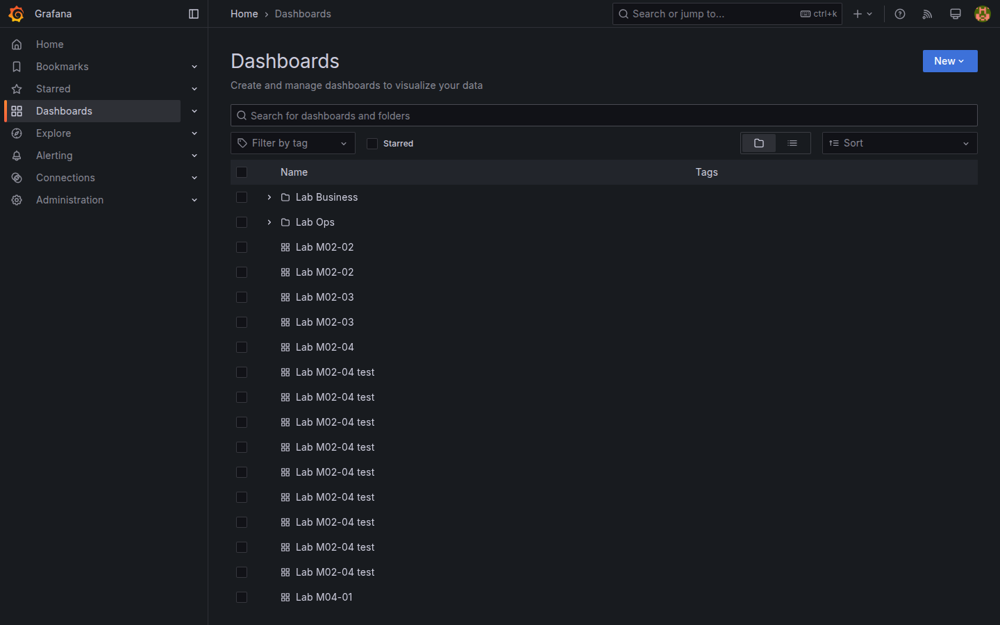
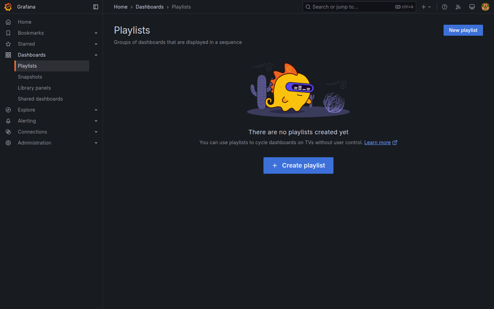

# M07-03 — Carpetas, playlists y presentación

[← Página anterior](M07-02-anotaciones-eventos.md) · [Siguiente página →](../m08-administracion/README.md)

Cuando el número de dashboards crece, hace falta **taxonomía** y modos de consumo distintos: exploración diaria, **playlist** en NOC o **kiosk** en monitor de pared. Grafana agrupa tableros en **folders**, permite **playlists** rotativas y opciones de **TV mode** / **Kiosk** para presentación.

En esta unidad organizarás dashboards del lab en carpetas, crearás una playlist rotatoria y practicarás modo presentación sobre `Lab M07-01`.

### Objetivos

Al cerrar la unidad deberías:

- Crear carpetas **Lab / Ops** y **Lab / Business** y mover dashboards.
- Configurar **playlist** con al menos tres dashboards del curso.
- Usar **TV mode** o **Kiosk** y **auto refresh** para mural operativo.
- Documentar convención de nombres `Lab Mxx-yy` en dashboard de índice.

---

## Conceptos

**Folder:** contenedor de dashboards en **Browse**. Permisos se heredan ([M08-02](../m08-administracion/M08-02-permisos-carpetas.md)). No confundir con folder de **Panel library** (M06).

**Playlist:** secuencia de dashboards con intervalo (p. ej. 30 s). **Dashboards → Playlists → New playlist** → añade entradas por título o tag.

**TV / Kiosk mode:** oculta chrome de Grafana para pantallas compartidas. Desde dashboard: **Shared dashboard** o atajo `d v` / menú **View** según versión; **Kiosk** elimina barra lateral.

**Auto refresh:** selector junto al time picker (`5s`, `30s`, `1m`) — crítico en playlists y muros NOC.

**Version history:** **Dashboard settings → Versions** lista snapshots al guardar — recuperación ante error ([M09](../m09-integraciones/M09-01-versionado-provisioning.md) exporta JSON a Git).

**Convención lab:** prefijo `Lab MNN-NN` alinea con unidades del curso y búsqueda API.

---

## En Grafana

**Dashboards → New → New folder** crea `Lab Ops`, `Lab Business`. En **Browse**, **Move** sobre dashboard → elige carpeta.

**Playlists → New playlist**:
- Name: `Lab NOC rotation`  
- Interval: `30s`  
- Add dashboards: M07-01, M04-01, M05-04  

**Start playlist** abre rotación a pantalla completa.

Desde dashboard abierto: **Dashboard settings → General → Auto refresh** default `30s` opcional.





---

## Laboratorio

### Objetivo

Carpetas Ops/Business pobladas, playlist `Lab NOC rotation` funcional y dashboard `Lab M07-03` (checklist organización) o ampliación de M07-01 con sección Playlists.

### En qué consiste

1. Crear carpetas y mover tableros.  
2. Crear playlist.  
3. Probar TV/kiosk + refresh.  
4. Version snapshot y save índice.

### 1 — Carpetas

**Acción:** crea folders `Lab Ops`, `Lab Business`. Mueve:
- Ops: `Lab M04-01`, `Lab M05-04`, `Lab M07-02`  
- Business: `Lab M04-02`, `Lab M04-04`, `Lab M05-03`  

Mantén `Lab M07-01` en folder `Lab` raíz o `Lab Ops` como índice.

**Por qué:** separación ops/negocio es patrón enterprise antes de RBAC.

**Resultado esperado:** Browse muestra árbol por carpetas.

### 2 — Playlist

**Acción:** **Dashboards → Playlists → New playlist** `Lab NOC rotation`, interval **30s**, dashboards:
1. `Lab M07-01`  
2. `Lab M04-01`  
3. `Lab M05-04`  

**Start playlist** → comprueba rotación y barra de control.

**Por qué:** NOC y oficinas usan rotación sin intervención manual.

**Resultado esperado:** ciclo automático entre tres tableros.

### 3 — Presentación

**Acción:** abre `Lab M04-01` → activa **Kiosk** o **TV mode** (menú Share / View). Configura **Refresh** `30s`. Observa durante dos ciclos.

**Por qué:** valida legibilidad a distancia (contraste, títulos).

**Resultado esperado:** UI minimalista; datos se actualizan.

### 4 — Índice y versiones

**Acción:** en `Lab M07-01`, panel Text actualiza tabla:

| Carpeta | Dashboards |
|---------|------------|
| Lab Ops | M04-01, M05-04, M07-02 |
| Lab Business | M04-02, M04-04, M05-03 |

**Settings → Versions** → anota que existe historial tras múltiples saves. **Save** como `Lab M07-03` *Organization index* o actualiza M07-01 (elige uno y mantén coherencia).

```bash
curl -s -u admin:admin http://localhost:3000/api/folders | python3 -m json.tool
```

**Resultado esperado:** API lista folders `Lab Ops`, `Lab Business`.

---

## Conclusiones

- **Folders** estructuran dashboards antes de permisos finos.
- **Playlists** automatizan rotación para monitores compartidos.
- **Kiosk/TV** y **auto refresh** completan el modo presentación.
- **Version history** complementa backup en Git (M09).

---

## Comprueba tu entendimiento

**Browse**  
**Dashboards → Browse**  
→ Carpetas Ops/Business con tableros movidos.

**Playlist**  
Inicia `Lab NOC rotation`.  
→ Rota entre tres dashboards cada 30 s.

**API folders**

```bash
curl -s -u admin:admin http://localhost:3000/api/folders
```

→ JSON con uid/title de carpetas lab.

**Version history**  
Abre **Versions** en un dashboard editado.  
→ Lista revisiones con autor y fecha.

---

## Reto

### 1 — Playlist por tag

Crea playlist filtrando dashboards con tag `lab` (si todos lo tienen tras M07-01).

<details>
<summary>Ver solución</summary>

Añade tag `lab` a dashboards faltantes. Playlist puede usar búsqueda manual si la UI no filtra por tag — documenta lista fija como alternativa.

</details>

### 2 — Intervalo 5 s

Prueba playlist a **5s** y valora impacto en carga Prometheus/PostgreSQL.

<details>
<summary>Ver solución</summary>

Refresh agresivo multiplica queries; en producción alinear intervalo con scrape y SLA de BD.

</details>

### 3 — Restaurar versión

En **Versions**, restaura revisión anterior y compara panel título.

<details>
<summary>Ver solución</summary>

**Restore** crea nueva versión con contenido antiguo; no borra historial.

</details>
