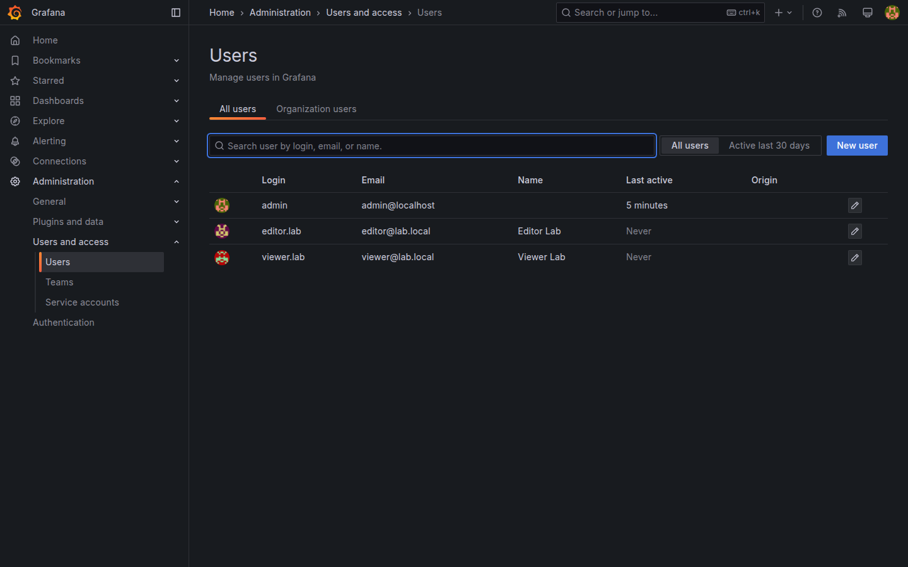
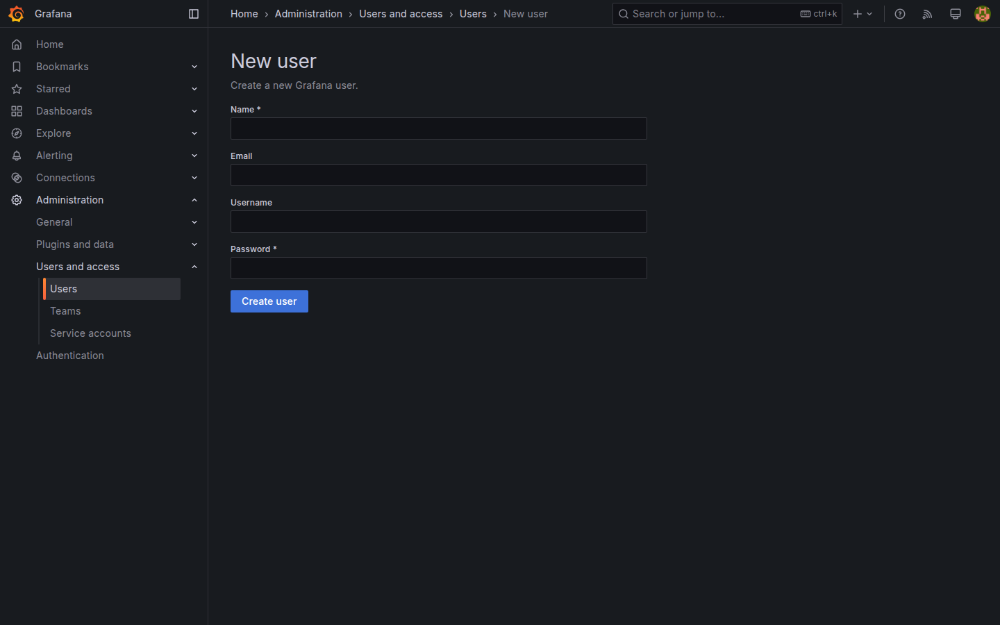

# M08-01 — Usuarios y roles

[← Página anterior](../m07-tableros-organizacion/M07-03-carpetas-playlists.md) · [Siguiente página →](M08-02-permisos-carpetas.md)

Grafana multi-usuario distingue **quién puede ver**, **editar** o **administrar** la plataforma. En producción conviven observadores de negocio, editores de dashboards y administradores de la instancia. El lab arranca con un solo **Admin**; aquí crearás usuarios de prueba y asignarás roles de organización.

En esta unidad darás de alta **viewer.lab** y **editor.lab**, comprobarás diferencias en la UI y validarás acceso con sesión incógnito o API.

### Objetivos

Al cerrar la unidad deberías:

- Crear usuarios locales en **Administration → Users** (server admin) y asignar rol en **Users and access**.
- Asignar roles **Viewer**, **Editor** y **Admin** a nivel organización.
- Identificar menús y acciones restringidas por rol.
- Validar login de **viewer.lab** sin permisos de edición.

---

## Conceptos

**Organization (org):** tenant lógico en Grafana OSS (el lab usa org `Main`). Usuarios pertenecen a org con un **role** global:

| Rol | Capacidades típicas |
|-----|---------------------|
| **Viewer** | Ver dashboards, Explore (según config), alertas; no guardar dashboards |
| **Editor** | Crear/editar dashboards, datasources (según config), alert rules |
| **Admin** | Usuarios, permisos, settings org, plugins |

**Service accounts** (Grafana 9+) automatizan API sin usuario humano — uso en CI ([M09](../m09-integraciones/M09-02-api-integraciones.md)).

**Authentication** en producción: LDAP, OAuth, SAML. El lab usa **auth local** (`GF_USERS_ALLOW_SIGN_UP=false` en [docker-compose.yml](../../infra/docker-compose.yml)).

**Teams:** agrupan usuarios para permisos sobre folders ([M08-02](M08-02-permisos-carpetas.md)).

**Principio mínimo privilegio:** viewers para stakeholders; editors en squads; pocos admins.

---

## En Grafana

Para crear un usuario local con contraseña: **Administration → Users → New user** (server admin):
- Name: `viewer.lab`  
- Email: `viewer@lab.local`  
- Username: `viewer.lab`  
- Password: `viewer` (solo lab)  

Después, en **Administration → Users and access → Users** (org users) ajusta su **Role** a **Viewer**. Repite con `editor.lab` / **Editor**.

**Switch user** no existe nativamente: prueba en ventana privada o otro navegador.

Menús que **Viewer** no ve o no puede usar: **Connections → Data sources** (add), **Dashboard settings → Save**, **Administration** completo.





---

## Laboratorio

### Objetivo

Usuarios `viewer.lab` (Viewer) y `editor.lab` (Editor) creados; checklist de capacidades documentada en dashboard `Lab M08-01` (panel Text).

### En qué consiste

1. Alta viewer.lab.  
2. Alta editor.lab.  
3. Prueba login viewer.  
4. Prueba login editor.  
5. Save checklist dashboard.

### 1 — Usuario Viewer

**Acción:** **Administration → Users → New user** `viewer.lab`, password `viewer`; luego role **Viewer**.

**Por qué:** simula consumidor de dashboards ejecutivos.

**Resultado esperado:** usuario listado en Users.

### 2 — Usuario Editor

**Acción:** **Administration → Users → New user** `editor.lab`, password `editor`; luego role **Editor**.

**Resultado esperado:** segundo usuario con rol superior a Viewer.

### 3 — Sesión Viewer

**Acción:** ventana privada → login `viewer.lab` / `viewer` → abre `Lab M07-01` o M04-01.

Intenta **Edit dashboard** o **Add panel**.

**Por qué:** verificación empírica de RBAC.

**Resultado esperado:** botones de edición ausentes o error al guardar.

### 4 — Sesión Editor

**Acción:** login `editor.lab` → abre mismo dashboard → **Edit** → cambia título panel → **Save dashboard**.

**Resultado esperado:** guardado exitoso; viewer ve cambio al refrescar.

### 5 — Checklist API

**Acción:** como admin:

```bash
curl -s -u admin:admin http://localhost:3000/api/org/users | python3 -m json.tool
```

Crea dashboard `Lab M08-01` con panel Text listando diferencias Viewer/Editor/Admin.

**Resultado esperado:** API muestra tres usuarios con roles distintos.

---

## Conclusiones

- Roles **Viewer / Editor / Admin** definen capacidades globales en la org.
- Viewers consumen; editors mantienen dashboards; admins gobiernan plataforma.
- Probar con sesiones separadas evita suposiciones sobre la UI.
- Teams y permisos de folder refinan RBAC (M08-02).

---

## Comprueba tu entendimiento

**Listado usuarios**  
**Administration → Users**  
→ `viewer.lab`, `editor.lab`, `admin`.

**Viewer editar**  
Login viewer → intenta guardar dashboard.  
→ Operación denegada o UI sin Save.

**Editor guardar**  
Login editor → cambia título → Save.  
→ Cambio persistido.

**API org users**

```bash
curl -s -u admin:admin http://localhost:3000/api/org/users
```

→ Array con `role` Viewer/Editor/Admin.

---

## Reto

### 1 — Desactivar usuario

Desactiva `viewer.lab` (**Disable**) e intenta login.

<details>
<summary>Ver solución</summary>

**Users → viewer.lab → Disable**. Login falla; útil offboarding.

</details>

### 2 — Contraseña

Cambia password de `editor.lab` desde perfil admin y revalida sesión editor.

<details>
<summary>Ver solución</summary>

**Users → editor.lab → Change password** → `editor-new`. Login con nueva clave.

</details>

### 3 — Grafana CLI

Desde contenedor (opcional):

```bash
docker exec grafana-lab grafana cli admin reset-admin-password admin
```

Solo en lab si pierdes credenciales — **no** en producción sin procedimiento.

<details>
<summary>Ver solución</summary>

Restablece admin; documenta riesgo de lockout sin SSO.

</details>
