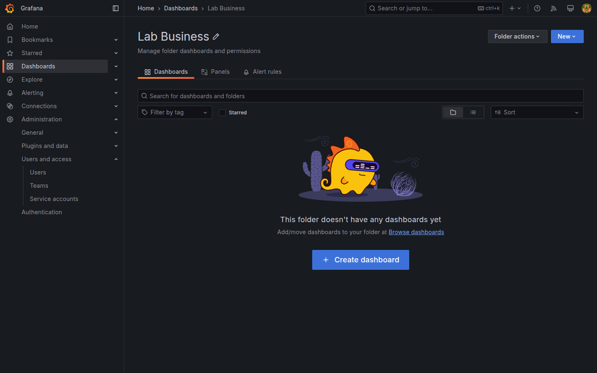

# M08-02 — Permisos en carpetas y dashboards

[← Página anterior](M08-01-usuarios-roles.md) · [Siguiente página →](M08-03-contact-points-politicas.md)

El rol de organización no basta cuando **Ops** no debe ver finanzas o un squad edita solo su carpeta. Grafana aplica **permisos ACL** sobre **folders** y dashboards individuales: Viewer, Editor o Admin **por recurso**, asignables a usuario o **team**.

En esta unidad crearás team **Lab Ops**, restringirás carpeta **Lab Business** y comprobarás acceso con `viewer.lab` y `editor.lab`.

### Objetivos

Al cerrar la unidad deberías:

- Crear **team** y añadir miembros.
- Asignar permisos de folder **Viewer** vs **Editor** a usuarios/teams.
- Ocultar dashboard financiero a viewer no autorizado.
- Documentar matriz permisos en `Lab M08-02`.

---

## Conceptos

**Folder permissions:** **Dashboards → Browse** → folder → **Permissions** (icono escudo). Herencia: dashboards hijos reciben ACL del folder salvo override local.

| Permiso folder | Efecto |
|----------------|--------|
| **View** | Ver dashboards del folder |
| **Edit** | Modificar dashboards del folder |
| **Admin** | Cambiar permisos del folder |

**Dashboard permissions:** mismo modelo a nivel tablero individual — útil excepciones.

**Teams vs roles org:** rol org es techo; permiso folder puede **restringir** más (viewer org sin acceso a folder = no ve dashboards aunque existan).

**Default permissions:** miembros org suelen tener **View** general; admin puede quitar **View** por defecto en folders sensibles (Grafana 10+ **hide dashboard** si sin permiso).

**Library panels:** edición sigue ligada a rol org/editor ([M06](../m06-paneles-fuentes-personalizados/README.md)).

---

## En Grafana

**Administration → Users and access → Teams → Add team** `Lab Ops` → Add `editor.lab`.

**Browse → Lab Business → Permissions**:
- Remove **Viewer** role heredado si aplica (cuidado en lab compartido)  
- Add **User** `viewer.lab` → **Deny** o simplemente no conceder View  
- Add **Team** `Lab Ops` → **Edit**  

Alternativa pedagógica más segura en lab compartido: crea folder **Lab Restricted** con un solo dashboard dummy y restringe solo a admin + editor team, sin quitar permisos globales.

**Lab Ops folder:** viewer tiene **View**; **Lab Business:** solo editor team **Edit**, viewer **sin entrada**.

Prueba con sesión viewer: Browse no lista Business o muestra candado.



---

## Laboratorio

### Objetivo

Team `Lab Ops`, permisos diferenciados en folders Ops/Business ([M07-03](../m07-tableros-organizacion/M07-03-carpetas-playlists.md)), dashboard `Lab M08-02` con matriz permisos.

### En qué consiste

1. Crear team y membresía.  
2. Permisos folder Business.  
3. Permisos folder Ops.  
4. Validación viewer/editor.  
5. Save matriz.

### 1 — Team Lab Ops

**Acción:** team `Lab Ops`, miembro `editor.lab`.

**Resultado esperado:** team visible en Permissions UI.

### 2 — Restringir Business

**Acción:** folder **Lab Business → Permissions**:
- Team **Lab Ops**: **Edit**  
- User **viewer.lab**: no añadir (o **Remove** View default si procede)  
- **Admin** mantiene Admin  

**Por qué:** datos revenue/regions solo para editores ops-finanzas.

**Resultado esperado:** viewer no abre dashboards Business.

### 3 — Ops lectura

**Acción:** folder **Lab Ops → Permissions**:
- User **viewer.lab**: **View**  
- Team **Lab Ops**: **Edit**  

**Resultado esperado:** viewer abre M04-01; no guarda cambios.

### 4 — Validación

**Acción:** sesión **viewer.lab** → Browse → confirma Ops visible, Business oculto o acceso denegado.

Sesión **editor.lab** → edita panel en Business → Save.

**Resultado esperado:** comportamiento coherente con matriz.

### 5 — Matriz Lab M08-02

**Acción:** dashboard Text:

| Recurso | viewer.lab | editor.lab | admin |
|---------|------------|------------|-------|
| Lab Ops | View | Edit | Admin |
| Lab Business | — | Edit | Admin |

```bash
curl -s -u admin:admin http://localhost:3000/api/folders | python3 -m json.tool
```

**Save** `Lab M08-02`.

---

## Conclusiones

- Permisos de **folder** segmentan dashboards por audiencia.
- **Teams** simplifican ACL frente a usuarios sueltos.
- Rol org y permiso folder se combinan — el más restrictivo gana en acceso.
- Probar con cuentas reales evita sorpresas en producción.

---

## Comprueba tu entendimiento

**Team**  
**Teams → Lab Ops**  
→ Incluye editor.lab.

**Viewer Business**  
Login viewer → intenta abrir M04-04.  
→ Denegado o no listado.

**Editor Business**  
Login editor → Save en M05-03.  
→ Permitido.

**API folder uid**  
Anota uid de Lab Business para scripts M09.

---

## Reto

### 1 — Permiso dashboard suelto

Dashboard M05-03 permiso **View** solo para viewer sin abrir todo Business folder.

<details>
<summary>Ver solución</summary>

**Dashboard settings → Permissions** → Add viewer **View**. Excepción a herencia folder — documenta complejidad operativa.

</details>

### 2 — Team Business

Crea team **Lab Business** con usuario ficticio y permiso Edit solo en Business.

<details>
<summary>Ver solución</summary>

Separa squads finanzas vs ops con teams disjuntos.

</details>

### 3 — Audit

Exporta permisos vía API (Grafana 11):

```bash
curl -s -u admin:admin "http://localhost:3000/api/folders/<uid>/permissions"
```

<details>
<summary>Ver solución</summary>

JSON lista ACL efectiva; útil revisiones compliance.

</details>
