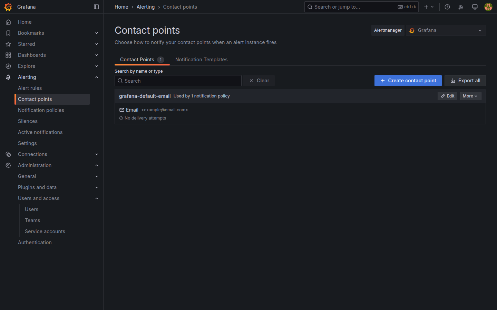
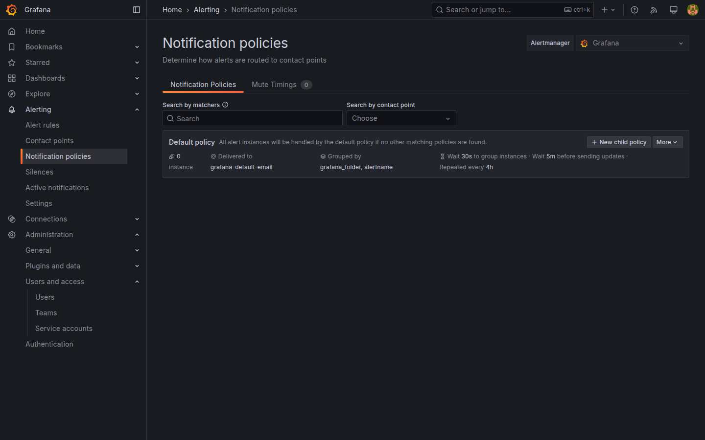
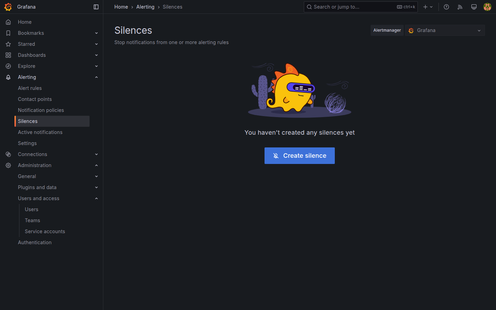

# M08-03 — Contact points y políticas de notificación

[← Página anterior](M08-02-permisos-carpetas.md) · [Siguiente página →](../m09-integraciones/README.md)

[M05-04](../m05-visualizaciones-avanzadas/M05-04-alertas-umbrales.md) creó **alert rules** y thresholds visuales. Falta cerrar el circuito **notify**: **contact points** (destinos), **notification policies** (routing por labels) y **silences** / **mute timings** para mantenimiento.

En esta unidad configurarás contact point **Webhook** de lab, política por label `team=ops` y silencio temporal sobre regla `up`.

### Objetivos

Al cerrar la unidad deberías:

- Crear **contact point** Webhook y email (opcional, sin SMTP real).
- Definir **notification policy** que enrute alertas con label `team=ops`.
- Aplicar **silence** o **mute timing** y observar supresión.
- Vincular regla M05-04 al contact point y documentar en `Lab M08-03`.

---

## Conceptos

**Contact point:** canal de salida — Email, Slack, Webhook, PagerDuty, etc. En lab, Webhook a URL ficticia basta para ver payload en logs si usas herramienta local; sin SMTP, email no entrega.

**Notification policy tree:** raíz recibe todas las alertas; ramas filtran por **matchers** (`team=ops`, `severity=critical`) hacia contact point.

**Grouping / wait / repeat:** agrupa alertas relacionadas, espera antes de enviar, re-notifica si persiste — reduce ruido.

**Silence:** supresión ad hoc con matchers y ventana temporal (mantenimiento node-exporter).

**Mute timing:** silencios recurrentes (noches, fines de semana).

**Alert rule labels:** p. ej. `team=ops`, `severity=warning` — alimentan routing ([M05-04](../m05-visualizaciones-avanzadas/M05-04-alertas-umbrales.md)).

**State:** Firing + sin silence → notificación; con silence activo → suprimida pero visible en UI.

---

## En Grafana

**Alerting → Contact points → New contact point**:
- Name: `Lab Webhook`  
- Integration: **Webhook**  
- URL: `https://example.com/grafana-alert` (lab)  

**Notification policies → Edit** root o **New child policy**:
- Matcher: `team=ops`  
- Contact point: `Lab Webhook`  

En alert rule M05-04: **Labels** añade `team=ops`. **Notifications** selecciona policy/contact point.

**Silences → New silence**:
- Matcher: `alertname=Lab node-exporter down` (ajusta al nombre de tu regla)  
- Duration: 15m  

**Alerting → Alert rules** muestra estado **Normal/Pending/Firing** y icono silenced.

---

## Laboratorio

### Objetivo

Contact point `Lab Webhook`, policy `team=ops`, silence de prueba y dashboard `Lab M08-03` resumen.

### En qué consiste

1. Contact point webhook.  
2. Labels en regla existente.  
3. Notification policy.  
4. Silence 15m.  
5. Save dashboard resumen.

### 1 — Contact point

**Acción:** **New contact point** `Lab Webhook`, URL `https://example.com/hook`, **Save**.

**Por qué:** webhook es patrón CI/ITSM ([M09](../m09-integraciones/M09-02-api-integraciones.md)).

**Resultado esperado:** contact point en lista.

### 2 — Labels regla

**Acción:** edita regla de M05-04 (`up` o CPU) → **Labels** `team=ops`, `severity=warning` → Save.

**Resultado esperado:** regla muestra labels en listado.

### 3 — Notification policy

**Acción:** **Notification policies → New child policy** (o edit):
- Matcher: `team=ops`  
- Contact point: `Lab Webhook`  
- Continue matching: off  

**Por qué:** solo alertas ops van al webhook de lab.

**Resultado esperado:** árbol policies con rama ops.

### 4 — Silence

**Acción:** **Silences → New silence**:
- Matcher: `team=ops`  
- Comment: `Lab maintenance test`  
- Duration: 15 minutes  

Opcional: `docker compose stop node-exporter` brevemente ([M05-04 reto](../m05-visualizaciones-avanzadas/M05-04-alertas-umbrales.md)) — con silence no esperas spam webhook.

**Resultado esperado:** alerta Firing silenced en UI.

### 5 — Dashboard resumen

**Acción:** `Lab M08-03` panel Text con enlaces:
- Contact points  
- Notification policies  
- Silences  
- Reglas M05-04  

**Save**.

---

## Conclusiones

- **Contact points** materializan notificaciones; policies enrutan por labels.
- **Silences** y **mute timings** controlan ruido en cambios planificados.
- Labels consistentes (`team`, `severity`) son contrato entre reglas y routing.
- SMTP/Slack real se configura igual cambiando integration type.

---

## Comprueba tu entendimiento

**Contact point**  
**Alerting → Contact points**  
→ `Lab Webhook` tipo Webhook.

**Policy matcher**  
Policy con matcher `team=ops`.  
→ Enlazada a Lab Webhook.

**Silence activo**  
**Silences** lista silence 15m.  
→ Estado Active.

**Regla labels**  
Alert rules → regla M05.  
→ Labels `team=ops`.

---

## Reto

### 1 — Email contact point

Crea contact point Email `lab@example.com` sin SMTP — observa warning en test.

Ver solución

**Test** falla sin relay; en producción configuras `GF_SMTP_*` o integración managed.

### 2 — Mute timing

**Mute timings** Lunes-Viernes 22:00–06:00 para matcher `severity=warning`.

Ver solución

Ventana recurrente; útil batch nocturno.

### 3 — Payload webhook

Si tienes `nc` o servicio RequestBin, apunta webhook real y dispara Firing sin silence.

Ver solución

JSON incluye labels, annotations, values — base integración ticketing.

