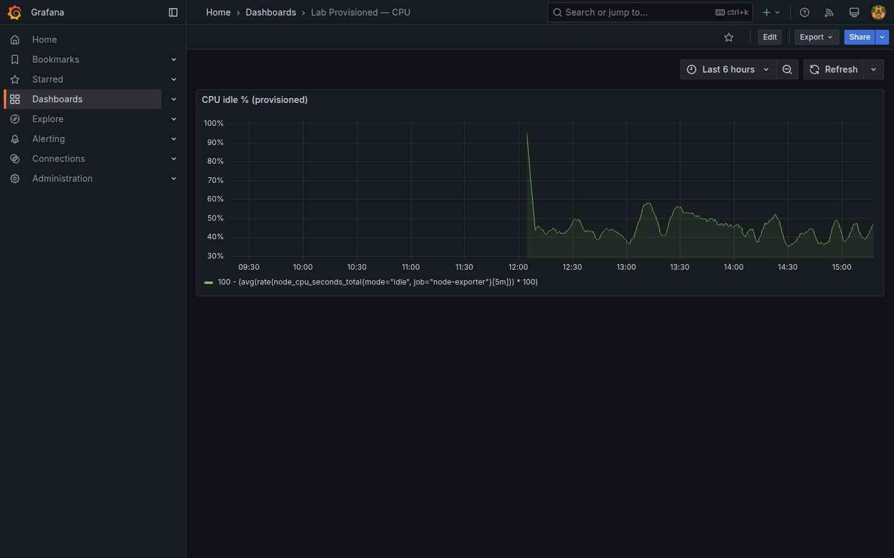
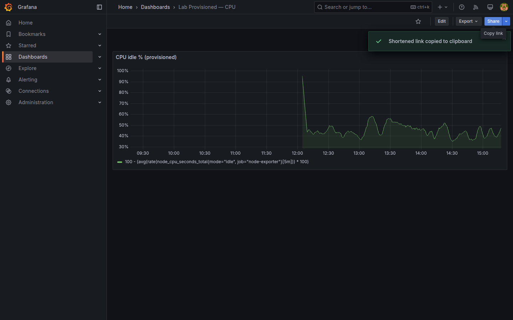
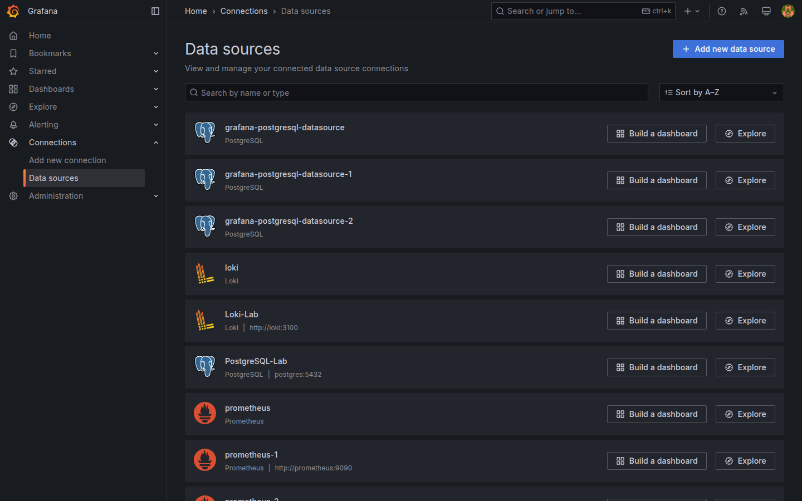

# M09-01 — Versionado y provisioning

[← Página anterior](../m08-administracion/M08-03-contact-points-politicas.md) · [Siguiente página →](M09-02-api-integraciones.md)

Dashboards guardados solo en la base de Grafana son frágiles: borrado de volumen, drift manual, entornos desalineados. **Export JSON**, **Git** y **provisioning** declarativo convierten tableros y datasources en artefactos revisables, igual que código de aplicación.

En esta unidad exportarás `Lab M04-01`, versionarás en Git, aplicarás provisioning de ejemplo del repo y validarás idempotencia.

### Objetivos

Al cerrar la unidad deberías:

- Exportar dashboard **JSON** (UI y API) con uid estable.
- Entender estructura mínima de **provisioning** (`datasources`, `dashboards`).
- Montar archivos de ejemplo en Grafana y ver datasource/dashboard provisionados.
- Recuperar dashboard desde Git tras reset de volumen (simulado).

---

## Conceptos

**Dashboard JSON:** incluye `panels`, `templating`, `uid`, `version`. **Export for sharing** elimina id interno; **export for provisioning** mantiene uid predecible.

**Provisioning path:** Grafana lee YAML/JSON al arrancar desde `/etc/grafana/provisioning/` (mapeado en Docker). Cambios en disco requieren reload o restart según tipo.

| Recurso | Archivo típico | Efecto |
|---------|----------------|--------|
| Datasource | `provisioning/datasources/*.yaml` | Alta/actualiza datasource |
| Dashboard | `provisioning/dashboards/*.yaml` + JSON | Carga dashboards en folder |
| Alerting | `provisioning/alerting/*.yaml` | Reglas (Grafana 11+) |

**`allowUiUpdates`:** si `false`, dashboard provisionado es solo lectura en UI; si `true`, edición local con drift respecto a Git.

**Git workflow:** rama → PR → merge → pipeline despliega JSON/YAML al volumen provisioning o usa API ([M09-02](M09-02-api-integraciones.md)).

Ejemplos en repo: [`infra/grafana/provisioning/examples/`](../../infra/grafana/provisioning/examples/README.md).

---

## En Grafana

**Share → Export → Save to file** descarga JSON del dashboard activo.

API equivalente:

```bash
curl -s -u admin:admin "http://localhost:3000/api/dashboards/uid/<uid>" | python3 -m json.tool > /tmp/lab-m04-01.json
```

**Connections → Data sources** muestra icono **Provisioned** si viene de YAML.

Tras montar provisioning examples y reiniciar Grafana, aparece folder **Provisioned** con dashboard **Lab Provisioned — CPU**.







---

## Laboratorio

### Objetivo

Export Git de `Lab M04-01`, revisión de ejemplos en `infra/grafana/provisioning/examples/` y activación opcional en Docker local.

### En qué consiste

1. Export JSON vía API.  
2. Commit en rama local (simulado o real).  
3. Revisar YAML examples.  
4. Montar provisioning y restart Grafana.  
5. Validar dashboard provisionado.

### 1 — Export API

**Acción:** obtén uid:

```bash
curl -s -u admin:admin "http://localhost:3000/api/search?query=Lab%20M04-01"
```

Export:

```bash
UID=<uid-del-resultado>
curl -s -u admin:admin "http://localhost:3000/api/dashboards/uid/$UID" \
  | python3 -c "import sys,json; print(json.dumps(json.load(sys.stdin)['dashboard'], indent=2))" \
  > exports/lab-m04-01.json
```

Crea carpeta `exports/` en tu fork si no existe (añade a `.gitignore` local opcional si no quieres commitear dumps).

**Por qué:** pipeline CI usa API/JSON, no solo clic UI.

**Resultado esperado:** archivo JSON con `panels` y `uid`.

> El export referencia el **uid del datasource** `Prometheus-Lab`. Si lo reimportas en un entorno donde el provisioning crea `Prometheus-Provisioned` (uid distinto), el panel saldrá vacío hasta reasignar el datasource. Mantén nombres/uids estables entre entornos para evitarlo.

### 2 — Git

**Acción:** copia JSON saneado a `infra/grafana/provisioning/examples/dashboards/lab-m04-01.json` (o documenta diff en PR). Anota mensaje de commit tipo: `Add provisioned export Lab M04-01`.

**Por qué:** trazabilidad quién cambió qué panel.

**Resultado esperado:** diff legible en `git diff`.

### 3 — Revisar examples

**Acción:** lee:
- `infra/grafana/provisioning/examples/datasources/prometheus-lab.yaml`  
- `infra/grafana/provisioning/examples/dashboards/dashboards.yaml`  
- `infra/grafana/provisioning/examples/dashboards/lab-provisioned-cpu.json`  

**Resultado esperado:** entiendes `apiVersion: 1`, `providers`, `options.path`.

### 4 — Activar provisioning (local)

**Acción:** en `infra/docker-compose.yml`, descomenta volumen de provisioning (ver comentario en compose) **solo en tu entorno**:

```yaml
# - ./grafana/provisioning/examples:/etc/grafana/provisioning:ro
```

Reinicia:

```bash
cd infra && docker compose up -d grafana
```

**Por qué:** en Codespace compartido puede pisar datasources manuales de M03 — usa solo local o fork dedicado.

**Resultado esperado:** datasource `Prometheus-Provisioned` y dashboard en folder Provisioned.

### 5 — Recargar provisioning (no destructivo)

**Acción:** edita el JSON en `examples/dashboards/`, guarda y recarga sin tocar datos:

```bash
cd infra && docker compose restart grafana
```

El dashboard provisionado refleja el cambio del archivo al reiniciar el servicio; tus `Lab MXX-YY` manuales siguen intactos.

**Resultado esperado:** el dashboard provisionado se actualiza desde el archivo; el resto del entorno se conserva.

> ⚠️ **Reset destructivo (opcional, fuera del flujo del curso):** `docker compose down -v` **borra el volumen `grafana-data`** y con él **todos** tus dashboards, alert rules, usuarios y library panels de M02–M08. Solo el dashboard provisionado reaparecería al volver a montar provisioning. Úsalo únicamente en un fork desechable o cuando quieras empezar de cero.

---

## Conclusiones

- **Export JSON** + Git es backup y revisión de cambios.
- **Provisioning** alinea entornos dev/stage/prod.
- `uid` estable evita duplicados al reimportar.
- Separar dashboards **UI-editable** vs **provisioned read-only** reduce drift.

---

## Comprueba tu entendimiento

**Export API**  
Archivo JSON contiene clave `"uid"`.  
→ Sí, uid del dashboard.

**Provider YAML**  
`dashboards.yaml` referencia carpeta `options.path`.  
→ Apunta a JSON en examples.

**Provisioned badge**  
Datasources tras montar examples.  
→ Entrada con etiqueta provisioned.

**Recarga vs reset**  
¿Qué pierde `restart grafana` frente a `down -v`?  
→ `restart` no pierde nada (recarga provisioning); `down -v` borra el volumen y todos los dashboards manuales.

---

## Reto

### 1 — allowUiUpdates false

En `dashboards.yaml` example, `allowUiUpdates: false` → intenta editar panel provisionado.

<details>
<summary>Ver solución</summary>

UI bloquea save o muestra warning; cambios deben ir al JSON en Git.

</details>

### 2 — Folder provisioning

Añade `folder: Lab Ops` en provider y reinicia.

<details>
<summary>Ver solución</summary>

Dashboard aparece bajo folder indicado; coherente con M07/M08.

</details>

### 3 — Diff dos versiones

Exporta mismo dashboard tras cambio menor; usa `diff` o `git diff` entre exports.

<details>
<summary>Ver solución</summary>

Solo cambian campos tocados (`version`, `panels[].title`, etc.) — base code review dashboards.

</details>
