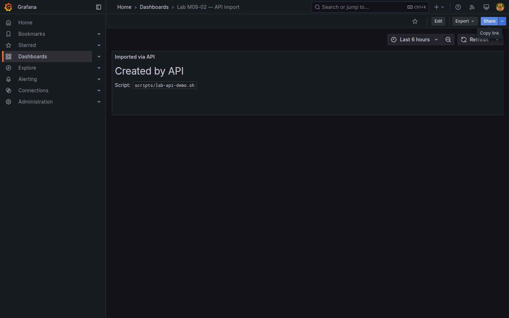

# M09-02 — API e integraciones

[← Página anterior](M09-01-versionado-provisioning.md) · [Siguiente página →](../../README.md)

La **HTTP API** de Grafana automatiza lo que practicaste en UI: datasources, dashboards, anotaciones, silences. Integraciones enterprise conectan alertas (**webhooks**), CI/CD (provision en deploy) y ITSM (tickets desde payload).

En esta unidad ejecutarás flujo **API** completo: upsert datasource, import dashboard, anotación de deploy y webhook de prueba enlazado a política M08.

### Objetivos

Al cerrar la unidad deberías:

- Autenticarte en API con basic auth (lab) y interpretar códigos de error.
- Crear/actualizar datasource y dashboard vía **POST/PUT**.
- Publicar **anotación** de despliegue desde script shell.
- Describir payload de alerta hacia webhook ITSM.

---

## Conceptos

**Base URL:** `http://localhost:3000/api/`. Header `Content-Type: application/json`. Auth lab: `-u admin:admin` (en producción: service account token).

| Endpoint | Uso |
|----------|-----|
| `GET /api/health` | Liveness |
| `GET /api/search?query=` | Buscar dashboards |
| `POST /api/dashboards/db` | Crear/overwrite dashboard |
| `POST /api/datasources` | Alta datasource |
| `POST /api/annotations` | Marcar deploy |
| `GET /api/alertmanager/grafana/api/v2/alerts` | Alertas activas (Unified Alerting) |

**Idempotencia:** `POST /api/dashboards/db` con `"overwrite": true` y **uid** fijo evita duplicados ([M09-01](M09-01-versionado-provisioning.md)).

**Webhooks alertas:** POST JSON con `status`, `labels`, `annotations`, `values` — mapeable a Jira/ServiceNow ([M08-03](../m08-administracion/M08-03-contact-points-politicas.md)).

**CI/CD:** job pipeline ejecuta curl o `grafanactl`/Terraform provider tras merge a main; alternativa montar provisioning volume.

**Rate limits / RBAC:** service account con rol mínimo para automation ([M08-01](../m08-administracion/M08-01-usuarios-roles.md)).

---

## En Grafana

**Administration → Service accounts** (opcional) crea token para scripts sin password admin.

**Alerting → Contact points → Webhook** muestra URL destino; **Test** envía payload de ejemplo si integration lo soporta.

Documentación oficial: [HTTP API](https://grafana.com/docs/grafana/latest/developers/http_api/).



---

## Laboratorio

### Objetivo

Script `scripts/lab-api-demo.sh` (o comandos inline) que health-check, upsert datasource demo, import dashboard mínimo y crea anotación.

### En qué consiste

1. Health y búsqueda.  
2. Upsert datasource JSON API mock (opcional) o verificar Prometheus-Lab.  
3. Import dashboard API.  
4. Anotación deploy.  
5. Resumen integración webhook.

### 1 — Health y search

**Acción:**

```bash
curl -s -u admin:admin http://localhost:3000/api/health
curl -s -u admin:admin "http://localhost:3000/api/search?type=dash-db&query=Lab"
```

**Resultado esperado:** `database: ok`; lista dashboards Lab.

### 2 — Datasource (idempotente)

**Acción:** verifica Prometheus-Lab (ya de M03) o upsert:

```bash
curl -s -u admin:admin -X POST http://localhost:3000/api/datasources \
  -H "Content-Type: application/json" \
  -d '{
    "name": "Prometheus-Lab",
    "type": "prometheus",
    "url": "http://prometheus:9090",
    "access": "proxy",
    "isDefault": true
  }'
```

Si existe, PUT por id ([M03-02](../m03-fuentes-datos/M03-02-configuracion-fuentes.md)).

**Resultado esperado:** JSON `"message":"Datasource added"` o update OK.

### 3 — Import dashboard mínimo

**Acción:**

```bash
curl -s -u admin:admin -X POST http://localhost:3000/api/dashboards/db \
  -H "Content-Type: application/json" \
  -d '{
    "dashboard": {
      "uid": "lab-m09-api",
      "title": "Lab M09-02 — API import",
      "tags": ["lab","api","m09"],
      "timezone": "browser",
      "schemaVersion": 39,
      "version": 1,
      "panels": [{
        "id": 1,
        "type": "text",
        "title": "Imported via API",
        "gridPos": {"h": 4, "w": 24, "x": 0, "y": 0},
        "options": {"mode": "markdown", "content": "# Created by API\nDeploy OK"}
      }]
    },
    "overwrite": true,
    "folderUid": ""
  }'
```

Ajusta `folderUid` si tienes uid de folder Lab Ops.

**Resultado esperado:** respuesta `"status":"success"`, `"url":"/d/lab-m09-api/..."`.

### 4 — Script o anotación manual

**Acción (recomendado):** ejecuta el script del repo, que incluye import y anotación:

```bash
bash scripts/lab-api-demo.sh
```

Alternativa manual — solo anotación tras paso 3:

```bash
NOW=$(($(date +%s)*1000))
curl -s -u admin:admin -X POST http://localhost:3000/api/annotations \
  -H "Content-Type: application/json" \
  -d "{\"dashboardUID\":\"lab-m09-api\",\"time\":$NOW,\"text\":\"Deploy via API\",\"tags\":[\"deploy\",\"api\"]}"
```

**Resultado esperado:** dashboard `Lab M09-02 — API import` y anotación creada.

### 5 — Webhook (documental)

**Acción:** en el dashboard importado, edita panel Text y documenta campos payload alerta:

```json
{
  "status": "firing",
  "labels": { "alertname": "...", "team": "ops" },
  "annotations": { "summary": "..." }
}
```

Enlaza contact point `Lab Webhook` (M08-03). Opcional: captura con `nc -l 9099` local si tu entorno lo permite.

**Save** dashboard API import o crea `Lab M09-02` Text enlazando scripts.

---

## Conclusiones

- La **API** replica operaciones UI para automatización y CI.
- **overwrite + uid** hace imports repetibles.
- **Anotaciones API** integran pipeline de deploy con contexto en gráficos ([M07-02](../m07-tableros-organizacion/M07-02-anotaciones-eventos.md)).
- **Webhooks** conectan Unified Alerting con herramientas externas.

---

## Comprueba tu entendimiento

**Dashboard importado**  
Browse busca `Lab M09-02` o `lab-m09-api`.  
→ Dashboard visible con panel markdown.

**Anotación**  
Abre dashboard importado con rango que incluye ahora.  
→ Marca Deploy via API (si panel time series añadido) o verifica en **Annotations list** admin.

**Overwrite**  
Re-ejecuta POST import cambiando markdown.  
→ Mismo uid, contenido actualizado.

**Auth fallida**  
curl sin `-u`.  
→ HTTP 401 Unauthorized.

---

## Reto

### 1 — Extender el script

Añade a `scripts/lab-api-demo.sh` un paso que liste silences o contact points vía API.

<details>
<summary>Ver solución</summary>

```bash
curl -sf "${AUTH[@]}" "$BASE/api/alertmanager/grafana/api/v2/alerts" | python3 -m json.tool | head
```

Documenta salida en comentario del script.

</details>

### 2 — Silence API

Crea silence 10m vía API Unified Alerting (endpoint `/api/alertmanager/grafana/api/v2/silences` — consulta docs versión 11).

<details>
<summary>Ver solución</summary>

Payload con matchers `team=ops`; respuesta incluye `silenceID`.

</details>

### 3 — Service account

Crea service account **ci-bot** con token y repite import dashboard usando `Authorization: Bearer`.

<details>
<summary>Ver solución</summary>

**Administration → Service accounts → Add token**; curl con header Bearer — patrón CI sin password admin.

</details>

---

## Cierre del curso

Has recorrido interfaz, datasources, paneles, visualizaciones avanzadas, biblioteca, organización, administración e integraciones. Mantén dashboards críticos en **Git**, permisos mínimos y alertas con **labels** coherentes. Para profundizar: [documentación oficial Grafana](https://grafana.com/docs/grafana/latest/).
